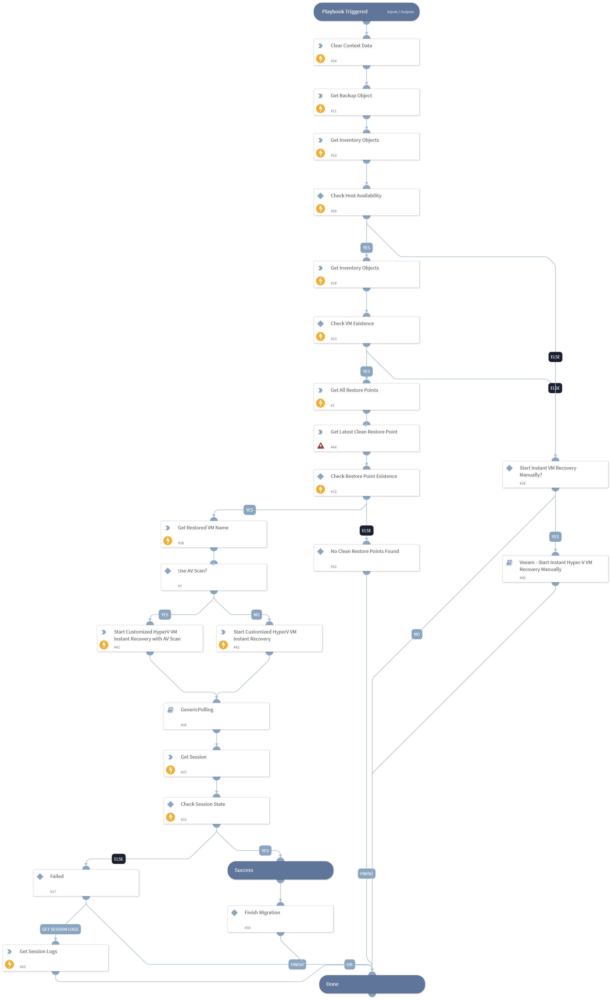

Starts Instant VM Recovery for Microsoft Hyper-V with automatic configuration.

## Dependencies

This playbook uses the following sub-playbooks, integrations, and scripts.

### Sub-playbooks

* GenericPolling
* Veeam - Start Instant Hyper-V VM Recovery Manually

### Integrations

* VBR REST API

### Scripts

* DeleteContext
* GetLatestCleanRestorePoint
* GetRestoredVmName

### Commands

* veeam-vbr-get-backup-object
* veeam-vbr-get-inventory-objects
* veeam-vbr-get-restore-points
* veeam-vbr-get-session
* veeam-vbr-get-session-logs
* veeam-vbr-start-instant-recovery-hyperv-vm-customized

## Playbook Inputs

---

| **Name** | **Description** | **Default Value** | **Required** |
| --- | --- | --- | --- |
| Instance |  | incident.sourceInstance | Optional |
| backupObjectId |  | incident.veeambackupobjectid | Optional |

## Playbook Outputs

---
There are no outputs for this playbook.

## Playbook Image

---

