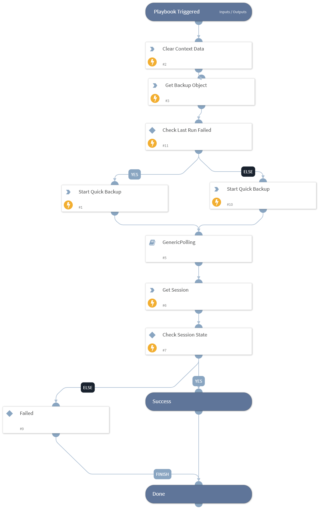

Starts a Quick Backup session for a specific virtual machine.

## Dependencies

This playbook uses the following sub-playbooks, integrations, and scripts.

### Sub-playbooks

* GenericPolling

### Integrations

* VBR REST API

### Scripts

* DeleteContext

### Commands

* veeam-vbr-get-backup-object
* veeam-vbr-get-session
* veeam-vbr-start-vsphere-quick-backup

## Playbook Inputs

---

| **Name** | **Description** | **Default Value** | **Required** |
| --- | --- | --- | --- |
| Instance |  | incident.sourceInstance | Optional |
| backupObjectId |  | incident.veeambackupobjectid | Optional |

## Playbook Outputs

---
There are no outputs for this playbook.

## Playbook Image

---

