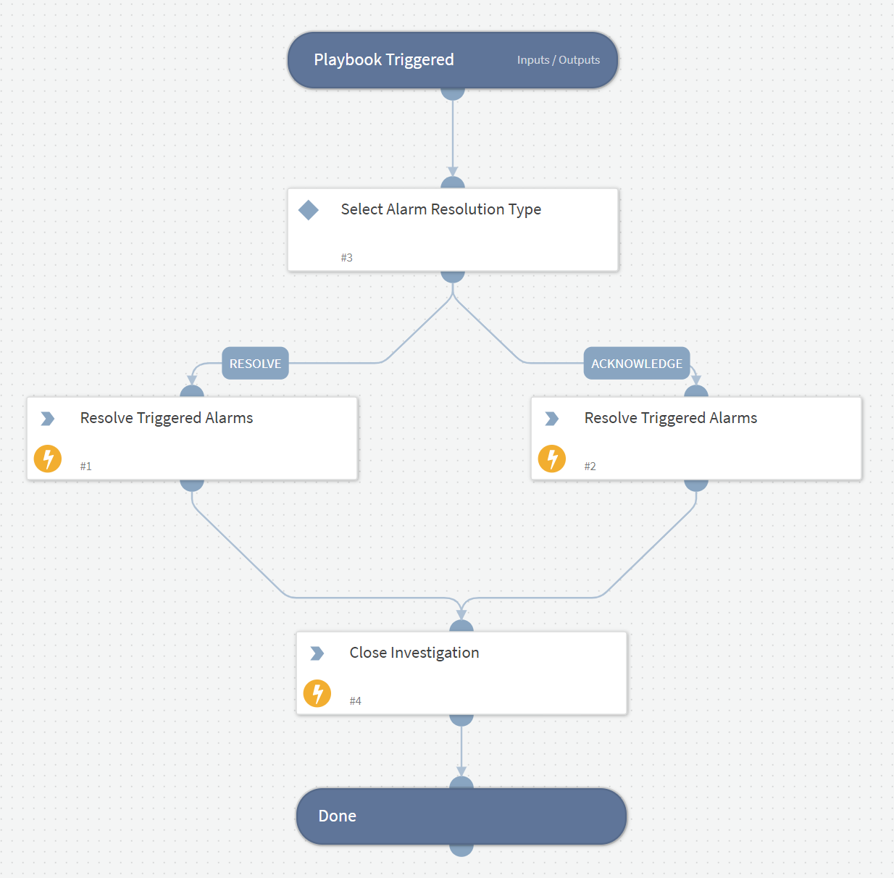

Resolves Veeam ONE triggered alarms

## Dependencies

This playbook uses the following sub-playbooks, integrations, and scripts.

### Sub-playbooks

This playbook does not use any sub-playbooks.

### Integrations

* Veeam ONE REST API

### Scripts

This playbook does not use any scripts.

### Commands

* veeam-vone-resolve-triggered-alarms
* closeInvestigation

## Playbook Inputs

---

| **Name** | **Description** | **Default Value** | **Required** |
| --- | --- | --- | --- |
| TriggeredAlarmId |  | incident.eventid | Optional |
| Instance |  | incident.sourceInstance | Optional |

## Playbook Outputs

---
There are no outputs for this playbook.

## Playbook Image

---

