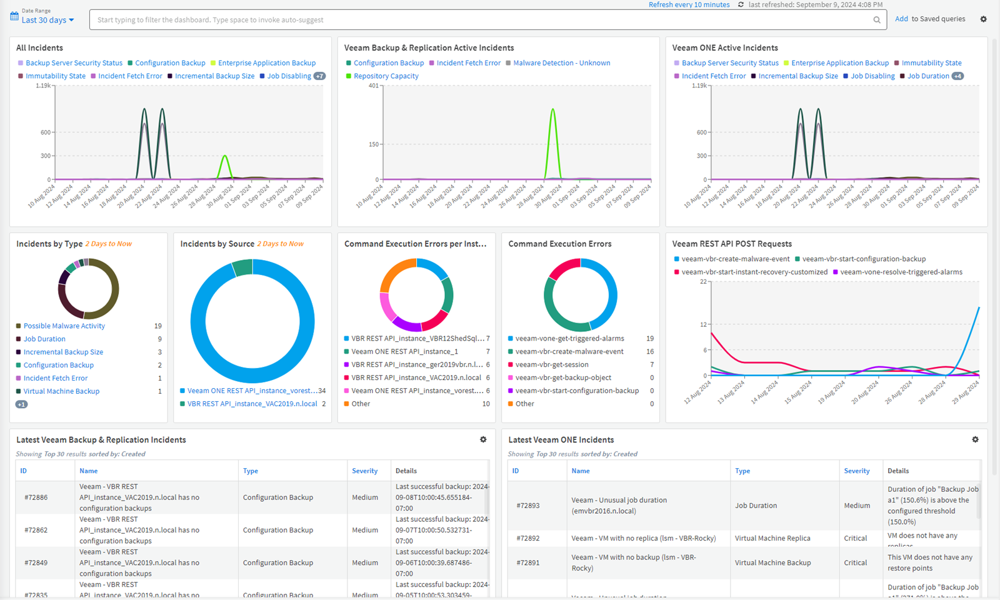
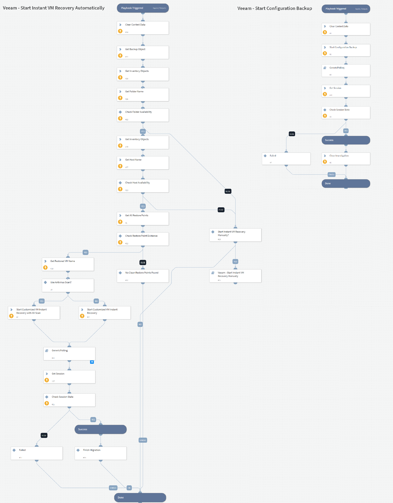
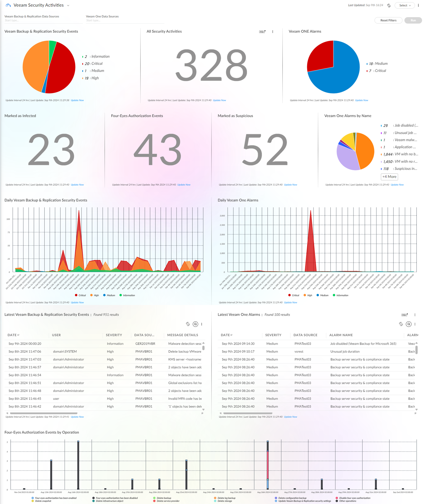
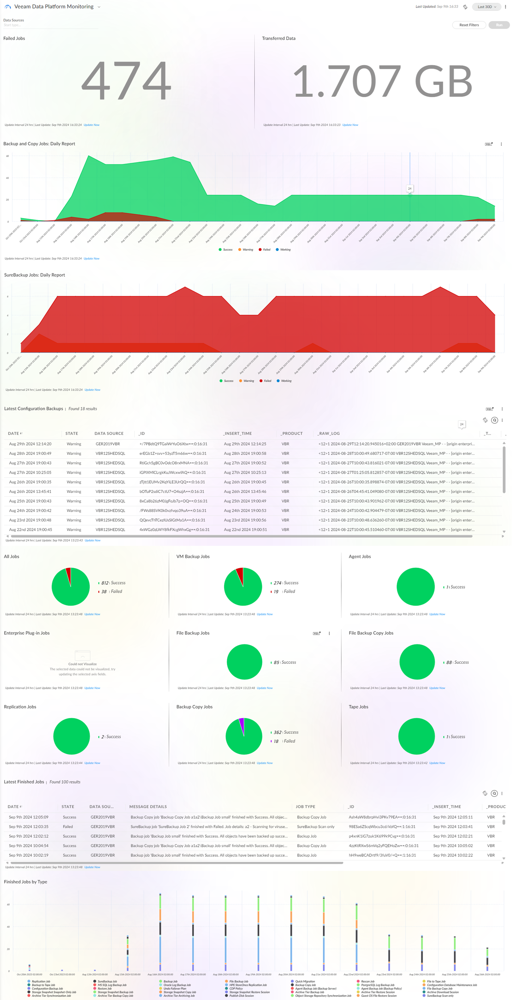

# Overview

The Veeam Apps for Palo Alto Networks bring backup intelligence into Cortex XSIAM and Cortex XSOAR. Backup and security events, recovery context, and response actions all arrive in the SOC, so security teams can enrich threat detection, investigate faster, and coordinate response and recovery without leaving the workflows they already use. Available to [Veeam Data Platform](https://www.veeam.com/products/veeam-data-platform.html) Advanced and Premium customers. 

<~XSOAR>
Security teams rarely have visibility into what is happening inside the backup environment. Malware detections, suspicious restore activity, configuration changes, and compliance gaps sit in tools owned by backup administrators, so they never reach the SOC — and analysts lose time chasing that context in the middle of an incident.  

The Veeam App for Palo Alto Networks Cortex XSOAR helps close that gap. It uses the Veeam Backup & Replication and Veeam ONE REST API to create incidents for malware detections, suspicious activity, and the health of your backup infrastructure. Analysts can triage incidents from the built-in Veeam Incident Dashboard and initiate predefined actions through built-in playbooks, without opening a backup console or handing the ticket to a backup administrator. 

The content pack includes: 

- What the app ingests as incidents: 
  - Malware detections, including Indicators of Compromise found in protected data (new in v2) 
  - Recon threat states identified in the backup environment (new in v2) 
  - Security & Compliance Analyzer violations (new in v2) 
  - SureBackup Content Scan findings (new in v2) 
  - Backup repository anomalies and capacity issues 
  - Configuration backup state 
  - Alarms triggered in Veeam ONE 
- What analysts get in Cortex XSOAR: 
  - The Veeam Incident Dashboard for a view of incidents and API activity handled by the app 
  - Custom incident types and fields, with classifiers and incoming mappers already mapped 
  - Restore point information and backup context, retrieved without leaving the incident 
  - Four-eyes authorization events, to investigate risky administrative actions (new in v2) 
  - Microsoft Entra ID validation — confirm protected users exist in the latest backup, and compare backed-up objects against production to spot changes (new in v2) 
- What analysts can trigger from a playbook or incident: 
  - Instant VM Recovery for VMware vSphere, manually or automatically 
  - Instant VM Recovery for Hyper-V (new in v2) 
  - Quick Backup, to preserve recovery options mid-investigation 
  - Antivirus and YARA scans against backup data (new in v2) 
  - A Security & Compliance Analyzer assessment (new in v2) 
  - Disk publishing via the Data Integration API for forensic analysis (new in v2) 
  - Configuration backup 
  - Resolution of Veeam ONE alarms 
  - Any of the above as a one-click action from the incident view (new in v2) 

Generic access to supported Veeam Backup & Replication REST API endpoints to extend the existing VBR integration with custom investigations and workflows (new in v2). 

## Documentation

[Veeam Helpcenter User Guide](https://helpcenter.veeam.com/docs/security_plugins_xsoar/guide/)

## Screenshots

</~XSOAR>
<~XSIAM>
Security teams rarely have visibility into what is happening inside the backup environment. Malware detections, suspicious restore activity, configuration changes, and compliance gaps sit in tools owned by backup administrators, so they never reach the SOC, and analysts lose time chasing that context in the middle of an incident. 

The Veeam App for Palo Alto Networks Cortex XSIAM helps close that gap by bringing Veeam backup and security events into Cortex XSIAM, where they can be analyzed alongside endpoint, identity, and network events to enrich threat detection and investigations. Analysts can also initiate predefined Veeam actions directly from Cortex workflows. It works with: 

- Veeam Backup & Replication 
- Veeam ONE 

### Monitoring & Security Visibility 

The app gets information from the event forwarding capabilities via syslog servers integrated with Veeam Backup & Replication and Veeam ONE, parses the data and displays it on the Veeam Data Platform Monitoring dashboard. For events and alarms with Medium, High and Critical severity, the app displays them on the Veeam Security Activities dashboard. 
It includes: 

- Built-in dashboards to monitor job statuses and security activities on a daily basis.
- Built-in reports.
- Multiple data source support.
- Coverage of malware detections and Indicators of Compromise, Recon threat states, Security & Compliance Analyzer violations, SureBackup Content Scan findings, four-eyes authorization events, and failed multi-factor authentication attempts (Recon, Security & Compliance Analyzer, SureBackup and IoC events are new in v2). 

***Information:***\
Consider the following:

- Correlation rules are not included in the content pack. To download and import them manually, please follow [this](https://www.veeam.com/download_add_packs/vmware-esx-backup/palo-alto-xsiam-monitoring/) link.
- The app supports Palo Alto Cortex XSIAM 2.5 and later.

### Response Actions & Playbooks :

Analysts can initiate predefined Veeam playbooks directly from Veeam incidents, including: 

- Instant VM Recovery for VMware vSphere, manually or automatically 
- Instant VM Recovery for Hyper-V (new in v2) 
- Quick Backup, to preserve recovery options mid-investigation 
- Antivirus and YARA scans against backup data (new in v2) 
- A Security & Compliance Analyzer assessment (new in v2) 
- Disk publishing via the Data Integration API for forensic analysis (new in v2) 
- Configuration backup 
- Resolution of Veeam ONE alarms 
- Generic access to supported Veeam Backup & Replication REST API endpoints to extend the existing VBR integration with custom investigations and workflows (new in v2). 

## Documentation

[Veeam Helpcenter User Guide for XSIAM Monitoring](https://helpcenter.veeam.com/docs/security_plugins_xsiam/guide/)

The documentation also includes examples of correlation rules for Veeam security activities.

## Screenshots

</~XSIAM>