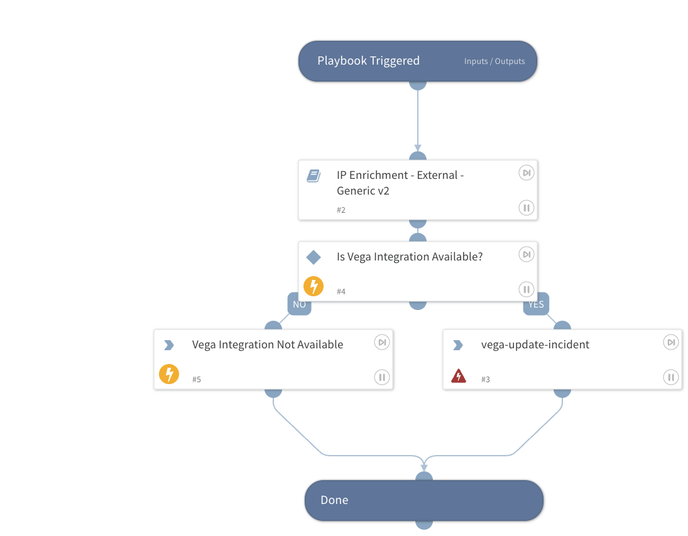

Enriches incoming IP addresses using the 'IP Enrichment - External - Generic v2' sub-playbook and automatically posts the retrieved endpoint details back to the Vega incident as a comment.

## Dependencies

This playbook uses the following sub-playbooks, integrations, and scripts.

### Sub-playbooks

* IP Enrichment - External - Generic v2

### Integrations

* Vega

### Scripts

* IsIntegrationAvailable
* Print

### Commands

* vega-update-incident

## Playbook Inputs

---

| **Name** | **Description** | **Default Value** | **Required** |
| --- | --- | --- | --- |
| IP_Address | The IP address\(es\) to enrich. | IP.Address | Optional |

## Playbook Outputs

---
There are no outputs for this playbook.

## Playbook Image

---

