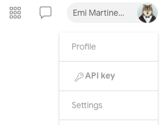

# VirusTotal (API v3)

This integration analyzes suspicious hashes, URLs, domains, and IP addresses.
The integration was integrated and tested with version v3 API of VirusTotal.

## Configure VirusTotal (API v3) in Cortex


| **Parameter** | **Description** | **Required** |
| --- | --- | --- |
| API Key | See [Acquiring your API key](#acquiring-your-api-key) | True |
| Use system proxy settings |  | False |
| Trust any certificate (not secure) |  | False |
| Source Reliability | Reliability of the source providing the intelligence data |  |
| Premium Subscription | Whether to use premium subscription. (For advanced reputation analyze. See [Premium analysis - Relationship Files Threshold](#premium-analysis---relationship-files-threshold)) | False |
| File Malicious Threshold. Minimum number of positive results from VT scanners to consider the file malicious. | See [Indicator Thresholds](#indicator-thresholds). | False |
| File Suspicious Threshold. Minimum number of positive and suspicious results from VT scanners to consider the file suspicious. | See [Indicator Thresholds](#indicator-thresholds). | False |
| IP Malicious Threshold. Minimum number of positive results from VT scanners to consider the IP malicious. | See [Indicator Thresholds](#indicator-thresholds). | False |
| IP Suspicious Threshold. Minimum number of positive and suspicious results from VT scanners to consider the IP suspicious. | See [Indicator Thresholds](#indicator-thresholds). | False |
| Disable reputation lookups for private IP addresses | To reduce the number of lookups made to the VT API, this option can be selected to gracefully skip enrichment of any IP addresses allocated for private networks. | False |
| URL Malicious Threshold. Minimum number of positive results from VT scanners to consider the URL malicious. | See [Indicator Thresholds](#indicator-thresholds). | False |
| URL Suspicious Threshold. Minimum number of positive and suspicious results from VT scanners to consider the URL suspicious. | See [Indicator Thresholds](#indicator-thresholds). | False |
| Domain Malicious Threshold. Minimum number of positive results from VT scanners to consider the domain malicious. | See [Indicator Thresholds](#indicator-thresholds). | False |
| Domain Suspicious Threshold. Minimum number of positive and suspicious results from VT scanners to consider the domain suspicious. | See [Indicator Thresholds](#indicator-thresholds). | False |
| Preferred Vendors List. CSV list of vendors who are considered more trustworthy. | See [Indicator Thresholds](#indicator-thresholds).  | False |
| Preferred Vendor Threshold. The minimum number of highly trusted vendors required to consider a domain, IP address, URL, or file as malicious.  | See [Indicator Thresholds](#indicator-thresholds). | False |
| Enable score analyzing by Crowdsourced Yara Rules, Sigma, and IDS | See [Rules Threshold](#rules-threshold). | False |
| Crowdsourced Yara Rules Threshold | See [Rules Threshold](#rules-threshold). | False |
| Sigma and Intrusion Detection Rules Threshold |  See [Rules Threshold](#rules-threshold). | False |
| Domain Popularity Ranking Threshold | See [Rules Threshold](#rules-threshold). | False |
| Premium Subscription Only: Relationship Malicious Files Threshold | See [Premium analysis - Relationship Files Threshold](#premium-analysis---relationship-files-threshold) | False |
| Premium Subscription Only: Relationship Suspicious Files Threshold | See [Premium analysis - Relationship Files Threshold](#premium-analysis---relationship-files-threshold) | False |


### Acquiring your API key

Your API key can be found in your VirusTotal account user menu:

Your API key carries all your privileges, so keep it secure and don't share it with anyone.

## DBot Score / Reputation scores

The following information describes DBot Score which is new for this version.

### Indicator Thresholds

Configure the default threshold for each indicator type in the instance settings.
You can also specify the threshold as an argument when running relevant commands.

- Indicators with positive results from preferred vendors equal to or higher than the threshold will be considered malicious.
- Indicators with positive results equal to or higher than the malicious threshold will be considered malicious.
- Indicators with positive results equal to or higher than the suspicious threshold value will be considered suspicious.
- Domain popularity ranks: VirusTotal is returning a popularity ranks for each vendor. The integration will calculate its average and will compare it to the threshold.

### Rules Threshold

If the YARA rules analysis threshold is enabled:

- Indicators with positive results, the number of found YARA rules results, Sigma analysis, or IDS equal to or higher than the threshold, will be considered suspicious.
- If both the the basic analysis and the rules analysis is suspicious, the indicator will be considered as malicious.
If the indicator was found to be suspicious only by the rules thresholds, the indicator will be considered suspicious.
- Domain popularity ranks: VirusTotal is returning a popularity ranks for each vendor. The integration will calculate its average and will compare it to the threshold.

The DbotScore calculation process can be seen on the "description" field in any malicious/suspicious DBot score.
You can aquire those calculation on all of the indicators also from the debug log.

Example of a VirusTotal (API v3) DBot score log:

```log
Basic analyzing of "<domain>"
Found popularity ranks. Analyzing.
The average of the ranks is 809009.0 and the threshold is 10000
Indicator is good by popularity ranks.
Analyzing by get_domain_communicating_files
Found safe by relationship files. total_malicious=0 >= 3
Analyzing by get_url_downloaded_files
Found safe by relationship files. total_malicious=0 >= 3
Analyzing by get_url_referrer_files
Found safe by relationship files. total_malicious=0 >= 3
```

### Premium analysis - Relationship Files Threshold

If the organization is using the premium subscription of VirusTotal, you can use the premium API analysis.
The premium API analysis will check 3 file relationships of each indicator (domain, url, and ip).

- If the relationship is found to be malicious, the indicator will be considered malicious.
- If the relationship is found to be suspicious and the basic score is suspicious, the indicator will be considered malicious.
- If the relationship is found to be suspicious, the indicator will be considered suspicious.

The premium API analysis can call up to 4 API calls per indicator. If you want to decrease the use of the API quota, you can disable it.

## Changes from VirusTotal integration

The following lists the changes in this version according to the commands from the VirusTotal integration.

### Reputation commands (ip, url, domain, and file)

- Removed output paths: Due to changes in VirusTotal API, the following output paths are no longer supported:
  - *IP.VirusTotal*
  - *Domain.VirusTotal*
  - *URL.VirusTotal*
  - *File.VirusTotal*

   Instead, you can use the following output paths that return concrete indicator reputations.
  - *VirusTotal.IP*
  - *VirusTotal.Domain*
  - *VirusTotal.File*
  - *VirusTotal.URL*

- The following commands will no longer analyze the file/url sent to it, but will get the information stored in VirusTotal.
  - *VirusTotal.Domain*
  - *VirusTotal.IP*

  To analyze (detonate) the indicator, you can use the following playbooks:
  - **Detonate File - VirusTotal (API v3)**
  - **Detonate URL - VirusTotal (API v3)**
- Each reputation command will use at least 1 API call. For advanced reputation commands, use the *Premium API* flag.
- For each reputation command there is the new *extended_data* argument . When set to "true", the results returned by the commands will contain
  additional information as *last_analysis_results* which contains the service name and its specific analysis.
- Reputation commands can return relationships of the indicator.
  The relationships that are supported are defined as part of the instance configuration.
  For more information regarding URL relationships, see: <https://docs.virustotal.com/reference/url-object>
  For more information regarding IP relationships, see: <https://docs.virustotal.com/reference/ip-object>
  For more information regarding Domain relationships, see: <https://docs.virustotal.com/reference/domains-object>
  For more information regarding File relationships, see: <https://docs.virustotal.com/reference/files>

- Starting with XSOAR version 6.8.0, You may monitor API usage via the *VirusTotal API Execution Metrics* dashboard.
### Comments

In VirusTotal (API v3) you can now add comments to all indicator types (IP, Domain, File and URL) so each command now has the *resource_type* argument.
If supplied, the command will use the resource type to add a comment. If not, the command will determine if the given input is a hash or a URL.
This arguments is available in the following commands:

- ***vt-comments-get***
- ***vt-comments-add***

### vt-comments-get

- Added the *resource_type* argument. If not supplied, will try to determine if the *resource* argument is a hash or a URL.
- Added the *limit* argument. Gets the latest comments within the given limit.
- New output path: *VirusTotal.Comments*.

### Detonation (scan) Commands

Removed the *vtLink* output from all commands as it does no longer return from the API.
To easily use the scan commands we suggest using the following playbooks:

- **Detonate File - VirusTotal (API v3)**
- **Detonate URL - VirusTotal (API v3)**

Use the ***vt-analysis-get*** command to get the report from the scans.

### file

***
Checks the file reputation of the specified hash.

#### Base Command

`file`

#### Input

| **Argument Name** | **Description** | **Required** |
| --- | --- | --- |
| file | Hash of the file to query. Supports MD5, SHA1, and SHA256. | Required |
| extended_data | Whether to return extended data (last_analysis_results). Possible values are: true, false. | Optional |

#### Context Output

| **Path** | **Type** | **Description** |
| --- | --- | --- |
| File.MD5 | String | Bad MD5 hash. |
| File.SHA1 | String | Bad SHA1 hash. |
| File.SHA256 | String | Bad SHA256 hash. |
| File.Relationships.EntityA | String | The source of the relationship. |
| File.Relationships.EntityB | String | The destination of the relationship. |
| File.Relationships.Relationship | String | The name of the relationship. |
| File.Relationships.EntityAType | String | The type of the source of the relationship. |
| File.Relationships.EntityBType | String | The type of the destination of the relationship. |
| File.Malicious.Vendor | String | For malicious files, the vendor that made the decision. |
| File.Malicious.Description | String | For malicious files, the reason that the vendor made the decision. |
| File.Malicious.Detections | Number | For malicious files, the total number of detections. |
| File.Malicious.TotalEngines | Number | For malicious files, the total number of engines that checked the file hash. |
| File.VTVendors.EngineDetections | Number | Number of VT vendors that flagged the file as malicious. |
| File.VTVendors.EngineVendors | Array | VT vendors who flagged the file as malicious. |
| File.VTVendors.EngineDetectionNames | Array | VT detection names that flagged the file as malicious. |
| DBotScore.Indicator | String | The indicator that was tested. |
| DBotScore.Type | String | The indicator type. |
| DBotScore.Vendor | unknown | The vendor used to calculate the score. |
| DBotScore.Score | Number | The actual score. | 
| DBotScore.Reliability | String | Reliability of the source providing the intelligence data. |
| VirusTotal.File.attributes.type_description | String | Description of the type of the file. |
| VirusTotal.File.attributes.tlsh | String | The locality-sensitive hashing. |
| VirusTotal.File.attributes.exiftool.MIMEType | String | MIME type of the file. |
| VirusTotal.File.attributes.names | String | Names of the file. |
| VirusTotal.File.attributes.javascript_info.tags | String | Tags of the JavaScript. |
| VirusTotal.File.attributes.exiftool.FileType | String | The file type. |
| VirusTotal.File.attributes.exiftool.WordCount | String | Total number of words in the file. |
| VirusTotal.File.attributes.exiftool.LineCount | String | Total number of lines in file. |
| VirusTotal.File.attributes.crowdsourced_ids_stats.info | Number | Number of IDS that marked the file as "info". |
| VirusTotal.File.attributes.crowdsourced_ids_stats.high | Number | Number of IDS that marked the file as "high". |
| VirusTotal.File.attributes.crowdsourced_ids_stats.medium | Number | Number of IDS that marked the file as "medium". |
| VirusTotal.File.attributes.crowdsourced_ids_stats.low | Number | Number of IDS that marked the file as "low". |
| VirusTotal.File.attributes.sigma_analysis_stats.critical | Number | Number of Sigma analysis that marked the file as "critical". |
| VirusTotal.File.attributes.sigma_analysis_stats.high | Number | Number of Sigma analysis that marked the file as "high". |
| VirusTotal.File.attributes.sigma_analysis_stats.medium | Number | Number of Sigma analysis that marked the file as "medium". |
| VirusTotal.File.attributes.sigma_analysis_stats.low | Number | Number of Sigma analysis that marked the file as "low". |
| VirusTotal.File.attributes.exiftool.MIMEEncoding | String | The MIME encoding. |
| VirusTotal.File.attributes.exiftool.FileTypeExtension | String | The file type extension. |
| VirusTotal.File.attributes.exiftool.Newlines | String | Number of newlines signs. |
| VirusTotal.File.attributes.trid.file_type | String | The TrID file type. |
| VirusTotal.File.attributes.trid.probability | Number | The TrID probability. |
| VirusTotal.File.attributes.crowdsourced_yara_results.description | String | Description of the YARA rule. |
| VirusTotal.File.attributes.crowdsourced_yara_results.source | String | Source of the YARA rule. |
| VirusTotal.File.attributes.crowdsourced_yara_results.author | String | Author of the YARA rule. |
| VirusTotal.File.attributes.crowdsourced_yara_results.ruleset_name | String | Rule set name of the YARA rule. |
| VirusTotal.File.attributes.crowdsourced_yara_results.rule_name | String | Name of the YARA rule. |
| VirusTotal.File.attributes.crowdsourced_yara_results.ruleset_id | String | ID of the YARA rule. |
| VirusTotal.File.attributes.names | String | Name of the file. |
| VirusTotal.File.attributes.last_modification_date | Number | The last modification date in epoch format. |
| VirusTotal.File.attributes.type_tag | String | Tag of the type. |
| VirusTotal.File.attributes.total_votes.harmless | Number | Total number of harmless votes. |
| VirusTotal.File.attributes.total_votes.malicious | Number | Total number of malicious votes. |
| VirusTotal.File.attributes.size | Number | Size of the file. |
| VirusTotal.File.attributes.popular_threat_classification.suggested_threat_label | String | Suggested thread label. |
| VirusTotal.File.attributes.popular_threat_classification.popular_threat_name | Number | The popular thread name. |
| VirusTotal.File.attributes.times_submitted | Number | Number of times the file was submitted. |
| VirusTotal.File.attributes.last_submission_date | Number | Last submission date in epoch format. |
| VirusTotal.File.attributes.downloadable | Boolean | Whether the file is downloadable. |
| VirusTotal.File.attributes.sha256 | String | SHA-256 hash of the file. |
| VirusTotal.File.attributes.type_extension | String | Extension of the type. |
| VirusTotal.File.attributes.tags | String | File tags. |
| VirusTotal.File.attributes.last_analysis_date | Number | Last analysis date in epoch format. |
| VirusTotal.File.attributes.unique_sources | Number | Unique sources. |
| VirusTotal.File.attributes.first_submission_date | Number | First submission date in epoch format. |
| VirusTotal.File.attributes.ssdeep | String | SSDeep hash of the file. |
| VirusTotal.File.attributes.md5 | String | MD5 hash of the file. |
| VirusTotal.File.attributes.sha1 | String | SHA-1 hash of the file. |
| VirusTotal.File.attributes.magic | String | Identification of file by the magic number. |
| VirusTotal.File.attributes.last_analysis_stats.harmless | Number | The number of engines that found the indicator to be harmless. |
| VirusTotal.File.attributes.last_analysis_stats.type-unsupported | Number | The number of engines that found the indicator to be of type unsupported. |
| VirusTotal.File.attributes.last_analysis_stats.suspicious | Number | The number of engines that found the indicator to be suspicious. |
| VirusTotal.File.attributes.last_analysis_stats.confirmed-timeout | Number | The number of engines that confirmed the timeout of the indicator. |
| VirusTotal.File.attributes.last_analysis_stats.timeout | Number | The number of engines that timed out for the indicator. |
| VirusTotal.File.attributes.last_analysis_stats.failure | Number | The number of failed analysis engines. |
| VirusTotal.File.attributes.last_analysis_stats.malicious | Number | The number of engines that found the indicator to be malicious. |
| VirusTotal.File.attributes.last_analysis_stats.undetected | Number | The number of engines that could not detect the indicator. |
| VirusTotal.File.attributes.meaningful_name | String | Meaningful name of the file. |
| VirusTotal.File.attributes.reputation | Number | The reputation of the file. |
| VirusTotal.File.type | String | Type of the indicator \(file\). |
| VirusTotal.File.id | String | Type ID of the indicator. |
| VirusTotal.File.links.self | String | Link to the response. |

#### Command Example

```!file file=6bcae8ceb7f8b3a503c321085d59d7441c2ae87220f7e7170fec91098d99bb7e```

#### Context Example

```json
{
    "DBotScore": {
        "Indicator": "6bcae8ceb7f8b3a503c321085d59d7441c2ae87220f7e7170fec91098d99bb7e",
        "Reliability": "A - Completely reliable",
        "Score": 2,
        "Type": "file",
        "Vendor": "VirusTotal"
    },
    "File": {
        "Extension": "txt",
        "MD5": "bea65efcc00169dec4f7e2ed612e041f",
        "SHA1": "24a0006bc375afc0987493f743ebc422ded9d561",
        "SHA256": "6bcae8ceb7f8b3a503c321085d59d7441c2ae87220f7e7170fec91098d99bb7e",
        "SSDeep": "3:AIO9AJraNvsgzsVqSwHqiUZ:AeJuOgzskwZ",
        "Size": 103,
        "Tags": [
            "text"
        ],
        "Type": "text/plain"
    },
    "VirusTotal": {
        "File": {
            "attributes": {
                "capabilities_tags": [],
                "crowdsourced_yara_results": [
                    {
                        "author": "Marc Rivero | McAfee ATR Team",
                        "description": "Rule to detect the EICAR pattern",
                        "rule_name": "malw_eicar",
                        "ruleset_id": "0019ab4291",
                        "ruleset_name": "MALW_Eicar",
                        "source": "https://github.com/advanced-threat-research/Yara-Rules"
                    }
                ],
                "downloadable": true,
                "exiftool": {
                    "FileType": "TXT",
                    "FileTypeExtension": "txt",
                    "LineCount": "1",
                    "MIMEEncoding": "us-ascii",
                    "MIMEType": "text/plain",
                    "Newlines": "(none)",
                    "WordCount": "7"
                },
                "first_submission_date": 1613356237,
                "last_analysis_date": 1617088893,
                "last_analysis_stats": {
                    "confirmed-timeout": 0,
                    "failure": 0,
                    "harmless": 0,
                    "malicious": 7,
                    "suspicious": 0,
                    "timeout": 1,
                    "type-unsupported": 16,
                    "undetected": 50
                },
                "last_modification_date": 1617088964,
                "last_submission_date": 1613356237,
                "magic": "ASCII text, with no line terminators",
                "md5": "bea65efcc00169dec4f7e2ed612e041f",
                "meaningful_name": "brokencert.exe",
                "names": [
                    "brokencert.exe"
                ],
                "popular_threat_classification": {
                    "popular_threat_name": [
                        [
                            "eicar",
                            7
                        ]
                    ],
                    "suggested_threat_label": "eicar/test"
                },
                "reputation": 0,
                "sha1": "24a0006bc375afc0987493f743ebc422ded9d561",
                "sha256": "6bcae8ceb7f8b3a503c321085d59d7441c2ae87220f7e7170fec91098d99bb7e",
                "size": 103,
                "ssdeep": "3:AIO9AJraNvsgzsVqSwHqiUZ:AeJuOgzskwZ",
                "tags": [
                    "text"
                ],
                "times_submitted": 1,
                "tlsh": "T1AEB01208274FFB1ED10738340431F8F14428434D1CD4697414911174887614512D8354",
                "total_votes": {
                    "harmless": 0,
                    "malicious": 0
                },
                "type_description": "Text",
                "type_extension": "txt",
                "type_tag": "text",
                "unique_sources": 1
            },
            "id": "6bcae8ceb7f8b3a503c321085d59d7441c2ae87220f7e7170fec91098d99bb7e",
            "links": {
                "self": "https://www.virustotal.com/api/v3/files/6bcae8ceb7f8b3a503c321085d59d7441c2ae87220f7e7170fec91098d99bb7e"
            },
            "type": "file"
        }
    }
}
```

#### Human Readable Output

>### Results of file hash 6bcae8ceb7f8b3a503c321085d59d7441c2ae87220f7e7170fec91098d99bb7e
>
>|Sha1|Sha256|Md5|MeaningfulName|TypeExtension|Last Modified|Reputation|Positives|
>|---|---|---|---|---|---|---|---|
>| 24a0006bc375afc0987493f743ebc422ded9d561 | 6bcae8ceb7f8b3a503c321085d59d7441c2ae87220f7e7170fec91098d99bb7e | bea65efcc00169dec4f7e2ed612e041f | brokencert.exe | txt | 2021-03-30 07:22:44Z | 0 | 7/74 |

### url-scan

- New output path: *VirusTotal.Submission*
- Preserved output: *vtScanID*
- Removed output path: *vtLink* - The V3 API does not returns a link to the GUI anymore.

### vt-file-scan-upload-url

- New output path: *VirusTotal.FileUploadURL*
- Preserved output: *vtUploadURL*

## New Commands

- ***vt-search***
- ***vt-ip-passive-dns-data***
- ***vt-file-sandbox-report***
- ***vt-comments-get-by-id***
- ***vt-analysis-get***

## Commands

You can execute these commands from the CLI, as part of an automation, or in a playbook.
After you successfully execute a command, a DBot message appears in the War Room with the command details.

### ip

***
Checks the reputation of an IP address.

#### Base Command

`ip`

#### Input

| **Argument Name** | **Description** | **Required** |
| --- | --- | --- |
| ip | IP address to check. | Required | 
| extended_data | Whether to return extended data (last_analysis_results). Possible values are: true, false. | Optional | 
| override_private_lookup | When set to "true", enrichment of private IP addresses will be conducted even if it has been disabled at the integration level. Possible values are: true, false. | Optional | 

#### Context Output

| **Path** | **Type** | **Description** |
| --- | --- | --- |
| IP.Address | unknown | Bad IP address. | 
| IP.ASN | unknown | Bad IP ASN. | 
| IP.Geo.Country | unknown | Bad IP country. | 
| IP.Relationships.EntityA | string | The source of the relationship. | 
| IP.Relationships.EntityB | string | The destination of the relationship. | 
| IP.Relationships.Relationship | string | The name of the relationship. | 
| IP.Relationships.EntityAType | string | The type of the source of the relationship. | 
| IP.Relationships.EntityBType | string | The type of the destination of the relationship. | 
| IP.Malicious.Vendor | String | For malicious IPs, the vendor who made the decision. | 
| IP.Malicious.Description | String | For malicious IPs, the reason that the vendor made the decision. | 
| IP.VTVendors.EngineDetections | Number | Number of VT vendors that flagged the IP as malicious. |
| IP.VTVendors.EngineVendors | Array | VT vendors who flagged the IP as malicious. |
| IP.VTVendors.EngineDetectionNames | Array | VT detection names that flagged the IP as malicious. |
| IP.ASOwner | String | The autonomous system owner of the IP. | 
| DBotScore.Indicator | unknown | The indicator that was tested. | 
| DBotScore.Type | unknown | The indicator type. | 
| DBotScore.Vendor | unknown | The vendor used to calculate the score. | 
| DBotScore.Score | Number | The actual score. |  
| DBotScore.Reliability | String | Reliability of the source providing the intelligence data. | 
| VirusTotal.IP.attributes.regional_internet_registry | String | Regional internet registry \(RIR\). | 
| VirusTotal.IP.attributes.jarm | String | JARM data. | 
| VirusTotal.IP.attributes.network | String | Network data. | 
| VirusTotal.IP.attributes.country | String | The country where the IP is located. | 
| VirusTotal.IP.attributes.as_owner | String | IP owner. | 
| VirusTotal.IP.attributes.last_analysis_stats.harmless | Number | The number of engines that found the domain to be harmless. | 
| VirusTotal.IP.attributes.last_analysis_stats.malicious | Number | The number of engines that found the indicator to be malicious. | 
| VirusTotal.IP.attributes.last_analysis_stats.suspicious | Number | The number of engines that found the indicator to be suspicious. | 
| VirusTotal.IP.attributes.last_analysis_stats.undetected | Number | The number of engines that could not detect the indicator. | 
| VirusTotal.IP.attributes.last_analysis_stats.timeout | Number | The number of engines that timed out for the indicator. | 
| VirusTotal.IP.attributes.asn | Number | ASN data. | 
| VirusTotal.IP.attributes.whois_date | Number | Date of the last update of the whois record. | 
| VirusTotal.IP.attributes.reputation | Number | IP reputation. | 
| VirusTotal.IP.attributes.last_modification_date | Number | Last modification date in epoch format. | 
| VirusTotal.IP.attributes.total_votes.harmless | Number | Total number of harmless votes. | 
| VirusTotal.IP.attributes.total_votes.malicious | Number | Total number of malicious votes. | 
| VirusTotal.IP.attributes.continent | String | The continent where the IP is located. | 
| VirusTotal.IP.attributes.whois | String | whois data. | 
| VirusTotal.IP.type | String | Indicator IP type. | 
| VirusTotal.IP.id | String | ID of the IP. | 

#### Command example
```!ip ip=1.1.1.1```
#### Context Example
```json
{
    "DBotScore": {
        "Indicator": "1.1.1.1",
        "Reliability": "C - Fairly reliable",
        "Score": 1,
        "Type": "ip",
        "Vendor": "VirusTotal (API v3)"
    },
    "IP": {
        "ASN": 13335,
        "ASOwner": "CLOUDFLARENET",
        "Address": "1.1.1.1",
        "DetectionEngines": 94,
        "PositiveDetections": 4,
        "Relationships": [
            {
                "EntityA": "1.1.1.1",
                "EntityAType": "IP",
                "EntityB": "00000cd773f456da710fa334507f8303e87ee228a0c42e365b0250a9a267e734",
                "EntityBType": "File",
                "Relationship": "communicates-with"
            },
            {
                "EntityA": "1.1.1.1",
                "EntityAType": "IP",
                "EntityB": "0000703e66fe64992425a5a6231671c08a6c3382a28d0efacc7efd3fb289a143",
                "EntityBType": "File",
                "Relationship": "communicates-with"
            }
        ]
    },
    "VirusTotal": {
        "IP": {
            "attributes": {
                "as_owner": "CLOUDFLARENET",
                "asn": 13335,
                "jarm": "27d3ed3ed0003ed1dc42d43d00041d6183ff1bfae51ebd88d70384363d525c",
                "last_analysis_stats": {
                    "harmless": 80,
                    "malicious": 4,
                    "suspicious": 0,
                    "timeout": 0,
                    "undetected": 10
                },
                "last_https_certificate": {
                    "cert_signature": {
                        "signature": "3064023024c2cf6cbdf6aed1c9d51f4a742e3c3dd1c03edcd71bd394715bfea5861626820122d30a6efc98b5d2e2b9e5076977960230457b6f82a67db662c33185d5b5355d4f4c8488ac1a003d0c8440dcb0a7ca1c1327151e37f946c3aed9fdf9b9238b7f2a",
                        "signature_algorithm": "1.2.840.10045.4.3.3"
                    },
                    "extensions": {
                        "**exten**": "0481f200f00076002979bef09e393921f056739f63a577e5be577d9c600af8f9",
                        "CA": true,
                        "authority_key_identifier": {
                            "keyid": "0abc0829178ca5396d7a0ece33c72eb3edfbc37a"
                        },
                        "ca_information_access": {
                            "CA Issuers": "http://cacerts.example.com/exampleTLSHybridECCSHA3842020CA1.crt",
                            "OCSP": "http://ocsp.example.com"
                        },
                        "certificate_policies": [
                            "**policy**"
                        ],
                        "crl_distribution_points": [
                            "http://crl3.example.com/exampleTLSHybridECCSHA3842020CA1.crl",
                            "http://crl4.example.com/exampleTLSHybridECCSHA3842020CA1.crl"
                        ],
                        "extended_key_usage": [
                            "serverAuth",
                            "clientAuth"
                        ],
                        "key_usage": [
                            "ff"
                        ],
                        "subject_alternative_name": [
                            "cloudflare-dns.com",
                            "*.cloudflare-dns.com",
                            "one.one.one.one",
                            "\u0001\u0001\u0001\u0001",
                            "\u0001\u0001",
                            "\\xa2\\x9f$\\x01",
                            "\\xa2\\x9f.\\x01",
                            "&\u0006GG\u0011\u0011",
                            "&\u0006GG\u0010\u0001",
                            "GGd",
                            "GGd"
                        ],
                        "subject_key_identifier": "19451b2318f874da2214cb466be213b360158240",
                        "tags": []
                    },
                    "issuer": {
                        "C": "US",
                        "CN": "example TLS Hybrid ECC SHA384 2020 CA1",
                        "O": "example Inc"
                    },
                    "public_key": {
                        "algorithm": "EC",
                        "ec": {
                            "oid": "secp256r1",
                            "pub": "0417ad1fe835af70d38d9c9e64fd471e5b970c0ad110a826321136664d1299c3e131bbf5216373dda5c1c1a0f06da4c45ee1c2dbdaf90d34801af7b9e03af2d574"
                        }
                    },
                    "serial_number": "5076f66d11b692256ccacd546ffec53",
                    "signature_algorithm": "1.2.840.10045.4.3.3",
                    "size": 1418,
                    "subject": {
                        "C": "US",
                        "CN": "cloudflare-dns.com",
                        "L": "San Francisco",
                        "O": "Cloudflare, Inc.",
                        "ST": "California"
                    },
                    "tags": [],
                    "thumbprint": "f1b38143b992645497cf452f8c1ac84249794282",
                    "thumbprint_sha256": "fb444eb8e68437bae06232b9f5091bccff62a768ca09e92eb5c9c2cf9d17c426",
                    "validity": {
                        "not_after": "2022-10-25 23:59:59",
                        "not_before": "2021-10-25 00:00:00"
                    },
                    "version": "V3"
                },
                "last_https_certificate_date": 1617041198,
                "last_modification_date": 1617083545,
                "network": "1.1.1.0/24",
                "reputation": 134,
                "tags": [],
                "total_votes": {
                    "harmless": 63,
                    "malicious": 8
                },
                "whois": "**whois string**",
                "whois_date": 1631599972
            },
            "id": "1.1.1.1",
            "links": {
                "self": "https://www.virustotal.com/api/v3/ip_addresses/1.1.1.1"
            },
            "relationships": {
                "communicating_files": {
                    "data": [
                        {
                            "id": "00000cd773f456da710fa334507f8303e87ee228a0c42e365b0250a9a267e734",
                            "type": "file"
                        },
                        {
                            "id": "0000703e66fe64992425a5a6231671c08a6c3382a28d0efacc7efd3fb289a143",
                            "type": "file"
                        }
                    ],
                    "links": {
                        "next": "https://www.virustotal.com/api/v3/ip_addresses/1.1.1.1/relationships/communicating_files?cursor=eyJsaW1pdCI6IDIwLCAib2Zmc2V0IjogMjB9&limit=20",
                        "related": "https://www.virustotal.com/api/v3/ip_addresses/1.1.1.1/communicating_files",
                        "self": "https://www.virustotal.com/api/v3/ip_addresses/1.1.1.1/relationships/communicating_files?limit=20"
                    },
                    "meta": {
                        "cursor": "eyJsaW1pdCI6IDIwLCAib2Zmc2V0IjogMjB9"
                    }
                }
            },
            "type": "ip_address"
        }
    }
}
```

#### Human Readable Output

>### IP reputation of 1.1.1.1
>
>|Id|Network|Country|AsOwner|LastModified| Reputation |Positives|
>|---|---|---|---|---|---|---|
>| 1.1.1.1 | 1.1.1.0/24 |  | CLOUDFLARENET | 2022-08-29 15:15:41Z | 134        | 4/94 |

### url

***
Checks the reputation of a URL.

#### Base Command

`url`

#### Input

| **Argument Name** | **Description** | **Required** |
| --- | --- | --- |
| url | URL to check. | Required |
| extended_data | Whether to return extended data (last_analysis_results). Possible values are: true, false. | Optional |

#### Context Output

| **Path** | **Type** | **Description** |
| --- | --- | --- |
| URL.Data | unknown | Bad URLs found. |
| URL.Relationships.EntityA | String | The source of the relationship. |
| URL.Relationships.EntityB | String | The destination of the relationship. |
| URL.Relationships.Relationship | String | The name of the relationship. |
| URL.Relationships.EntityAType | String | The type of the source of the relationship. |
| URL.Relationships.EntityBType | String | The type of the destination of the relationship. |
| URL.Malicious.Vendor | String | For malicious URLs, the vendor who made the decision. |
| URL.Malicious.Description | String | For malicious URLs, the reason that the vendor made the decision. |
| URL.VTVendors.EngineDetections | Number | Number of VT vendors that flagged the URL as malicious. |
| URL.VTVendors.EngineVendors | Array | VT vendors who flagged the URL as malicious. |
| URL.VTVendors.EngineDetectionNames | Array | VT detection names that flagged the URL as malicious. |
| DBotScore.Indicator | unknown | The indicator that was tested. |
| DBotScore.Type | unknown | The indicator type. |
| DBotScore.Vendor | unknown | The vendor used to calculate the score. |
| DBotScore.Score | Number | The actual score. |
| DBotScore.Reliability | String | Reliability of the source providing the intelligence data. |
| VirusTotal.URL.attributes.favicon.raw_md5 | String | The MD5 hash of the URL. |
| VirusTotal.URL.attributes.favicon.dhash | String | Difference hash. |
| VirusTotal.URL.attributes.last_modification_date | Number | Last modification date in epoch format. |
| VirusTotal.URL.attributes.times_submitted | Number | The number of times the url has been submitted. |
| VirusTotal.URL.attributes.total_votes.harmless | Number | Total number of harmless votes. |
| VirusTotal.URL.attributes.total_votes.malicious | Number | Total number of malicious votes. |
| VirusTotal.URL.attributes.threat_names | String | Name of the threats found. |
| VirusTotal.URL.attributes.last_submission_date | Number | The last submission date in epoch format. |
| VirusTotal.URL.attributes.last_http_response_content_length | Number | The last HTTPS response length. |
| VirusTotal.URL.attributes.last_http_response_headers.date | Date | The last response header date. |
| VirusTotal.URL.attributes.last_http_response_headers.x-sinkhole | String | DNS sinkhole from last response. |
| VirusTotal.URL.attributes.last_http_response_headers.content-length | String | The content length of the last response. |
| VirusTotal.URL.attributes.last_http_response_headers.content-type | String | The content type of the last response. |
| VirusTotal.URL.attributes.reputation | Number | Reputation of the indicator. |
| VirusTotal.URL.attributes.last_analysis_date | Number | The date of the last analysis in epoch format. |
| VirusTotal.URL.attributes.has_content | Boolean | Whether the url has content in it. |
| VirusTotal.URL.attributes.first_submission_date | Number | The first submission date in epoch format. |
| VirusTotal.URL.attributes.last_http_response_content_sha256 | String | The SHA-256 hash of the content of the last response. |
| VirusTotal.URL.attributes.last_http_response_code | Number | Last response status code. |
| VirusTotal.URL.attributes.last_final_url | String | Last final URL. |
| VirusTotal.URL.attributes.url | String | The URL itself. |
| VirusTotal.URL.attributes.title | String | Title of the page. |
| VirusTotal.URL.attributes.last_analysis_stats.harmless | Number | The number of engines that found the domain to be harmless. |
| VirusTotal.URL.attributes.last_analysis_stats.malicious | Number | The number of engines that found the indicator to be malicious. |
| VirusTotal.URL.attributes.last_analysis_stats.suspicious | Number | The number of engines that found the indicator to be suspicious. |
| VirusTotal.URL.attributes.last_analysis_stats.undetected | Number | The number of engines that could not detect the indicator. |
| VirusTotal.URL.attributes.last_analysis_stats.timeout | Number | The number of engines that timed out for the indicator. |
| VirusTotal.URL.attributes.outgoing_links | String | Outgoing links of the URL page. |
| VirusTotal.URL.type | String | Type of the indicator \(url\). |
| VirusTotal.URL.id | String | ID of the indicator. |
| VirusTotal.URL.links.self | String | Link to the response. |

#### Command Example

```!url url=https://example.com```

#### Context Example

```json
{
    "DBotScore": {
        "Indicator": "https://example.com",
        "Reliability": "A - Completely reliable",
        "Score": 2,
        "Type": "url",
        "Vendor": "VirusTotal"
    },
    "URL": {
        "Category": {
            "Dr.Web": "known infection source",
            "Forcepoint ThreatSeeker": "information technology",
            "alphaMountain.ai": "Malicious",
            "sophos": "malware callhome, command and control"
        },
        "Data": "https://example.com",
        "DetectionEngines": 86,
        "PositiveDetections": 8
    },
    "VirusTotal": {
        "URL": {
            "attributes": {
                "categories": {
                    "Dr.Web": "known infection source"
                },
                "first_submission_date": 1554509044,
                "has_content": false,
                "html_meta": {},
                "last_analysis_date": 1615900309,
                "last_analysis_stats": {
                    "harmless": 71,
                    "malicious": 8,
                    "suspicious": 0,
                    "timeout": 0,
                    "undetected": 7
                },
                "last_final_url": "https://example.com/dashboard/",
                "last_http_response_code": 200,
                "last_http_response_content_length": 1671,
                "last_http_response_content_sha256": "f2ddbc5b5468c2cd9c28ae820420d32c4f53d088e4a1cc31f661230e4893104a",
                "last_http_response_headers": {
                    "content-length": "1671",
                    "content-type": "text/html; charset=utf-8",
                    "date": "Tue, 16 Mar 2021 13:16:50 GMT",
                    "x-sinkhole": "Malware"
                },
                "last_modification_date": 1615900620,
                "last_submission_date": 1615900309,
                "outgoing_links": [
                    "http://www.example.com",
                    "http://www.example.com"
                ],
                "reputation": 0,
                "tags": [],
                "targeted_brand": {},
                "threat_names": [
                    "C2/Generic-A"
                ],
                "times_submitted": 5,
                "title": "Welcome page",
                "total_votes": {
                    "harmless": 0,
                    "malicious": 0
                },
                "trackers": {},
                "url": "https://example.com/"
            },
            "id": "84eb1485254266e093683024b3bd172abde615fc6a37498707ca912964a108a9",
            "links": {
                "self": "https://www.virustotal.com/api/v3/urls/84eb1485254266e093683024b3bd172abde615fc6a37498707ca912964a108a9"
            },
            "type": "url"
        }
    }
}
```

#### Human Readable Output

>### URL data of "https://example.com"
>
>|Url|Title|LastModified|HasContent|LastHttpResponseContentSha256|Positives|Reputation|
>|---|---|---|---|---|---|---|
>| <https://example.com> | Welcome page | 2021-03-16 13:17:00Z | false | f2ddbc5b5468c2cd9c28ae820420d32c4f53d088e4a1cc31f661230e4893104a | 8/86 | 0 |

### domain

***
Checks the reputation of a domain.

#### Base Command

`domain`\

#### Input

| **Argument Name** | **Description** | **Required** |
| --- | --- | --- |
| domain | Domain name to check. | Required |
| extended_data | Whether to return extended data (last_analysis_results). Possible values are: true, false. | Optional |

#### Context Output

| **Path** | **Type** | **Description** |
| --- | --- | --- |
| Domain.Name | unknown | Bad domain found. |
| Domain.Relationships.EntityA | String | The source of the relationship. |
| Domain.Relationships.EntityB | String | The destination of the relationship. |
| Domain.Relationships.Relationship | String | The name of the relationship. |
| Domain.Relationships.EntityAType | String | The type of the source of the relationship. |
| Domain.Relationships.EntityBType | String | The type of the destination of the relationship. |
| Domain.Malicious.Vendor | String | For malicious domains, the vendor who made the decision. |
| Domain.Malicious.Description | String | For malicious domains, the reason that the vendor made the decision. |
| Domain.VTVendors.EngineDetections | Number | Number of VT vendors that flagged the domain as malicious. |
| Domain.VTVendors.EngineVendors | Array | VT vendors who flagged the domain as malicious. |
| Domain.VTVendors.EngineDetectionNames | Array | VT detection names that flagged the domain as malicious. |
| DBotScore.Indicator | unknown | The indicator that was tested. |
| DBotScore.Type | unknown | The indicator type. |
| DBotScore.Vendor | unknown | The vendor used to calculate the score. |
| DBotScore.Score | Number | The actual score. |
| DBotScore.Reliability | String | Reliability of the source providing the intelligence data. |
| VirusTotal.Domain.attributes.last_dns_records.type | String | The type of the last DNS records. |
| VirusTotal.Domain.attributes.last_dns_records.value | String | The value of the last DNS records. |
| VirusTotal.Domain.attributes.last_dns_records.ttl | Number | The time To live \(ttl\) of the last DNS records. |
| VirusTotal.Domain.attributes.jarm | String | JARM data. |
| VirusTotal.Domain.attributes.whois | String | whois data. |
| VirusTotal.Domain.attributes.last_dns_records_date | Number | The last DNS records date in epoch format. |
| VirusTotal.Domain.attributes.last_analysis_stats.harmless | Number | The number of engines that found the domain to be harmless. |
| VirusTotal.Domain.attributes.last_analysis_stats.malicious | Number | The number of engines that found the indicator to be malicious. |
| VirusTotal.Domain.attributes.last_analysis_stats.suspicious | Number | The number of engines that found the indicator to be suspicious. |
| VirusTotal.Domain.attributes.last_analysis_stats.undetected | Number | The number of engines that could not detect the indicator. |
| VirusTotal.Domain.attributes.last_analysis_stats.timeout | Number | The number of engines that timed out for the indicator. |
| VirusTotal.Domain.attributes.favicon.raw_md5 | String | MD5 hash of the domain. |
| VirusTotal.Domain.attributes.favicon.dhash | String | Difference hash. |
| VirusTotal.Domain.attributes.reputation | Number | Reputation of the indicator. |
| VirusTotal.Domain.attributes.registrar | String | Registrar information. |
| VirusTotal.Domain.attributes.last_update_date | Number | Last updated date in epoch format. |
| VirusTotal.Domain.attributes.last_modification_date | Number | Last modification date in epoch format. |
| VirusTotal.Domain.attributes.creation_date | Number | Creation date in epoch format. |
| VirusTotal.Domain.attributes.total_votes.harmless | Number | Total number of harmless votes. |
| VirusTotal.Domain.attributes.total_votes.malicious | Number | Total number of malicious votes. |
| VirusTotal.Domain.type | String | Type of indicator \(domain\). |
| VirusTotal.Domain.id | String | ID of the domain. |
| VirusTotal.Domain.links.self | String | Link to the domain investigation. |

#### Command Example

```!domain domain=example.com```

#### Context Example

```json
{
    "DBotScore": {
        "Indicator": "example.com",
        "Reliability": "A - Completely reliable",
        "Score": 2,
        "Type": "domain",
        "Vendor": "VirusTotal"
    },
    "Domain": {
        "Admin": {
            "Country": " PA",
            "Email": " [REDACTED]@whoisguard.com",
            "Name": " WhoisGuard, Inc.",
            "Phone": null
        },
        "CreationDate": [
            " 2017-01-21T16:26:19.0Z"
        ],
        "ExpirationDate": " 2018-01-21T23:59:59.0Z",
        "Name": "example.com",
        "NameServers": [
            " PDNS1.REGISTRAR-SERVERS.COM"
        ],
        "Registrant": {
            "Country": " PA",
            "Email": " [REDACTED]@whoisguard.com",
            "Name": null,
            "Phone": null
        },
        "Registrar": {
            "AbuseEmail": " abuse@namecheap.com",
            "AbusePhone": " +1.6613102107",
            "Name": [
                " Namecheap",
                " NAMECHEAP INC"
            ]
        },
        "UpdatedDate": [
            "2017-03-06T21:52:39.0Z"
        ],
        "WHOIS": {
            "Admin": {
                "Country": " PA",
                "Email": " [REDACTED]@whoisguard.com",
                "Name": " WhoisGuard, Inc.",
                "Phone": null
            },
            "CreationDate": [
                "2017-01-21T16:26:19.0Z"
            ],
            "ExpirationDate": " 2018-01-21T23:59:59.0Z",
            "NameServers": [
                " PDNS1.REGISTRAR-SERVERS.COM"
            ],
            "Registrant": {
                "Country": " PA",
                "Email": " [REDACTED]@whoisguard.com",
                "Name": null,
                "Phone": null
            },
            "Registrar": {
                "AbuseEmail": " abuse@namecheap.com",
                "AbusePhone": " +1.6613102107",
                "Name": [
                    " Namecheap",
                    " NAMECHEAP INC"
                ]
            },
            "UpdatedDate": [
                " 2017-03-06T21:52:39.0Z"
            ]
        }
    },
    "VirusTotal": {
        "Domain": {
            "attributes": {
                "categories": {
                    "Dr.Web": "known infection source",
                    "Forcepoint ThreatSeeker": "information technology",
                    "alphaMountain.ai": "Malicious",
                    "sophos": "malware callhome, command and control"
                },
                "creation_date": 1485015979,
                "favicon": {
                    "dhash": "f4cca89496a0ccb2",
                    "raw_md5": "6eb4a43cb64c97f76562af703893c8fd"
                },
                "jarm": "29d21b20d29d29d21c41d21b21b41d494e0df9532e75299f15ba73156cee38",
                "last_analysis_stats": {
                    "harmless": 66,
                    "malicious": 8,
                    "suspicious": 0,
                    "timeout": 0,
                    "undetected": 8
                },
                "last_dns_records": [
                    {
                        "ttl": 3599,
                        "type": "A",
                        "value": "value"
                    }
                ],
                "last_dns_records_date": 1615900633,
                "last_modification_date": 1615900633,
                "last_update_date": 1488837159,
                "popularity_ranks": {},
                "registrar": "Namecheap",
                "reputation": 0,
                "tags": [],
                "total_votes": {
                    "harmless": 0,
                    "malicious": 0
                },
                "whois": "**whoisstring**"
            },
            "id": "example.com",
            "links": {
                "self": "https://www.virustotal.com/api/v3/domains/example.com"
            },
            "type": "domain"
        }
    }
}
```

#### Human Readable Output

>### Domain data of example.com
>
>|Id|Registrant Country|LastModified|LastAnalysisStats|
>|---|---|---|---|
>| example.com |  PA | 2021-03-16 13:17:13Z | harmless: 66malicious: 8<br/>suspicious: 0<br/>undetected: 8<br/>timeout: 0 |

### url-scan

***
Scans a specified URL. Use the vt-analysis-get command to get the scan results.

#### Base Command

`url-scan`

#### Input

| **Argument Name** | **Description** | **Required** |
| --- | --- | --- |
| url | The URL to scan. | Required |

#### Context Output

| **Path** | **Type** | **Description** |
| --- | --- | --- |
| VirusTotal.Submission.Type | String | The type of the submission \(analysis\). |
| VirusTotal.Submission.id | String | The ID of the submission. |
| VirusTotal.Submission.hash | String | The indicator sent to rescan. |

#### Command Example

```!url-scan url=https://example.com```

#### Context Example

```json
{
    "VirusTotal": {
        "Submission": {
            "id": "u-0f115db062b7c0dd030b16878c99dea5c354b49dc37b38eb8846179c7783e9d7-1617088890",
            "type": "analysis",
            "url": "https://example.com"
        }
    },
    "vtScanID": "u-0f115db062b7c0dd030b16878c99dea5c354b49dc37b38eb8846179c7783e9d7-1617088890"
}
```

#### Human Readable Output

>### New url submission
>
>|id|url|
>|---|---|
>| u-0f115db062b7c0dd030b16878c99dea5c354b49dc37b38eb8846179c7783e9d7-1617088890 | <https://example.com> |

### vt-comments-add

***
Adds comments to files and URLs.

#### Base Command

`vt-comments-add`

#### Input

| **Argument Name** | **Description** | **Required** |
| --- | --- | --- |
| resource | The file hash (MD5, SHA1, orSHA256), Domain, URL or IP on which you're commenting on. If not supplied, will try to determine if it's a hash or a url. | Required |
| resource_type | The type of the resource on which you're commenting. Possible values are: ip, url, domain, hash. | Optional |
| comment | The actual review that you can tag by using the "#" twitter-like syntax, for example, #disinfection #zbot, and reference users using the "@" syntax, for example, @VirusTotalTeam. | Required |

#### Context Output

| **Path** | **Type** | **Description** |
| --- | --- | --- |
| VirusTotal.Comments.comments.attributes.date | Number | The date of the comment in epoch format. |
| VirusTotal.Comments.comments.attributes.text | String | The text of the comment. |
| VirusTotal.Comments.comments.attributes.votes.positive | Number | Number of positive votes. |
| VirusTotal.Comments.comments.attributes.votes.abuse | Number | Number of abuse votes. |
| VirusTotal.Comments.comments.attributes.votes.negative | Number | Number of negative votes. |
| VirusTotal.Comments.comments.attributes.html | String | The HTML content. |
| VirusTotal.Comments.comments.type | String | The type of the comment. |
| VirusTotal.Comments.comments.id | String | ID of the comment. |
| VirusTotal.Comments.comments.links.self | String | Link to the request. |

#### Command Example

```!vt-comments-add resource=paloaltonetworks.com resource_type=domain comment="this is a comment"```

#### Context Example

```json
{
    "VirusTotal": {
        "Comments": {
            "comments": {
                "attributes": {
                    "date": 1617088894,
                    "html": "this is a comment",
                    "tags": [],
                    "text": "this is a comment",
                    "votes": {
                        "abuse": 0,
                        "negative": 0,
                        "positive": 0
                    }
                },
                "id": "d-paloaltonetworks.com-e757b16b",
                "links": {
                    "self": "https://www.virustotal.com/api/v3/comments/d-paloaltonetworks.com-e757b16b"
                },
                "type": "comment"
            }
        }
    }
}
```

#### Human Readable Output

>### Comment has been added
>
>|Date|Text|Positive Votes|Abuse Votes|Negative Votes|
>|---|---|---|---|---|
>| 2021-03-30 07:21:34Z | this is a comment | 0 | 0 | 0 |

### vt-file-scan-upload-url

***
Premium API. Get a special URL for files larger than 32 MB.

#### Base Command

`vt-file-scan-upload-url`

#### Input

There are no input arguments for this command.

#### Context Output

| **Path** | **Type** | **Description** |
| --- | --- | --- |
| VirusTotal.FileUploadURL | unknown | The special upload URL for large files. |

#### Command Example

```!vt-file-scan-upload-url```

#### Context Example

```json
{
    "VirusTotal": {
        "FileUploadURL": "https://www.virustotal.com/_ah/upload/**upload-hash**"
    },
    "vtUploadURL": "https://www.virustotal.com/_ah/upload/**upload-hash**"
}
```

#### Human Readable Output

>### New upload url acquired
>
>|Upload url|
>|---|
>| <https://www.virustotal.com/_ah/upload/**upload-hash**/> |

### vt-comments-delete

***
Delete a comment.

#### Base Command

`vt-comments-delete`

#### Input

| **Argument Name** | **Description** | **Required** |
| --- | --- | --- |
| id | Comment ID. | Required |

#### Context Output

There is no context output for this command.

#### Command Example

```!vt-comments-delete id=d-paloaltonetworks.com-7886a33c```

#### Human Readable Output

Comment d-paloaltonetworks.com-7886a33c has been deleted!

### vt-comments-get

***
Retrieves comments for a given resource.

#### Base Command

`vt-comments-get`

#### Input

| **Argument Name** | **Description** | **Required** |
| --- | --- | --- |
| resource | The file hash (MD5, SHA1, orSHA256), Domain, URL or IP on which you're commenting on. If not supplied, will try to determine if it's a hash or a url. | Required |
| resource_type | The type of the resource on which you're commenting. If not supplied, will determine if it's a url or a file. Possible values are: ip, url, domain, file. | Optional |
| limit | Maximum comments to fetch. Default is 10. | Optional |
| before | Fetch only comments before the given time. | Optional |

#### Context Output

| **Path** | **Type** | **Description** |
| --- | --- | --- |
| VirusTotal.Comments.id | String | ID that contains the comment \(the given hash, domain, url, or ip\). |
| VirusTotal.Comments.comments.attributes.date | Number | The date of the comment in epoch format. |
| VirusTotal.Comments.comments.attributes.text | String | The text of the comment. |
| VirusTotal.Comments.comments.attributes.votes.positive | Number | Number of positive votes. |
| VirusTotal.Comments.comments.attributes.votes.abuse | Number | Number of abuse votes. |
| VirusTotal.Comments.comments.attributes.votes.negative | Number | Number of negative votes. |
| VirusTotal.Comments.comments.attributes.html | String | The HTML content. |
| VirusTotal.Comments.comments.type | String | The type of the comment. |
| VirusTotal.Comments.comments.id | String | ID of the commented. |
| VirusTotal.Comments.comments.links.self | String | Link to the request |

#### Command Example

```!vt-comments-get resource=https://paloaltonetworks.com```

#### Context Example

```json
{
    "VirusTotal": {
        "Comments": {
            "comments": [
                {
                    "attributes": {
                        "date": 1616325673,
                        "html": "another comment",
                        "tags": [],
                        "text": "another comment",
                        "votes": {
                            "abuse": 0,
                            "negative": 0,
                            "positive": 0
                        }
                    },
                    "id": "u-c5fad1f7084153e328563fbacdb07a9ad6428dc3f0a88e756266efb7c0553d9d-fe2d6a9e",
                    "links": {
                        "self": "https://www.virustotal.com/api/v3/comments/u-c5fad1f7084153e328563fbacdb07a9ad6428dc3f0a88e756266efb7c0553d9d-fe2d6a9e"
                    },
                    "type": "comment"
                },
                {
                    "attributes": {
                        "date": 1616325673,
                        "html": "another comment",
                        "tags": [],
                        "text": "another comment",
                        "votes": {
                            "abuse": 0,
                            "negative": 0,
                            "positive": 0
                        }
                    },
                    "id": "u-c5fad1f7084153e328563fbacdb07a9ad6428dc3f0a88e756266efb7c0553d9d-d63782a9",
                    "links": {
                        "self": "https://www.virustotal.com/api/v3/comments/u-c5fad1f7084153e328563fbacdb07a9ad6428dc3f0a88e756266efb7c0553d9d-d63782a9"
                    },
                    "type": "comment"
                },
                {
                    "attributes": {
                        "date": 1616313101,
                        "html": "a new comment",
                        "tags": [],
                        "text": "a new comment",
                        "votes": {
                            "abuse": 0,
                            "negative": 0,
                            "positive": 0
                        }
                    },
                    "id": "u-c5fad1f7084153e328563fbacdb07a9ad6428dc3f0a88e756266efb7c0553d9d-97a331a3",
                    "links": {
                        "self": "https://www.virustotal.com/api/v3/comments/u-c5fad1f7084153e328563fbacdb07a9ad6428dc3f0a88e756266efb7c0553d9d-97a331a3"
                    },
                    "type": "comment"
                },
                {
                    "attributes": {
                        "date": 1616313067,
                        "html": "a comment",
                        "tags": [],
                        "text": "a comment",
                        "votes": {
                            "abuse": 0,
                            "negative": 0,
                            "positive": 0
                        }
                    },
                    "id": "u-c5fad1f7084153e328563fbacdb07a9ad6428dc3f0a88e756266efb7c0553d9d-ae0de9fc",
                    "links": {
                        "self": "https://www.virustotal.com/api/v3/comments/u-c5fad1f7084153e328563fbacdb07a9ad6428dc3f0a88e756266efb7c0553d9d-ae0de9fc"
                    },
                    "type": "comment"
                }
            ],
            "indicator": "https://paloaltonetworks.com"
        }
    }
}
```

#### Human Readable Output

>### Virus Total comments of url: "https://paloaltonetworks.com"
>
>|Date|Text|Positive Votes|Abuse Votes|Negative Votes|
>|---|---|---|---|---|
>| 2021-03-21 11:21:13Z | another comment | 0 | 0 | 0 |
>| 2021-03-21 11:21:13Z | another comment | 0 | 0 | 0 |
>| 2021-03-21 07:51:41Z | a new comment | 0 | 0 | 0 |
>| 2021-03-21 07:51:07Z | a comment | 0 | 0 | 0 |

### vt-comments-get-by-id

***
Retrieves a comment by comment ID.

#### Base Command

`vt-comments-get-by-id`

#### Input

| **Argument Name** | **Description** | **Required** |
| --- | --- | --- |
| id | The comment's ID. Can be retrieved using the vt-comments-get command. | Required |

#### Context Output

| **Path** | **Type** | **Description** |
| --- | --- | --- |
| VirusTotal.Comments.comments.id | String | ID of the comment. |
| VirusTotal.Comments.comments.attributes.date | Number | The date of the comment in epoch format. |
| VirusTotal.Comments.comments.attributes.text | String | The text of the comment. |
| VirusTotal.Comments.comments.attributes.votes.positive | Number | Number of positive votes. |
| VirusTotal.Comments.comments.attributes.votes.abuse | Number | Number of abuse votes. |
| VirusTotal.Comments.comments.attributes.votes.negative | Number | Number of negative votes. |
| VirusTotal.Comments.comments.attributes.html | String | The HTML content. |
| VirusTotal.Comments.comments.type | String | The type of the comment. |
| VirusTotal.Comments.comments.links.self | String | Link to the request. |

#### Command Example

```!vt-comments-get-by-id id=d-paloaltonetworks.com-64591897```

#### Context Example

```json
{
    "VirusTotal": {
        "Comments": {
            "comments": {
                "attributes": {
                    "date": 1615195751,
                    "html": "a new comment!",
                    "tags": [],
                    "text": "a new comment!",
                    "votes": {
                        "abuse": 0,
                        "negative": 0,
                        "positive": 0
                    }
                },
                "id": "d-paloaltonetworks.com-64591897",
                "links": {
                    "self": "https://www.virustotal.com/api/v3/comments/d-paloaltonetworks.com-64591897"
                },
                "type": "comment"
            }
        }
    }
}
```

#### Human Readable Output

>### Comment of ID d-paloaltonetworks.com-64591897
>
>|Date|Text|Positive Votes|Abuse Votes|Negative Votes|
>|---|---|---|---|---|
>| 2021-03-08 09:29:11Z | a new comment! | 0 | 0 | 0 |

### vt-search

***
Search for an indicator in VirusTotal.

#### Base Command

`vt-search`

#### Input

| **Argument Name** | **Description** | **Required** |
| --- | --- | --- |
| query | This endpoint searches any of the following: A file hash, URL, domain, IP address, tag comments. | Required |
| extended_data | Whether to return extended data (last_analysis_results). Possible values are: true, false. | Optional |
| limit | Maximum number of results to fetch. Default is 10. | Optional |

#### Context Output

| **Path** | **Type** | **Description** |
| --- | --- | --- |
| VirusTotal.SearchResults.attributes.last_analysis_stats.harmless | Number | Number of engines that found the indicator to be harmless. |
| VirusTotal.SearchResults.attributes.last_analysis_stats.malicious | Number | Number of engines that found the indicator to be malicious. |
| VirusTotal.SearchResults.attributes.last_analysis_stats.suspicious | Number | Number of engines that found the indicator to be suspicious. |
| VirusTotal.SearchResults.attributes.last_analysis_stats.undetected | Number | Number of engines that could not detect the indicator. |
| VirusTotal.SearchResults.attributes.last_analysis_stats.timeout | Number | Number of engines that timed out. |
| VirusTotal.SearchResults.attributes.reputation | Number | The indicator's reputation |
| VirusTotal.SearchResults.attributes.last_modification_date | Number | The last modification date in epoch format. |
| VirusTotal.SearchResults.attributes.total_votes.harmless | Number | Total number of harmless votes. |
| VirusTotal.SearchResults.attributes.total_votes.malicious | Number | Total number of malicious votes. |
| VirusTotal.SearchResults.type | String | The type of the indicator \(ip, domain, url, file\). |
| VirusTotal.SearchResults.id | String | ID of the indicator. |
| VirusTotal.SearchResults.links.self | String | Link to the response. |

#### Command Example

```!vt-search query=paloaltonetworks.com```

#### Context Example

```json
{
    "VirusTotal": {
        "SearchResults": {
            "attributes": {
                "categories": {
                    "BitDefender": "marketing",
                    "Forcepoint ThreatSeeker": "information technology",
                    "alphaMountain.ai": "Business/Economy, Information Technology",
                    "sophos": "information technology"
                },
                "creation_date": 1108953730,
                "favicon": {
                    "dhash": "02e9ecb69ac869a8",
                    "raw_md5": "920c3c89139c32d356fa4b8b61616f37"
                },
                "jarm": "29d3fd00029d29d00042d43d00041d598ac0c1012db967bb1ad0ff2491b3ae",
                "last_analysis_stats": {
                    "harmless": 75,
                    "malicious": 0,
                    "suspicious": 0,
                    "timeout": 0,
                    "undetected": 7
                },
                "last_dns_records": [
                    {
                        "ttl": 14399,
                        "type": "TXT",
                        "value": "atlassian-domain-verification=WeW32v7AwYQEviMzlNjYyXNMUngcnmIMtNZKJ69TuQUoda5T6DFFV/A6rRvOzwvs"
                    }
],
                "last_dns_records_date": 1616986415,
                "last_https_certificate": {
                    "cert_signature": {
                        "signature": "signature",
                        "signature_algorithm": "sha256RSA"
                    },
                    "extensions": {
                        "**exten**": "0482016a0168007600a4b90990b418581487bb13a2cc67700a3c359804f91bdf",
                        "CA": true,
                        "authority_key_identifier": {
                            "keyid": "40c2bd278ecc348330a233d7fb6cb3f0b42c80ce"
                        },
                        "ca_information_access": {
                            "CA Issuers": "http://certificates.example.com/repository/gdig2.crt",
                            "OCSP": "http://ocsp.example.com/"
                        },
                        "certificate_policies": [
                            "**policy**"
                        ],
                        "crl_distribution_points": [
                            "http://example.com/gdig2s1-1677.crl"
                        ],
                        "extended_key_usage": [
                            "serverAuth",
                            "clientAuth"
                        ],
                        "key_usage": [
                            "ff"
                        ],
                        "subject_alternative_name": [
                            "www.paloaltonetworks.com"
                        ],
                        "subject_key_identifier": "ed89d4b918aab2968bd1dfde421a179c51445be0",
                        "tags": []
                    },
                    "issuer": {
                        "C": "US",
                        "CN": "Go Daddy Secure Certificate Authority - G2",
                        "L": "Scottsdale",
                        "O": "example.com, Inc.",
                        "OU": "http://certs.example.com/repository/",
                        "ST": "Arizona"
                    },
                    "public_key": {
                        "algorithm": "RSA",
                        "rsa": {
                            "exponent": "010001",
                            "key_size": 2048,
                            "modulus": "modulus"
                        }
                    },
                    "serial_number": "f5fa379466d9884a",
                    "signature_algorithm": "sha256RSA",
                    "size": 1963,
                    "subject": {
                        "CN": "www.paloaltonetworks.com",
                        "OU": "Domain Control Validated"
                    },
                    "tags": [],
                    "thumbprint": "0296c20e3a4a607b8d9e2af86155cde04594535e",
                    "thumbprint_sha256": "17bb7bda507abc602bdf1b160d7f51edaccac39fd34f8dab1e793c3612cfc8c2",
                    "validity": {
                        "not_after": "2022-01-27 16:52:24",
                        "not_before": "2020-01-27 16:52:24"
                    },
                    "version": "V3"
                },
                "last_https_certificate_date": 1616986415,
                "last_modification_date": 1617084294,
                "last_update_date": 1594825871,
                "popularity_ranks": {
                    "Alexa": {
                        "rank": 32577,
                        "timestamp": 1617032161
                    }
                },
                "registrar": "MarkMonitor Inc.",
                "reputation": 0,
                "tags": [],
                "total_votes": {
                    "harmless": 0,
                    "malicious": 0
                },
                "whois": "whois string",
                "whois_date": 1615321176
            },
            "id": "paloaltonetworks.com",
            "links": {
                "self": "https://www.virustotal.com/api/v3/domains/paloaltonetworks.com"
            },
            "type": "domain"
        }
    }
}
```

#### Human Readable Output

>### Search result of query paloaltonetworks.com
>
>|Categories|CreationDate|LastAnalysisStats|
>|---|---|---|
>| Forcepoint ThreatSeeker: information technology<br/>sophos: information technology<br/>BitDefender: marketing<br/>alphaMountain.ai: Business/Economy, Information Technology | 1108953730  | harmless: 75<br/>malicious: 0<br/>suspicious: 0<br/>undetected: 7<br/>timeout: 0 | | 1615321176 |

### vt-file-sandbox-report

***
Retrieves a behavioral relationship of the given file hash.

#### Base Command

`vt-file-sandbox-report`

#### Input

| **Argument Name** | **Description** | **Required** |
| --- | --- | --- |
| file | Hash of the file to query. Supports MD5, SHA1, and SHA256. | Required |
| limit | Maximum number of results to fetch. Default is 10. | Optional |

#### Context Output

| **Path** | **Type** | **Description** |
| --- | --- | --- |
| SandboxReport.attributes.analysis_date | Number | The date of the analysis in epoch format. |
| SandboxReport.attributes.behash | String | Behash of the attribute. |
| SandboxReport.attributes.command_executions | String | Which command were executed. |
| SandboxReport.attributes.dns_lookups.hostname | String | Host names found in the lookup. |
| SandboxReport.attributes.dns_lookups.resolved_ips | String | The IPs that were resolved. |
| SandboxReport.attributes.files_attribute_changed | String | The file attributes that were changed. |
| SandboxReport.attributes.has_html_report | Boolean | Whether there is an HTML report. |
| SandboxReport.attributes.has_pcap | Boolean | Whether the IP has a PCAP file. |
| SandboxReport.attributes.http_conversations.request_method | String | The request method of the HTTP conversation. |
| SandboxReport.attributes.http_conversations.response_headers.Cache-Control | String | The cache-control method of the response header. |
| SandboxReport.attributes.http_conversations.response_headers.Connection | String | The connection of the response header. |
| SandboxReport.attributes.http_conversations.response_headers.Content-Length | String | THe Content-Length of the response header. |
| SandboxReport.attributes.http_conversations.response_headers.Content-Type | String | The Content-Type of the response header. |
| SandboxReport.attributes.http_conversations.response_headers.Pragma | String | The pragma of the  response header. |
| SandboxReport.attributes.http_conversations.response_headers.Server | String | The server of the response header. |
| SandboxReport.attributes.http_conversations.response_headers.Status-Line | String | The Status-Line of the response header. |
| SandboxReport.attributes.http_conversations.response_status_code | Number | The response status code. |
| SandboxReport.attributes.http_conversations.url | String | The conversation URL. |
| SandboxReport.attributes.last_modification_date | Number | Last modified data in epoch format. |
| SandboxReport.attributes.modules_loaded | String | Loaded modules. |
| SandboxReport.attributes.mutexes_created | String | The mutexes that were created. |
| SandboxReport.attributes.mutexes_opened | String | The mutexes that were opened. |
| SandboxReport.attributes.processes_created | String | The processes that were created. |
| SandboxReport.attributes.processes_tree.name | String | The name of the process tree. |
| SandboxReport.attributes.processes_tree.process_id | String | The ID of the process. |
| SandboxReport.attributes.registry_keys_deleted | String | Deleted registry keys. |
| SandboxReport.attributes.registry_keys_set.key | String | Key of the registry key. |
| SandboxReport.attributes.registry_keys_set.value | String | Value of the registry key. |
| SandboxReport.attributes.sandbox_name | String | The name of the sandbox. |
| SandboxReport.attributes.services_started | String | The services that were started. |
| SandboxReport.attributes.verdicts | String | The verdicts. |
| SandboxReport.id | String | The IP analyzed. |
| SandboxReport.links.self | String | Link to the response. |
| SandboxReport.attributes.files_dropped.path | String | Path of the file dropped. |
| SandboxReport.attributes.files_dropped.sha256 | String | SHA-256 hash of the dropped files. |
| SandboxReport.attributes.files_opened | String | The files that were opened. |
| SandboxReport.attributes.files_written | String | The files that were written. |
| SandboxReport.attributes.ip_traffic.destination_ip | String | Destination IP in the traffic. |
| SandboxReport.attributes.ip_traffic.destination_port | Number | Destination port in the traffic. |
| SandboxReport.attributes.ip_traffic.transport_layer_protocol | String | Transport layer protocol in the traffic. |
| SandboxReport.attributes.registry_keys_opened | String | The registry keys that were opened. |
| SandboxReport.attributes.tags | String | The tags of the DNS data. |
| SandboxReport.attributes.files_copied.destination | String | Destination of the files copied. |
| SandboxReport.attributes.files_copied.source | String | Source of the files copied. |
| SandboxReport.attributes.permissions_requested | String | The permissions that where requested. |
| SandboxReport.attributes.processes_injected | String | The processes that were injected. |
| SandboxReport.attributes.processes_terminated | String | The processes that were terminated. |
| SandboxReport.attributes.processes_tree.children.name | String | The name of the children of the process. |
| SandboxReport.attributes.processes_tree.children.process_id | String | The ID of the children of the process. |
| SandboxReport.attributes.services_opened | String | The services that were opened. |
| SandboxReport.attributes.text_highlighted | String | The text that was highlighted. |
| SandboxReport.attributes.calls_highlighted | String | The calls that were highlighted. |
| SandboxReport.attributes.processes_tree.children.time_offset | Number | The time offset of the children in the process. |
| SandboxReport.links.self | String | The link to the response. |
| SandboxReport.meta.count | Number | The number of objects that were found in the attributes. |

#### Command Example

```!vt-file-sandbox-report file=2b294b3499d1cce794badffc959b7618```

#### Context Example

```json
{
    "VirusTotal": {
        "SandboxReport": [
            {
                "attributes": {
                    "analysis_date": 1558429832,
                    "behash": "079386becc949a2aafdcd2c6042cf0a9",
                    "command_executions": [
                        "C:\\DOCUME~1\\Miller\\LOCALS~1\\Temp\\Win32.AgentTesla.exe",
                    ],
                    "dns_lookups": [
                        {
                            "hostname": "checkip.dyndns.org",
                            "resolved_ips": [
                                "**ip**"
                            ]
                        },
                        {
                            "hostname": "checkip.dyndns.org",
                            "resolved_ips": [
                                "**ip**"
                            ]
                        }
                    ],
                    "files_attribute_changed": [
                        "C:\\Documents and Settings\\Miller\\Local Settings\\Temp\\xws\\xws.exe"
                    ],
                    "has_html_report": false,
                    "has_pcap": false,
                    "http_conversations": [
                        {
                            "request_method": "GET",
                            "response_headers": {
                                "Cache-Control": "no-cache",
                                "Connection": "close",
                                "Content-Length": "107",
                                "Content-Type": "text/html",
                                "Pragma": "no-cache",
                                "Server": "DynDNS-CheckIP/1.0.1",
                                "Status-Line": "HTTP/1.1 200"
                            },
                            "response_status_code": 200,
                            "url": "http://checkip.dyndns.org/"
                        },
                        {
                            "request_method": "GET",
                            "response_headers": {
                                "Cache-Control": "no-cache",
                                "Connection": "close",
                                "Content-Length": "105",
                                "Content-Type": "text/html",
                                "Pragma": "no-cache",
                                "Server": "DynDNS-CheckIP/1.0.1",
                                "Status-Line": "HTTP/1.1 200"
                            },
                            "response_status_code": 200,
                            "url": "http://checkip.dyndns.org/"
                        }
                    ],
                    "last_modification_date": 1588377117,
                    "modules_loaded": [
                        "c:\\windows\\system32\\imm32.dll"
                    ],
                    "mutexes_created": [
                        "CTF.Compart.MutexDefaultS-1-5-21-1229272821-1563985344-1801674531-1003"
                    ],
                    "mutexes_opened": [
                        "ShimCacheMutex"
                    ],
                    "processes_created": [
                        "C:\\DOCUME~1\\Miller\\LOCALS~1\\Temp\\Win32.AgentTesla.exe"
                    ],
                    "processes_tree": [
                        {
                            "name": "C:\\DOCUME~1\\Miller\\LOCALS~1\\Temp\\Win32.AgentTesla.exe",
                            "process_id": "272"
                        }
                    ],
                    "registry_keys_deleted": [
                        "HKU\\S-1-5-21-3712457824-2419000099-45725732-1005\\SOFTWARE\\CLASSES\\MSCFILE\\SHELL\\OPEN\\COMMAND"
                    ],
                    "registry_keys_set": [
                        {
                            "key": "HKU\\S-1-5-21-1229272821-1563985344-1801674531-1003\\SOFTWARE\\MICROSOFT\\WINDOWS\\CURRENTVERSION\\RUN",
                            "value": "xws"
                        }
                    ],
                    "sandbox_name": "Lastline",
                    "services_started": [
                        "RASMAN",
                        "WinHttpAutoProxySvc"
                    ],
                    "verdicts": [
                        "MALWARE",
                        "TROJAN"
                    ]
                },
                "id": "699ec052ecc898bdbdafea0027c4ab44c3d01ae011c17745dd2b7fbddaa077f3_Lastline",
                "links": {
                    "self": "https://www.virustotal.com/api/v3/file_behaviours/699ec052ecc898bdbdafea0027c4ab44c3d01ae011c17745dd2b7fbddaa077f3_Lastline"
                },
                "type": "file_behaviour"
            },
            {
                "attributes": {
                    "analysis_date": 1561405459,
                    "files_dropped": [
                        {
                            "path": "\\Users\\Petra\\AppData\\Local\\Temp\\xws\\xws.exe",
                            "sha256": "699ec052ecc898bdbdafea0027c4ab44c3d01ae011c17745dd2b7fbddaa077f3"
                        }
                    ],
                    "files_opened": [
                        "C:\\Windows\\Microsoft.NET\\Framework\\v4.0.30319\\config\\machine.config"
                    ],
                    "files_written": [
                        "C:\\Users\\<USER>\\AppData\\Local\\Temp\\xws\\xws.exe"
                    ],
                    "has_html_report": false,
                    "has_pcap": false,
                    "ip_traffic": [
                        {
                            "destination_ip": "**ip**",
                            "destination_port": 80,
                            "transport_layer_protocol": "TCP"
                        }
                    ],
                    "last_modification_date": 1563272815,
                    "processes_tree": [
                        {
                            "name": "1526312897-2b294b349.pe32",
                            "process_id": "2624"
                        }
                    ],
                    "registry_keys_opened": [
                        "\\REGISTRY\\MACHINE\\SOFTWARE\\Microsoft\\OLE",
                    ],
                    "registry_keys_set": [
                        {
                            "key": "\\REGISTRY\\USER\\S-1-5-21-1119815420-2032815650-2779196966-1000\\Software\\Microsoft\\Windows\\CurrentVersion\\Run",
                            "value": "xws"
                        }
                    ],
                    "sandbox_name": "SNDBOX",
                    "tags": [
                        "PERSISTENCE"
                    ]
                },
                "id": "699ec052ecc898bdbdafea0027c4ab44c3d01ae011c17745dd2b7fbddaa077f3_SNDBOX",
                "links": {
                    "self": "https://www.virustotal.com/api/v3/file_behaviours/699ec052ecc898bdbdafea0027c4ab44c3d01ae011c17745dd2b7fbddaa077f3_SNDBOX"
                },
                "type": "file_behaviour"
            },
            {
                "attributes": {
                    "analysis_date": 1601545446,
                    "behash": "7617055bb3994dea99c19877fd7ec55a",
                    "command_executions": [
                        "\"C:\\Documents and Settings\\Administrator\\Local Settings\\Temp\\EB93A6\\996E.exe\"",
                        "Shutdown -r -t 5"
                    ],
                    "dns_lookups": [
                        {
                            "hostname": "checkip.dyndns.org"
                        }
                    ],
                    "files_copied": [
                        {
                            "destination": "C:\\Documents and Settings\\Administrator\\Local Settings\\Temp\\xws\\xws.exe ",
                            "source": "C:\\Documents and Settings\\Administrator\\Local Settings\\Temp\\EB93A6\\996E.exe "
                        }
                    ],
                    "files_opened": [
                        "C:\\WINDOWS\\system32\\winime32.dll"
                    ],
                    "files_written": [
                        "C:\\Documents and Settings\\Administrator\\Local Settings\\Temp\\xws\\xws.exe",
                        "C:\\Documents and Settings\\Administrator\\Local Settings\\Temp\\Ktx.exe"
                    ],
                    "has_html_report": true,
                    "has_pcap": false,
                    "last_modification_date": 1601545448,
                    "modules_loaded": [
                        "ADVAPI32.dll"
                    ],
                    "mutexes_created": [
                        "CTF.LBES.MutexDefaultS-1-5-21-1482476501-1645522239-1417001333-500",

                    ],
                    "mutexes_opened": [
                        "ShimCacheMutex"
                    ],
                    "permissions_requested": [
                        "SE_DEBUG_PRIVILEGE"
                    ],
                    "processes_created": [
                        "C:\\Documents and Settings\\Administrator\\Local Settings\\Temp\\EB93A6\\996E.exe"
                    ],
                    "processes_injected": [
                        "C:\\Documents and Settings\\Administrator\\Local Settings\\Temp\\EB93A6\\996E.exe"
                    ],
                    "processes_terminated": [
                        "C:\\Documents and Settings\\Administrator\\Local Settings\\Temp\\EB93A6\\996E.exe"
                    ],
                    "processes_tree": [
                        {
                            "children": [
                                {
                                    "children": [
                                        {
                                            "name": "shutdown.exe",
                                            "process_id": "2336"
                                        }
                                    ],
                                    "name": "****.exe",
                                    "process_id": "1024"
                                }
                            ],
                            "name": "****.exe",
                            "process_id": "628"
                        }
                    ],
                    "registry_keys_opened": [
                        "\\Registry\\Machine\\Software\\Microsoft\\Windows NT\\CurrentVersion\\Image File Execution Options\\996E.exe"
                    ],
                    "registry_keys_set": [
                        {
                            "key": "HKCU\\Software\\Microsoft\\Windows\\CurrentVersion\\Run\\xws",
                            "value": "C:\\Users\\<USER>\\AppData\\Local\\Temp\\xws\\xws.exe"
                        }
                    ],
                    "sandbox_name": "VirusTotal Jujubox",
                    "tags": [
                        "DIRECT_CPU_CLOCK_ACCESS"
                    ],
                    "text_highlighted": [
                        "C:\\Windows\\system32\\cmd.exe"
                    ]
                },
                "id": "699ec052ecc898bdbdafea0027c4ab44c3d01ae011c17745dd2b7fbddaa077f3_VirusTotal Jujubox",
                "links": {
                    "self": "https://www.virustotal.com/api/v3/file_behaviours/699ec052ecc898bdbdafea0027c4ab44c3d01ae011c17745dd2b7fbddaa077f3_VirusTotal Jujubox"
                },
                "type": "file_behaviour"
            }
        ]
    }
}
```

#### Human Readable Output

>### Sandbox Reports for file hash: 2b294b3499d1cce794badffc959b7618
>
>|AnalysisDate|LastModificationDate|SandboxName|Link|
>|---|---|---|---|
>| 1558429832 | 1588377117 | Lastline | <https://www.virustotal.com/api/v3/file_behaviours/699ec052ecc898bdbdafea0027c4ab44c3d01ae011c17745dd2b7fbddaa077f3_Lastline> |
>| 1561405459 | 1563272815 | SNDBOX | <https://www.virustotal.com/api/v3/file_behaviours/699ec052ecc898bdbdafea0027c4ab44c3d01ae011c17745dd2b7fbddaa077f3_SNDBOX> |
>| 1601545446 | 1601545448 | Tencent HABO | <https://www.virustotal.com/api/v3/file_behaviours/699ec052ecc898bdbdafea0027c4ab44c3d01ae011c17745dd2b7fbddaa077f3_Tencent> HABO |
>| 1592373137 | 1592373137 | VirusTotal Jujubox | <https://www.virustotal.com/api/v3/file_behaviours/699ec052ecc898bdbdafea0027c4ab44c3d01ae011c17745dd2b7fbddaa077f3_VirusTotal> Jujubox |

### vt-passive-dns-data

***
Returns passive DNS records by indicator.

#### Base Command

`vt-passive-dns-data`

#### Input

| **Argument Name** | **Description** | **Required** |
| --- | --- | --- |
| id | IP or domain for which to get its DNS data. | Optional |
| ip | IP for which to get its DNS data. | Optional |
| domain | Domain for which to get its DNS data. | Optional |
| limit | Maximum number of results to fetch. Default is 10. | Optional |

#### Context Output

| **Path** | **Type** | **Description** |
| --- | --- | --- |
| VirusTotal.PassiveDNS.attributes.date | Number | Date of the DNS analysis in epoch format. |
| VirusTotal.PassiveDNS.attributes.host_name | String | The DNS host name. |
| VirusTotal.PassiveDNS.attributes.ip_address | String | The DNS IP address. |
| VirusTotal.PassiveDNS.attributes.resolver | String | The name of the resolver. |
| VirusTotal.PassiveDNS.id | String | The ID of the resolution. |
| VirusTotal.PassiveDNS.links.self | String | The link to the resolution. |
| VirusTotal.PassiveDNS.type | String | The type of the resolution. |

#### Command Example

```!vt-passive-dns-data ip=1.1.1.1```

#### Context Example

```json
{
    "VirusTotal": {
        "PassiveDNS": [
            {
                "attributes": {
                    "date": 1617085962,
                    "host_name": "muhaha.xyz",
                    "ip_address": "1.1.1.1",
                    "resolver": "VirusTotal"
                },
                "id": "1.1.1.1muhaha.xyz",
                "links": {
                    "self": "https://www.virustotal.com/api/v3/resolutions/1.1.1.1muhaha.xyz"
                },
                "type": "resolution"
            }
        ]
    }
}
```

#### Human Readable Output

>### Passive DNS data for IP 1.1.1.1
>
>|Id|Date|HostName|IpAddress|Resolver|
>|---|---|---|---|---|
>| 1.1.1.1muhaha.xyz | 1617085962 | muhaha.xyz | 1.1.1.1 | VirusTotal |

### vt-analysis-get

***
Retrieves resolutions of the given IP.

#### Base Command

`vt-analysis-get`

#### Input

| **Argument Name** | **Description** | **Required** |
| --- | --- | --- |
| id | ID of the analysis (from file-scan, file-rescan, or url-scan). | Required |
| extended_data | Whether to return extended data (last_analysis_results). | Optional |

#### Context Output

| **Path** | **Type** | **Description** |
| --- | --- | --- |
| VirusTotal.Analysis.data.attributes.date | Number | Date of the analysis in epoch format. |
| VirusTotal.Analysis.data.attributes.stats.harmless | Number | Number of engines that found the indicator to be harmless. |
| VirusTotal.Analysis.data.attributes.stats.malicious | Number | Number of engines that found the indicator to be malicious. |
| VirusTotal.Analysis.data.attributes.stats.suspicious | Number | Number of engines that found the indicator to be suspicious. |
| VirusTotal.Analysis.data.attributes.stats.timeout | Number | he number of engines that timed out for the indicator. |
| VirusTotal.Analysis.data.attributes.stats.undetected | Number | Number of engines the found the indicator to be undetected. |
| VirusTotal.Analysis.data.attributes.status | String | Status of the analysis. |
| VirusTotal.Analysis.data.id | String | ID of the analysis. |
| VirusTotal.Analysis.data.type | String | Type of object \(analysis\). |
| VirusTotal.Analysis.meta.file_info.sha256 | String | SHA-256 hash of the file \(if it is a file\). |
| VirusTotal.Analysis.meta.file_info.sha1 | String | SHA-1 hash of the file \(if it is a file\). |
| VirusTotal.Analysis.meta.file_info.md5 | String | MD5 hash of the file \(if it is a file\). |
| VirusTotal.Analysis.meta.file_info.name | unknown | Name of the file \(if it is a file\). |
| VirusTotal.Analysis.meta.file_info.size | String | Size of the file \(if it is a file\). |
| VirusTotal.Analysis.meta.url_info.id | String | ID of the url \(if it is a URL\). |
| VirusTotal.Analysis.meta.url_info.url | String | The URL \(if it is a URL\). |
| VirusTotal.Analysis.id | String | The analysis ID. |

#### Command Example

```!vt-analysis-get id=u-20694f234fbac92b1dcc16f424aa1c85e9dd7af75b360745df6484dcae410853-1613980758```

#### Context Example

```json
{
    "VirusTotal": {
        "Analysis": {
            "data": {
                "attributes": {
                    "date": 1613980758,
                    "results": {
                        "ADMINUSLabs": {
                            "category": "harmless",
                            "engine_name": "ADMINUSLabs",
                            "method": "blacklist",
                            "result": "clean"
                        }
                    },
                    "stats": {
                        "harmless": 69,
                        "malicious": 7,
                        "suspicious": 0,
                        "timeout": 0,
                        "undetected": 7
                    },
                    "status": "completed"
                },
                "id": "u-20694f234fbac92b1dcc16f424aa1c85e9dd7af75b360745df6484dcae410853-1613980758",
                "links": {
                    "self": "https://www.virustotal.com/api/v3/analyses/u-20694f234fbac92b1dcc16f424aa1c85e9dd7af75b360745df6484dcae410853-1613980758"
                },
                "type": "analysis"
            },
            "id": "u-20694f234fbac92b1dcc16f424aa1c85e9dd7af75b360745df6484dcae410853-1613980758",
            "meta": {
                "url_info": {
                    "id": "20694f234fbac92b1dcc16f424aa1c85e9dd7af75b360745df6484dcae410853"
                }
            }
        }
    }
}
```

#### Human Readable Output

>### Analysis results
>
>|Id|Stats|Status|
>|---|---|---|
>| u-20694f234fbac92b1dcc16f424aa1c85e9dd7af75b360745df6484dcae410853-1613980758 | harmless: 69<br/>malicious: 7<br/>suspicious: 0<br/>undetected: 7<br/>timeout: 0 | completed |

### vt-file-sigma-analysis

***
Retrieves result of the last Sigma analysis.

#### Base Command

`vt-file-sigma-analysis`

#### Input

| **Argument Name** | **Description** | **Required** |
| --- | --- | --- |
| file | File hash (md5, sha1, sha256). | Required |
| only_stats | Print only Sigma analysis summary stats. | Optional |

#### Context Output

| **Path** | **Type** | **Description** |
| --- | --- | --- |
| VirusTotal.SigmaAnalysis.data.attributes.last_modification_date | Number | Date of the last update in epoch format. |
| VirusTotal.SigmaAnalysis.data.attributes.analysis_date | Number | Date of the last update in epoch format. |
| VirusTotal.SigmaAnalysis.data.attributes.stats.rule_matches.match_context | String | Matched strings from the log file. |
| VirusTotal.SigmaAnalysis.data.attributes.stats.rule_matches.rule_author | String | Rule authors separated by commas. |
| VirusTotal.SigmaAnalysis.data.attributes.stats.rule_matches.rule_description | String | Brief summary about what the rule detects. |
| VirusTotal.SigmaAnalysis.data.attributes.stats.rule_matches.rule_id | String | Rule ID in VirusTotal's database. |
| VirusTotal.SigmaAnalysis.data.attributes.stats.rule_matches.rule_level | String | Rule severity. Can be "low", "medium", "high" or "critical". |
| VirusTotal.SigmaAnalysis.data.attributes.stats.rule_matches.rule_source | String | Ruleset where the rule belongs. |
| VirusTotal.SigmaAnalysis.data.attributes.stats.rule_matches.rule_title | String | Rule title. |
| VirusTotal.SigmaAnalysis.data.attributes.stats.severity_stats.critical | Number | Number of matched rules having a "critical" severity. |
| VirusTotal.SigmaAnalysis.data.attributes.stats.severity_stats.high | Number | Number of matched rules having a "high" severity. |
| VirusTotal.SigmaAnalysis.data.attributes.stats.severity_stats.low | Number | Number of matched rules having a "low" severity. |
| VirusTotal.SigmaAnalysis.data.attributes.stats.severity_stats.medium | Number | Number of matched rules having a "medium" severity. |
| VirusTotal.SigmaAnalysis.data.attributes.stats.source_severity_stats | unknown | Same as severity_stats but grouping stats by ruleset. Keys are ruleset names as string and values are stats in a dictionary. |
| VirusTotal.SigmaAnalysis.data.id | String | ID of the analysis. |

#### Command Example

```!vt-file-sigma-analysis file=f912398cb3542ab704fe917af4a60d4feee21ac577535b10453170f10c6fd6de```

#### Context Example

```json
{
    "VirusTotal": {
        "SigmaAnalysis": {
            "meta": {
                "count": 1
            },
            "data": {
                "attributes": {
                    "last_modification_date": 1650970667,
                    "analysis_date": 1650968852,
                    "rule_matches": [
                        {
                            "match_context": "$EventID: '1117'",
                            "rule_level": "high",
                            "rule_description": "Detects all actions taken by Windows Defender malware detection engines",
                            "rule_source": "Sigma Integrated Rule Set (GitHub)",
                            "rule_title": "Windows Defender Threat Detected",
                            "rule_id": "cf90b923dcb2c8192e6651425886607684aac6680bf25b20c39ae3f8743aebf1",
                            "rule_author": "Ján Trenčanský"
                        },
                        {
                            "match_context": "$EventID: '2002'",
                            "rule_level": "low",
                            "rule_description": "Setting have been change in Windows Firewall",
                            "rule_source": "Sigma Integrated Rule Set (GitHub)",
                            "rule_title": "Setting Change in Windows Firewall with Advanced Security",
                            "rule_id": "693c36f61ac022fd66354b440464f490058c22b984ba1bef05ca246aba210ed1",
                            "rule_author": "frack113"
                        }
                    ],
                    "source_severity_stats": {
                        "Sigma Integrated Rule Set (GitHub)": {
                            "high": 1,
                            "medium": 0,
                            "critical": 0,
                            "low": 1
                        },
                    },
                    "severity_stats": {
                        "high": 1,
                        "medium": 0,
                        "critical": 0,
                        "low": 1
                    }
                },
                "type": "sigma_analysis",
                "id": "f912398cb3542ab704fe917af4a60d4feee21ac577535b10453170f10c6fd6de",
                "links": {
                    "self": "https://www.virustotal.com/api/v3/sigma_analyses/f912398cb3542ab704fe917af4a60d4feee21ac577535b10453170f10c6fd6de"
                }
            },
            "links": {
                "self": "https://www.virustotal.com/api/v3/files/f912398cb3542ab704fe917af4a60d4feee21ac577535b10453170f10c6fd6de/sigma_analysis"
            }
        }
    }
}
```

#### Human Readable Output

>### Last Sigma analysis results
>
>|MatchContext|RuleLevel|RuleDescription|RuleSource|RuleTitle|RuleId|RuleAuthor|
>|---|---|---|---|---|---|---|
>| $EventID: '1117' | high | Detects all actions taken by Windows Defender malware detection engines | Sigma Integrated Rule Set (GitHub) | Windows Defender Threat Detected | 693c36f61ac022fd66354b440464f490058c22b984ba1bef05ca246aba210ed1 | Ján Trenčanský |


### vt-privatescanning-file

***
Checks the file reputation of the specified private hash.

See files through the eyes of VirusTotal without uploading them to the main threat corpus, keeping them entirely private. Static, dynamic, network and similarity analysis included, as well as automated threat intel enrichment, but NOT multi-antivirus analysis.

#### Base Command

`vt-privatescanning-file`

#### Input

| **Argument Name** | **Description** | **Required** |
| --- | --- | --- |
| file | File hash (md5, sha1, sha256). | Required |

#### Context Output

| **Path** | **Type** | **Description** |
| --- | --- | --- |
| VirusTotal.File.attributes.type_description | String | Description of the type of the file. |
| VirusTotal.File.attributes.tlsh | String | The locality-sensitive hashing. |
| VirusTotal.File.attributes.exiftool.MIMEType | String | MIME type of the file. |
| VirusTotal.File.attributes.names | String | Names of the file. |
| VirusTotal.File.attributes.javascript_info.tags | String | Tags of the JavaScript. |
| VirusTotal.File.attributes.exiftool.FileType | String | The file type. |
| VirusTotal.File.attributes.exiftool.WordCount | Number | Total number of words in the file. |
| VirusTotal.File.attributes.exiftool.LineCount | Number | Total number of lines in file. |
| VirusTotal.File.attributes.exiftool.MIMEEncoding | String | The MIME encoding. |
| VirusTotal.File.attributes.exiftool.FileTypeExtension | String | The file type extension. |
| VirusTotal.File.attributes.exiftool.Newlines | Number | Number of newlines signs. |
| VirusTotal.File.attributes.crowdsourced_ids_stats.info | Number | Number of IDS that marked the file as "info". |
| VirusTotal.File.attributes.crowdsourced_ids_stats.high | Number | Number of IDS that marked the file as "high". |
| VirusTotal.File.attributes.crowdsourced_ids_stats.medium | Number | Number of IDS that marked the file as "medium". |
| VirusTotal.File.attributes.crowdsourced_ids_stats.low | Number | Number of IDS that marked the file as "low". |
| VirusTotal.File.attributes.trid.file_type | String | The TrID file type. |
| VirusTotal.File.attributes.trid.probability | Number | The TrID probability. |
| VirusTotal.File.attributes.crowdsourced_yara_results.description | String | Description of the YARA rule. |
| VirusTotal.File.attributes.crowdsourced_yara_results.source | String | Source of the YARA rule. |
| VirusTotal.File.attributes.crowdsourced_yara_results.author | String | Author of the YARA rule. |
| VirusTotal.File.attributes.crowdsourced_yara_results.ruleset_name | String | Rule set name of the YARA rule. |
| VirusTotal.File.attributes.crowdsourced_yara_results.rule_name | String | Name of the YARA rule. |
| VirusTotal.File.attributes.crowdsourced_yara_results.ruleset_id | String | ID of the YARA rule. |
| VirusTotal.File.attributes.names | String | Name of the file. |
| VirusTotal.File.attributes.type_tag | String | Tag of the type. |
| VirusTotal.File.attributes.size | Number | Size of the file. |
| VirusTotal.File.attributes.sha256 | String | SHA-256 hash of the file. |
| VirusTotal.File.attributes.type_extension | String | Extension of the type. |
| VirusTotal.File.attributes.tags | String | File tags. |
| VirusTotal.File.attributes.last_analysis_date | Number | Last analysis date in epoch format. |
| VirusTotal.File.attributes.ssdeep | String | SSDeep hash of the file. |
| VirusTotal.File.attributes.md5 | String | MD5 hash of the file. |
| VirusTotal.File.attributes.sha1 | String | SHA-1 hash of the file. |
| VirusTotal.File.attributes.magic | String | Identification of file by the magic number. |
| VirusTotal.File.attributes.meaningful_name | String | Meaningful name of the file. |
| VirusTotal.File.attributes.threat_severity.threat_severity_level | String | Threat severity level of the file. |
| VirusTotal.File.attributes.threat_severity.threat_severity_data.popular_threat_category | String | Popular threat category of the file. |
| VirusTotal.File.attributes.threat_verdict | String | Threat verdict of the file. |
| VirusTotal.File.type | String | Type of the file. |
| VirusTotal.File.id | String | ID of the file. |
| VirusTotal.File.links.self | String | Link to the response. |

#### Command Example

```!vt-privatescanning-file file=example-file-hash```

#### Context Example

```json
{
    "VirusTotal": {
        "File": {
            "attributes": {
                "type_description": "ELF",
                "tlsh": "Example tlsh",
                "vhash": "Example vhash",
                "exiftool": {
                    "MIMEType": "application/octet-stream",
                    "CPUByteOrder": "Little endian",
                    "ObjectFileType": "Executable file",
                    "CPUArchitecture": "32 bit",
                    "CPUType": "i386",
                    "FileType": "ELF executable"
                },
                "trid": [
                    {
                        "file_type": "ELF Executable and Linkable format (Linux)",
                        "probability": 55
                    },
                    {
                        "file_type": "ELF Executable and Linkable format (generic)",
                        "probability": 45
                    }
                ],
                "crowdsourced_yara_results": [
                    {
                        "description": "Detects a suspicious ELF binary with UPX compression",
                        "source": "https://www.example.com",
                        "author": "Author X",
                        "ruleset_name": "gen_elf_file_anomalies",
                        "rule_name": "SUSP_ELF_LNX_UPX_Compressed_File",
                        "ruleset_id": "0224a54ba7"
                    }
                ],
                "threat_severity": {
                    "threat_severity_level": "SEVERITY_HIGH",
                    "threat_severity_data": {
                        "has_dropped_files_with_detections": true,
                        "type_tag": "elf",
                        "has_execution_parents_with_detections": true,
                        "can_be_detonated": true,
                        "popular_threat_category": "trojan"
                    },
                    "last_analysis_date": "1681045097",
                    "version": 1
                },
                "names": [
                    "private",
                    "/usr/lib/sample.so",
                    "private_sample.bin",
                ],
                "owner": "virustotal",
                "type_tag": "elf",
                "elf_info": {
                    "header": {
                        "hdr_version": "1 (current)",
                        "type": "EXEC (Executable file)",
                        "obj_version": "0x1",
                        "data": "2's complement, little endian",
                        "machine": "Intel 80386",
                        "num_section_headers": 0,
                        "os_abi": "UNIX - Linux",
                        "abi_version": 0,
                        "entrypoint": 4633,
                        "num_prog_headers": 2,
                        "class": "ELF32"
                    },
                    "packers": [
                        "upx"
                    ],
                    "segment_list": [
                        {
                            "segment_type": "LOAD"
                        }
                    ]
                },
                "size": 255510,
                "type_extension": "so",
                "threat_verdict": "VERDICT_MALICIOUS",
                "detectiteasy": {
                    "filetype": "ELF32",
                    "values": [
                        {
                            "info": "EXEC 386-32",
                            "version": "3.05",
                            "type": "Packer",
                            "name": "UPX"
                        }
                    ]
                },
                "crowdsourced_ids_stats": {
                    "high": 0,
                    "info": 0,
                    "medium": 1,
                    "low": 1
                },
                "type_tags": [
                    "executable",
                    "linux",
                    "elf"
                ],
                "sandbox_verdicts": {
                    "Zenbox Linux": {
                        "category": "malicious",
                        "confidence": 81,
                        "sandbox_name": "Zenbox Linux",
                        "malware_classification": [
                            "MALWARE",
                            "TROJAN",
                            "EVADER"
                        ],
                        "malware_names": [
                            "MalwareName"
                        ]
                    }
                },
                "sha256": "Example_sha256",
                "tags": [
                    "elf",
                    "upx"
                ],
                "crowdsourced_ids_results": [
                    {
                        "rule_category": "Misc Attack",
                        "alert_severity": "medium",
                        "rule_msg": "Known Compromised or Hostile Host Traffic",
                        "rule_raw": "alert ip [8.8.8.8] any -> $HOME_NET any"
                    },
                    {
                        "rule_category": "Misc Attack",
                        "alert_severity": "low",
                        "rule_msg": "Poor Reputation IP",
                        "rule_raw": "alert ip [1.1.1.1] any -> $HOME_NET any)"
                    },
                ],
                "last_analysis_date": 1681386314,
                "ssdeep": "Example ssdeep",
                "packers": {
                    "Gandelf": "upx"
                },
                "md5": "Example_md5",
                "sha1": "Example_sha1",
                "magic": "ELF 32-bit LSB executable, Intel 80386, version 1 (GNU/Linux), statically linked, stripped",
                "meaningful_name": "private"
            },
            "type": "private_file",
            "id": "Example_sha256",
            "links": {
                "self": "https://www.virustotal.com/api/v3/private/files/Example_sha256"
            }
        }
    }
}
```

#### Human Readable Output

>### Results of file hash Example_sha256
>
>|Sha1|Sha256|Md5|Meaningful Name|Threat Severity Level|Popular Threat Category|Threat Verdict|
>|---|---|---|---|---|---|---|
>| Example_sha1 | Example_sha256 | Example_md5 | private | HIGH | trojan | MALICIOUS |


### vt-privatescanning-file-scan

***
Submits a file for private scanning. Use the vt-privatescanning-analysis-get command to get the scan results.

#### Base Command

`vt-privatescanning-file-scan`

#### Input

| **Argument Name** | **Description** | **Required** |
| --- | --- | --- |
| entryID | The file entry ID to submit. | Required |

#### Context Output

| **Path** | **Type** | **Description** |
| --- | --- | --- |
| VirusTotal.Submission.type | String | The type of the submission (analysis). |
| VirusTotal.Submission.id | String | The ID of the submission. |
| VirusTotal.Submission.EntryID | String | The entry ID of the file detonated. |
| VirusTotal.Submission.Extension | String | File extension. |
| VirusTotal.Submission.Info | String | File info. |
| VirusTotal.Submission.MD5 | String | MD5 hash of the file. |
| VirusTotal.Submission.Name | String | Name of the file. |
| VirusTotal.Submission.SHA1 | String | SHA-1 of the file. |
| VirusTotal.Submission.SHA256 | String | SHA-256 of the file. |
| VirusTotal.Submission.SHA512 | String | SHA-512 of the file. |
| VirusTotal.Submission.SSDeep | String | SSDeep of the file. |
| VirusTotal.Submission.Size | String | Size of the file. |
| VirusTotal.Submission.Type | String | Type of the file. |

#### Command Example

```!vt-privatescanning-file-scan entryID=example-entry-id```

#### Context Example

```json
{
    "VirusTotal": {
        "Submission": {
            "type": "private_analysis",
            "id": "example-analysis-id",
            "EntryID": "example-entry-id",
            "Extension": "txt",
            "Info": "ASCII text, with no line terminators",
            "MD5": "Example_md5",
            "Name": "Testing.txt",
            "SHA1": "Example_sha1",
            "SHA256": "Example_sha256",
            "SHA512": "Example_sha512",
            "SSDeep": "Example ssdeep",
            "Size": "71 bytes",
            "Type": "text/plain; charset=utf-8"
        }
    }
}
```

#### Human Readable Output

>### The file has been submitted "Testing.txt"
>
>|id|EntryID|MD5|SHA1|SHA256|
>|---|---|---|---|---|---|---|
>| example-analysis-id | example-entry-id | Example_md5 | Example_sha1 | Example_sha256 |


### vt-privatescanning-analysis-get

***
Get analysis of a private file submitted to VirusTotal.

#### Base Command

`vt-privatescanning-analysis-get`

#### Input

| **Argument Name** | **Description** | **Required** |
| --- | --- | --- |
| id | ID of the analysis. | Required |

#### Context Output

| **Path** | **Type** | **Description** |
| --- | --- | --- |
| VirusTotal.Analysis.data.attributes.date | Number | Date of the analysis in epoch format. |
| VirusTotal.Analysis.data.attributes.status | String | Status of the analysis. |
| VirusTotal.Analysis.data.attributes.threat_severity_level | String | Threat severity level of the private file. |
| VirusTotal.Analysis.data.attributes.popular_threat_category | String | Popular threat category of the private file. |
| VirusTotal.Analysis.data.attributes.threat_verdict | String | Threat verdict of the private file. |
| VirusTotal.Analysis.data.id | String | ID of the analysis. |
| VirusTotal.Analysis.data.type | String | Type of object (analysis). |
| VirusTotal.Analysis.meta.file_info.sha256 | String | SHA-256 hash of the file (if it is a file). |
| VirusTotal.Analysis.meta.file_info.sha1 | String | SHA-1 hash of the file (if it is a file). |
| VirusTotal.Analysis.meta.file_info.md5 | String | MD5 hash of the file (if it is a file). |
| VirusTotal.Analysis.meta.file_info.size | Number | Size of the file (if it is a file). |
| VirusTotal.Analysis.id | String | The analysis ID. |

#### Command Example

```!vt-privatescanning-analysis-get id=example-analysis-id```

#### Context Example

```json
{
    "VirusTotal": {
        "Analysis": {
            "id": "example-analysis-id",
            "meta": {
                "file_info": {
                    "sha256": "Example_sha256",
                    "sha1": "Example_sha1",
                    "md5": "Example_md5",
                    "size": 48
                }
            },
            "data": {
                "attributes": {
                    "date": 1681461324,
                    "status": "completed",
                    "threat_severity_level": "SEVERITY_HIGH",
                    "popular_threat_category": "trojan",
                    "threat_verdict": "VERDICT_MALICIOUS",
                },
                "type": "private_analysis",
                "id": "example-analysis-id"
            }
        }
    }
}
```

#### Human Readable Output

>### Analysis results
>
>|Id|Threat Severity Level|Popular Threat Category|Threat Verdict|Status|
>|---|---|---|---|---|---|---|
>| example-analysis-id | HIGH | trojan | MALICIOUS | completed |

## VT indicator fields

3 indicator fields have been added to all indicator types:
- **VT Engine Detections**. Number. Number of VT vendors that flagged the indicator as malicious.
- **VT Engine Vendors**. Array. VT vendors who flagged the indicator as malicious.
- **VT Engine Detection Names**. Array. VT detection names that flagged the indicator as malicious.

To display the new fields in indicators:

1. Navigate to `Settings > Objects Setup > Indicators > Types`. 
2. Select the desired indicator type, for example, `File`. 
3. Click `Edit` and, under `Custom Fields`, choose the desired field and add the corresponding path. For instance, if you select the `VT Engine Detections` field for the `File` indicator type, add the path `File.VTVendors.EngineDetections`. This will enable the field to be populated in the indicator data.

Note that the field will not automatically appear in the indicator's layout. To make it visible:

1. Navigate to `Settings > Objects Setup > Indicators > Layouts`.
2. Select the desired layout (e.g., `File Indicator`).
3. Click `Detach` if needed, and then edit the layout to include the new field.