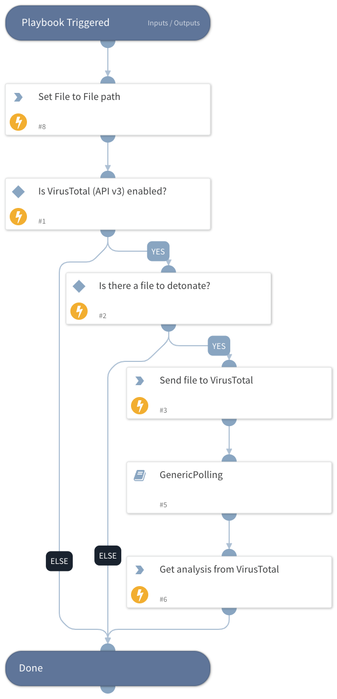

Detonate a file through VirusTotal (API v3)

## Dependencies
This playbook uses the following sub-playbooks, integrations, and scripts.

### Sub-playbooks
* GenericPolling

### Integrations
* VirusTotal (API v3)

### Scripts
* Set

### Commands
* vt-analysis-get
* file-scan

## Playbook Inputs
---

| **Name** | **Description** | **Default Value** | **Required** |
| --- | --- | --- | --- |
| File | Entry ID of the file to detonate | File | Required |

## Playbook Outputs
---

| **Path** | **Description** | **Type** |
| --- | --- | --- |
| VirusTotal.Analysis.data.attributes.stats.harmless | Number of engines found the indicator harmless. | number |
| VirusTotal.Analysis.data.attributes.stats.malicious | Number of engines found the indicator malicious. | number |
| VirusTotal.Analysis.data.attributes.stats.suspicious | Number of engines found the indicator suspicious. | number |
| VirusTotal.Analysis.data.attributes.stats.timeout | Number of engines found the indicator timeout. | number |
| VirusTotal.Analysis.data.attributes.stats.undetected | Number of engines found the indicator undetected. | number |
| VirusTotal.Analysis.data.attributes.date | Date of the analysis in epoch | number |
| VirusTotal.Analysis.data.attributes.status | Status of the analysis | string |
| VirusTotal.Analysis.meta.file_info.sha256 | SHA-256 of the file | string |
| VirusTotal.Analysis.meta.file_info.sha1 | SHA-1 of the file | string |
| VirusTotal.Analysis.meta.file_info.md5 | MD5 of the file | string |
| VirusTotal.Analysis.meta.file_info.name | name of the file | string |
| VirusTotal.Analysis.meta.file_info.size | Size of the file in bytes | number |
| VirusTotal.Analysis.meta.url_info.id | ID of the url | string |

## Playbook Image
---
