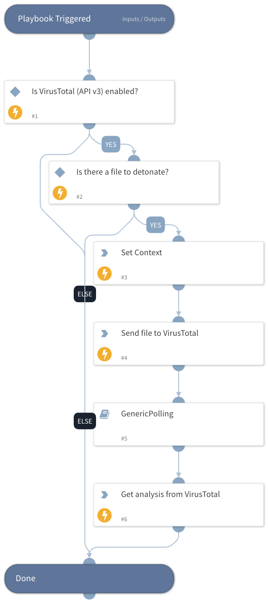

Detonate a private file through VirusTotal Private Scanning service

See files through the eyes of VirusTotal without uploading them to the main threat corpus, keeping them entirely private. Static, dynamic, network and similarity analysis included, as well as automated threat intel enrichment, but NOT multi-antivirus analysis.

More information: https://docs.virustotal.com/docs/private-scanning

Get Private Scanning: https://www.virustotal.com/gui/contact-us

## Dependencies
This playbook uses the following sub-playbooks, integrations, and scripts.

### Sub-playbooks
* GenericPolling

### Integrations
* VirusTotal (API v3)

### Scripts
* Set

### Commands
* vt-privatescanning-analysis-get
* vt-privatescanning-file-scan

## Playbook Inputs
---

| **Name** | **Description** | **Default Value** | **Required** |
| --- | --- | --- | --- |
| File | Private file to be uploaded to VirusTotal | File | Required |

## Playbook Outputs
---

| **Path** | **Description** | **Type** |
| --- | --- | --- |
| VirusTotal.Analysis.id | The analysis ID. | string |
| VirusTotal.Analysis.data.id | ID of the analysis. | string |
| VirusTotal.Analysis.data.type | Type of object (analysis). | string |
| VirusTotal.Analysis.data.attributes.threat_severity_level | Threat severity level of the private file. | string |
| VirusTotal.Analysis.data.attributes.popular_threat_category | Popular threat category of the private file. | string |
| VirusTotal.Analysis.data.attributes.threat_verdict | Threat verdict of the private file. | string |
| VirusTotal.Analysis.data.attributes.date | Date of the analysis in epoch | number |
| VirusTotal.Analysis.data.attributes.status | Status of the analysis | string |
| VirusTotal.Analysis.meta.file_info.sha256 | SHA-256 of the file | string |
| VirusTotal.Analysis.meta.file_info.sha1 | SHA-1 of the file | string |
| VirusTotal.Analysis.meta.file_info.md5 | MD5 of the file | string |
| VirusTotal.Analysis.meta.file_info.name | name of the file | string |
| VirusTotal.Analysis.meta.file_info.size | Size of the file in bytes | number |

## Playbook Image
---
