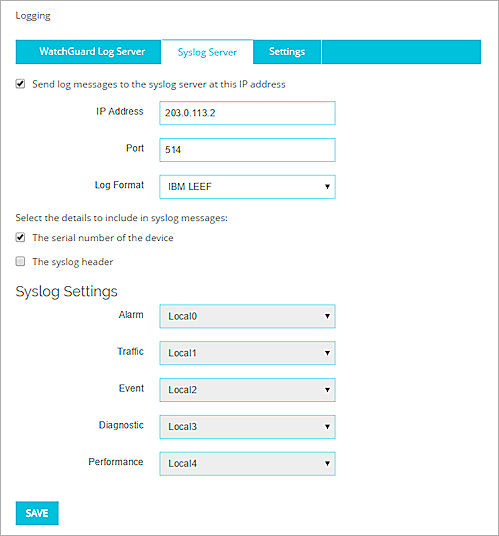

# Watchguard Firebox
This pack includes Cortex XSIAM content

# How to config to send syslog LEEF logs

1. Select **System** > **Logging**.
   The Logging page appears.
2. Click the **Syslog Server** tab.
3. Click the **Send log messages to the syslog server at this IP address** checkbox.
4. In the **IP Address** text box, type the IP address for the syslog.
5. In the **Port** text box, the default syslog server port (514) appears. To change the server port, type or select a different port for your server.
6. From the **Log Format** drop-down list, select **IBM LEEF**.

8. In the **Syslog Settings** section, for each type of log message, select a syslog facility from the drop-down list.
   If you select the IBM LEEF log format, you must select the syslog header checkbox before you can select the syslog facility for the log message types.
   For high-priority syslog messages, such as alarms, select **Local0**.
   To assign priorities for other types of log messages (lower numbers have greater priority), select **Local1–Local7**.
   To not send details for a message type, select **NONE**.
9. Click **Save**.

## Collect Events from Vendor
In order to use the collector, use the [Broker VM](#broker-vm) option.

### Broker VM
To create or configure the Broker VM, use the information described [here](https://docs-cortex.paloaltonetworks.com/r/Cortex-XDR/Cortex-XDR-Pro-Administrator-Guide/Configure-the-Broker-VM).

You can configure the specific vendor and product for this instance.

1. Navigate to **Settings** > **Configuration** > **Data Broker** > **Broker VMs**. 
2. Go to the apps tab and add the **Syslog** app. If it already exists, click the **Syslog** app and then click **Configure**.
3. Click **Add New**.
4. When configuring the Syslog Collector, set the following values:
   - vendor as vendor<- watchguard
   - product as product<- firebox