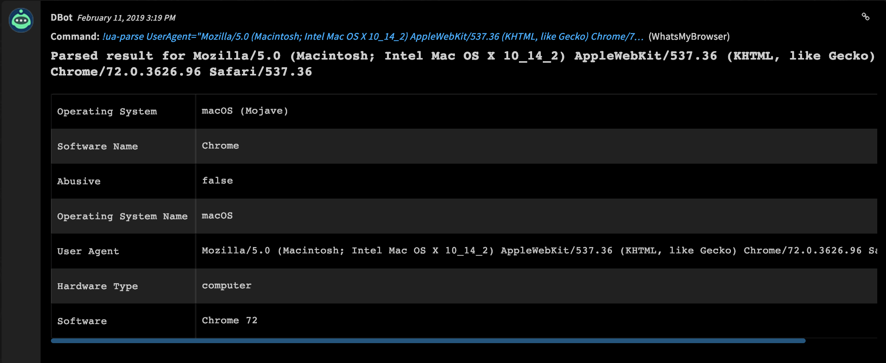

<!-- HTML_DOC -->

WhatIsMyBrowser parses user agent strings and gives insight into known user agents. For example, if the user agent string is malicious, WhatIsMyBrowser will indicate that the user agent is known to be malicious.

<h2 id="configure-whatsmybrowser-on-demisto">Configure WhatIsMyBrowser on Cortex XSOAR</h2>

<ol>
<li>Navigate to <strong>Settings</strong> &gt; <strong>Integrations</strong> &gt; <strong>Servers &amp; Services</strong>.</li>
<li>Search for WhatsMyBrowser.</li>
<li>Click <strong>Add instance</strong> to create and configure a new integration instance.
<ul>
<li>
<strong>Name</strong>: a textual name for the integration instance.</li>
<li>
<strong>API Key</strong>: your API key</li>
<li>
<strong>Use system proxy settings</strong>:</li>
<li><strong>Trust any certificate (insecure)</strong></li>
<li>
<strong>URL for WhatIsMyBrowser</strong>: The URL endpoint for the WhatIsMyBrowser</li>
</ul>
</li>
<li>Click <strong>Test</strong> to validate the URLs, token, and connection.</li>
</ol>

<h2 id="commands">Commands</h2>

You can execute these commands from the Cortex XSOAR CLI, as part of an automation, or in a playbook. After you successfully execute a command, a DBot message appears in the War Room with the command details.

<ol>
<li><a href="#parse-a-user-agent-string">Parse a User Agent string: ua-parse</a></li>
</ol>

<h3 id="parse-a-user-agent-string">1. Parse a User Agent string</h3>

Parses a User Agent string.

<h5 id="base-command">Base Command</h5>

<code>ua-parse</code>

<h5 id="input">Input</h5>

<table style="width: 749px;">
<thead>
<tr>
<th style="width: 287px;"><strong>Argument Name</strong></th>
<th style="width: 288px;"><strong>Description</strong></th>
<th style="width: 165px;"><strong>Required</strong></th>
</tr>
</thead>
<tbody>
<tr>
<td style="width: 287px;">UserAgent</td>
<td style="width: 288px;">User Agent string</td>
<td style="width: 165px;">Required</td>
</tr>
</tbody>
</table>

 

<h5 id="context-output">Context Output</h5>

<table style="width: 749px;">
<thead>
<tr>
<th style="width: 252px;"><strong>Path</strong></th>
<th style="width: 67px;"><strong>Type</strong></th>
<th style="width: 421px;"><strong>Description</strong></th>
</tr>
</thead>
<tbody>
<tr>
<td style="width: 252px;">UA.Parse.Software</td>
<td style="width: 67px;">string</td>
<td style="width: 421px;">Software extracted from UA string.</td>
</tr>
<tr>
<td style="width: 252px;">UA.Parse.SoftwareName</td>
<td style="width: 67px;">string</td>
<td style="width: 421px;">Software Name extracted from UA string.</td>
</tr>
<tr>
<td style="width: 252px;">UA.Parse.OperatingSystem</td>
<td style="width: 67px;">string</td>
<td style="width: 421px;">Operating System extracted from UA string.</td>
</tr>
<tr>
<td style="width: 252px;">UA.Parse.Abusive</td>
<td style="width: 67px;">boolean</td>
<td style="width: 421px;">Whether or not the UA has been identified as abusive.</td>
</tr>
<tr>
<td style="width: 252px;">UA.Parse.OperatingSystemName</td>
<td style="width: 67px;">string</td>
<td style="width: 421px;">Operating System Name extracted from UA string.</td>
</tr>
<tr>
<td style="width: 252px;">UA.Parse.UserAgent</td>
<td style="width: 67px;">string</td>
<td style="width: 421px;">User agent string.</td>
</tr>
<tr>
<td style="width: 252px;">UA.Parse.HardwareType</td>
<td style="width: 67px;">string</td>
<td style="width: 421px;">Hardware Type as extracted from UA string.</td>
</tr>
<tr>
<td style="width: 252px;">UA.Parse.HardwareSubType</td>
<td style="width: 67px;">string</td>
<td style="width: 421px;">Hardware Sub Type as extracted from UA string.</td>
</tr>
</tbody>
</table>

 

<h5 id="command-example">Command Example</h5>

<code>!ua-parse UserAgent="Mozilla/5.0 (Macintosh; Intel Mac OS X 10_14_2) AppleWebKit/537.36 (KHTML, like Gecko) Chrome/72.0.3626.96 Safari/537.36"</code>

<h5 id="context-example">Context Example</h5>

<pre>{
    "DBotScore": {
        "Vendor": "WhatIsMyBrowser",
        "Indicator": "Mozilla/5.0 (Macintosh; Intel Mac OS X 10_14_2) AppleWebKit/537.36 (KHTML, like Gecko) Chrome/72.0.3626.96 Safari/537.36",
        "Score": 1,
        "Type": "UserAgent"
    },
    "UA": {
        "Parse": {
            "Abusive": false,
            "HardwareType": "computer",
            "SoftwareName": "Chrome",
            "OperatingSystemName": "macOS",
            "UserAgent": "Mozilla/5.0 (Macintosh; Intel Mac OS X 10_14_2) AppleWebKit/537.36 (KHTML, like Gecko) Chrome/72.0.3626.96 Safari/537.36",
            "OperatingSystem": "macOS (Mojave)",
            "Software": "Chrome 72"
        }
    }
}

</pre>

<h5 id="human-readable-output">Human Readable Output</h5>

