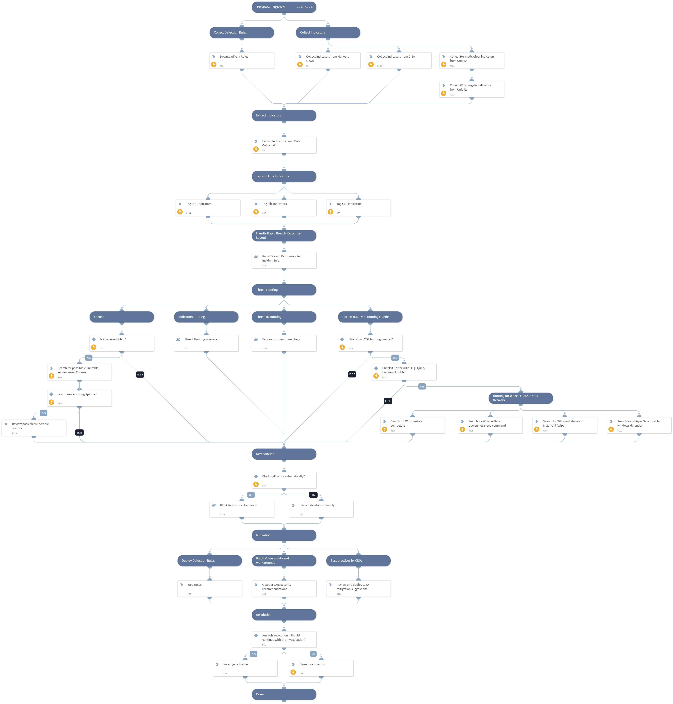

- On January 14th, 2022, reports began on a malware operation dubbed "WhisperGate" targeting multiple -organizations in Ukraine.

- On February 23, 2022, a new wiper malware known as "HermeticWiper" was disclosed by several cybersecurity researchers. The new wiper "HermeticWiper" was also being used against organizations in Ukraine.

CVE-2021-32648 vulnerability has a CVSS score of 9.1 and was found in octobercms, which is a CMS platform based on the Laravel PHP Framework. 
In affected versions of the october/system package an attacker can request an account password reset and then gain access to the account using a specially crafted request. 
The issue has been patched in Build 472 and v1.1.5.

**The playbook includes the following tasks:**
- Collect related known indicators from Unit 42, CISA and Malware News blog.
-  Search for possible vulnerable servers using Xpanse.
- Indicators and exploitation patterns hunting using PAN-OS, Cortex XDR and SIEM products.
- Block indicators automatically or manually.

**Mitigations:**
* October CMS security recommendations
* Deploy YARA detection Rules.

More information:
[UNIT42 Blog - Ongoing Russia and Ukraine Cyber Conflict](https://unit42.paloaltonetworks.com/ukraine-cyber-conflict-cve-2021-32648-whispergate/)
[Russia-Ukraine Cyberattacks: How to Protect Against Related Cyberthreats Including DDoS, HermeticWiper, Gamaredon and Website Defacement](https://unit42.paloaltonetworks.com/preparing-for-cyber-impact-russia-ukraine-crisis/)
[Microsoft Blog](https://www.microsoft.com/security/blog/2022/01/15/destructive-malware-targeting-ukrainian-organizations/)
[CVE-2021-32648 NVD](https://nvd.nist.gov/vuln/detail/CVE-2021-32648#vulnCurrentDescriptionTitle)

Note: This is a beta playbook, which lets you implement and test pre-release software. Since the playbook is beta, it might contain bugs. Updates to the pack during the beta phase might include non-backward compatible features. We appreciate your feedback on the quality and usability of the pack to help us identify issues, fix them, and continually improve.

## Dependencies

This playbook uses the following sub-playbooks, integrations, and scripts.

### Sub-playbooks

* Threat Hunting - Generic
* Panorama query threat logs
* Rapid Breach Response - Set Incident Info
* Block Indicators - Generic v2

### Integrations

This playbook does not use any integrations.

### Scripts

* IsIntegrationAvailable
* ParseHTMLIndicators
* http

### Commands

* extractIndicators
* closeInvestigation
* xdr-xql-generic-query
* createNewIndicator
* expanse-get-issues

## Playbook Inputs

---

| **Name** | **Description** | **Default Value** | **Required** |
| --- | --- | --- | --- |
| PlaybookDescription | The playbook description for Rapid Breach Response layout. | - On January 14th, 2022, reports began on a malware operation dubbed "WhisperGate" targeting multiple -organizations in Ukraine.  - On February 23, 2022, a new wiper malware known as "HermeticWiper" was disclosed by several cybersecurity researchers. The new wiper "HermeticWiper" was also being used against organizations in Ukraine.  CVE-2021-32648 vulnerability has a CVSS score of 9.1 and was found in octobercms, which is a CMS platform based on the Laravel PHP Framework.  In affected versions of the october/system package an attacker can request an account password reset and then gain access to the account using a specially crafted request.  The issue has been patched in Build 472 and v1.1.5.  **The playbook includes the following tasks:** - Collect related known indicators from Unit 42, CISA and Malware News blog. -  Search for possible vulnerable servers using Xpanse. - Indicators and exploitation patterns hunting using PAN-OS, Cortex XDR and SIEM products. - Block indicators automatically or manually.  **Mitigations:** * October CMS security recommendations * Deploy YARA detection Rules.  More information: [UNIT42 Blog - Ongoing Russia and Ukraine Cyber Conflict](https://unit42.paloaltonetworks.com/ukraine-cyber-conflict-cve-2021-32648-whispergate/) [Russia-Ukraine Cyberattacks: How to Protect Against Related Cyberthreats Including DDoS, HermeticWiper, Gamaredon and Website Defacement](https://unit42.paloaltonetworks.com/preparing-for-cyber-impact-russia-ukraine-crisis/) [Microsoft Blog](https://www.microsoft.com/security/blog/2022/01/15/destructive-malware-targeting-ukrainian-organizations/) [CVE-2021-32648 NVD](https://nvd.nist.gov/vuln/detail/CVE-2021-32648#vulnCurrentDescriptionTitle)  Note: This is a beta playbook, which lets you implement and test pre-release software. Since the playbook is beta, it might contain bugs. Updates to the pack during the beta phase might include non-backward compatible features. We appreciate your feedback on the quality and usability of the pack to help us identify issues, fix them, and continually improve. | Optional |
| BlockIndicatorsAutomatically | Whether to block the indicators automatically or not. | False | Optional |
| CollectedIndicatorsSeverity | The verdict of the collected indicators. Default is "Malicious".  Other options can be "Suspicious" and "Unknown". | Malicious | Optional |
| RelatedCVE | The WhisperGate malware related CVE. | CVE-2021-32648 | Optional |
| RunXQLHuntingQueries | Whether to perform XQL hunting queries. Default is "False". | False | Optional |

## Playbook Outputs

---
There are no outputs for this playbook.

## Playbook Image

---

