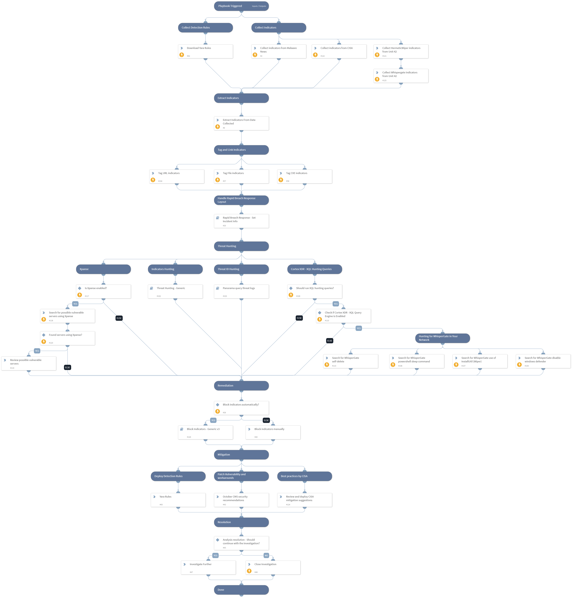

This pack is part of the [Rapid Breach Response](https://xsoar.pan.dev/marketplace/details/MajorBreachesInvestigationandResponse) pack.

On January 14th, 2022, reports began on a malware operation dubbed "WhisperGate" targeting multiple organizations in Ukraine.
CVE-2021-32648 vulnerability has a CVSS score of 9.1 and was found in octobercms, which is a CMS platform based on the Laravel PHP Framework. 
In affected versions of the october/system package an attacker can request an account password reset and then gain access to the account using a specially crafted request. 
The issue has been patched in Build 472 and v1.1.5.

**The playbook includes the following tasks:**
- Collect related known indicators from Malware News blog.
- Indicators hunting using PAN-OS and SIEM products.
- Search for possible vulnerable servers using Xpanse.
- Block indicators automatically or manually.

**Mitigations:**
* October CMS security recommendations.
* Deploy YARA detection Rules.

More information:
[UNIT42 Blog - Ongoing Russia and Ukraine Cyber Conflict](https://unit42.paloaltonetworks.com/ukraine-cyber-conflict-cve-2021-32648-whispergate/)
[Microsoft Blog](https://www.microsoft.com/security/blog/2022/01/15/destructive-malware-targeting-ukrainian-organizations/)
[CVE-2021-32648 NVD](https://nvd.nist.gov/vuln/detail/CVE-2021-32648#vulnCurrentDescriptionTitle)
[October security recommendation](https://github.com/octobercms/october/security/advisories/GHSA-mxr5-mc97-63rc)

Note: This is a beta playbook, which lets you implement and test pre-release software. Since the playbook is beta, it might contain bugs. Updates to the pack during the beta phase might include non-backward compatible features. We appreciate your feedback on the quality and usability of the pack to help us identify issues, fix them, and continually improve.

