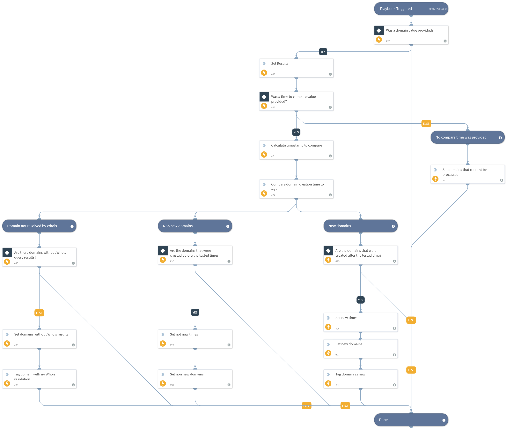

This playbook compares the domain creation time against a provided time value such as one month ago. The period can be configured within the playbook inputs MinimumAgeOfDomainMonths or MinimumAgeOfDomainHours. The playbook calculates the timestamp for the relevant period and compares it to the domain creation time value provided by Whois. The domains are outputted accordingly if they were created before or after the compared time, respectively.

## Dependencies
This playbook uses the following sub-playbooks, integrations, and scripts.

### Sub-playbooks
This playbook does not use any sub-playbooks.

### Integrations
This playbook does not use any integrations.

### Scripts
* TimeStampCompare
* Set
* GetTime

### Commands
* appendIndicatorField

## Playbook Inputs
---

| **Name** | **Description** | **Default Value** | **Required** |
| --- | --- | --- | --- |
| MinimumAgeMonthValue | The number of months that a domain must exist for it to be considered not new. For example, specifying the value 1 means that if the tested domain was registered less than a month ago, it will be considered a new domain. |  | Optional |
| MinimumAgeDayValue | The number of days that a domain must exist for it to be considered not new. Specifying the value 1 will mean that if the tested domain was registered less than one day ago, it will be considered a new domain. |  | Optional |
| MinimumAgeYearValue | The number of years that a domain must exist for it to be considered not new. Specifying the value 1 will mean that if the tested domain was registered less than one year ago, it will be considered a new domain. |  | Optional |
| WhoisResults | This input receives the Whois results from the parent playbook. |  | Optional |

## Playbook Outputs
---

| **Path** | **Description** | **Type** |
| --- | --- | --- |
| NewDomains | Domains whose create value is after the tested date. | string |
| NotNewDomains | Domains whose create value is before the tested date. | string |
| DomainsNotResolvedByWhois | Domains that could not be resolved by Whois. | string |
| DomainsNotProcessed | In case no time value to compare was provided, all domains will be outputted here. | string |

## Playbook Image
---
