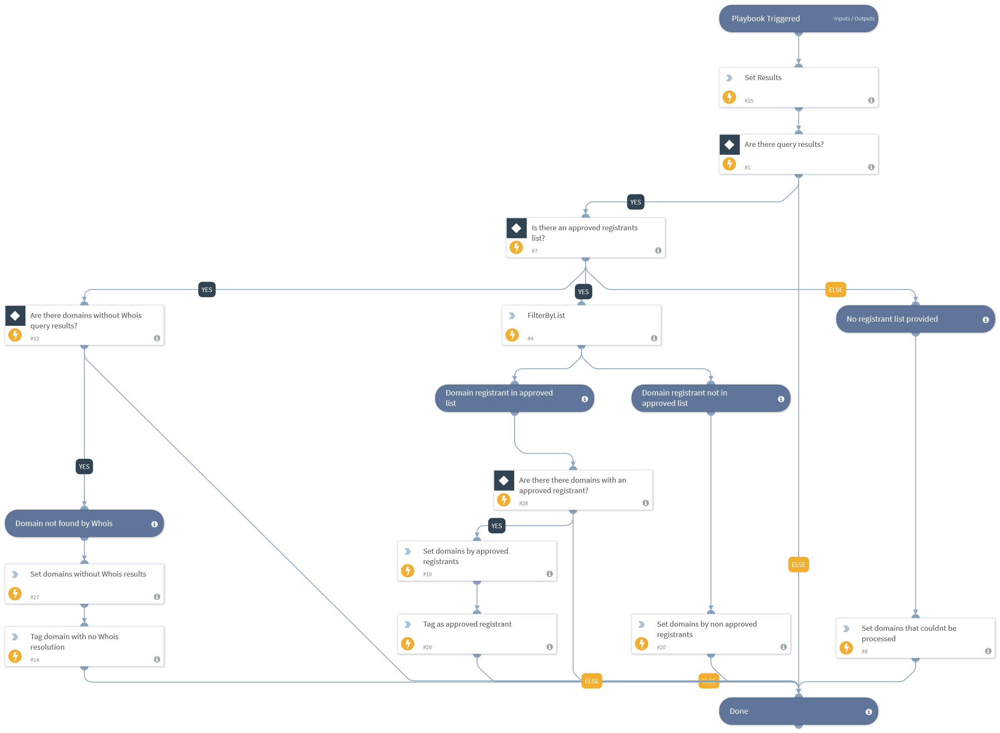

This playbook compares the domain registrant against the Cortex XSOAR list of approved registrants provided in the inputs. A registrant is the company or entity that owns the domain.

## Dependencies
This playbook uses the following sub-playbooks, integrations, and scripts.

### Sub-playbooks
This playbook does not use any sub-playbooks.

### Integrations
This playbook does not use any integrations.

### Scripts
* SetAndHandleEmpty
* Set
* FilterByList

### Commands
* appendIndicatorField

## Playbook Inputs
---

| **Name** | **Description** | **Default Value** | **Required** |
| --- | --- | --- | --- |
| Indicator Query | Indicators matching the indicator query will be used as playbook input |  | Optional |
| ApprovedregistrantsListName | The Cortex XSOAR list name that contains the approved registrars.  A registrant is the company or entity  that owns the domain. |  | Optional |
| RegistrantListDelimiter | A one-character string used to delimit fields. This must match the value that you defined in the list separator server configuration. The default value is a comma, however, as registrants might contain the "," character in their name, Cortex XSOAR recommends that you select a different delimiter. | , | Optional |
| WhoisResults | This input receives the Whois results from the parent playbook. |  | Optional |

## Playbook Outputs
---

| **Path** | **Description** | **Type** |
| --- | --- | --- |
| RegistrantDomainNotInList | Domains for which the registrant wasn't in the list. | string |
| RegistrantDomainInList | Domains for which the registrant was in the list. | string |
| DomainsNotResolvedByWhois | Domains which Whois wasn't able to resolve. | string |
| DomainsNotProcessed | In case no registrant list was provided all domains will be outputted to this context path. | string |

## Playbook Image
---
