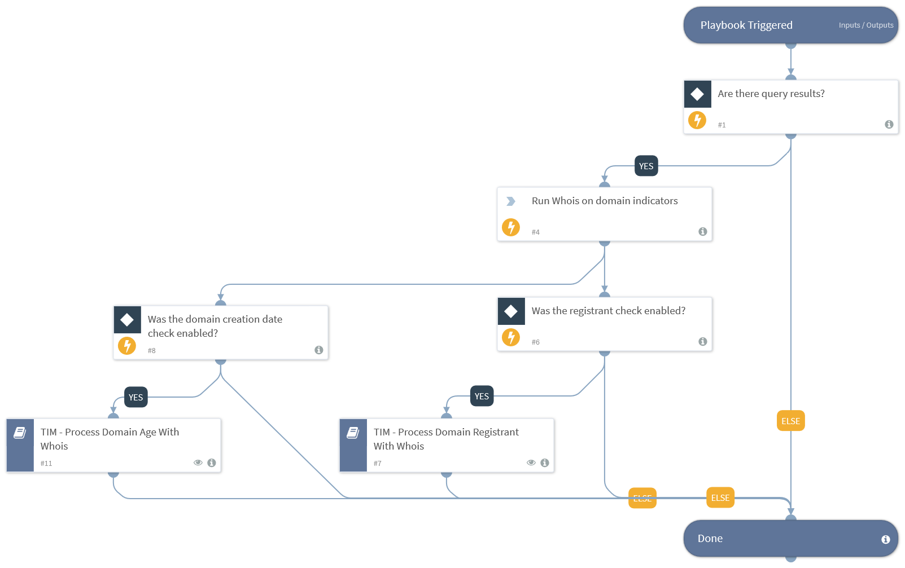

Whois is a powerful open source tool and protocol for querying details about a domain. Domain details that can be obtained include the domain registrant that owns the domain name, the registrar or service provider who registered the domain, the domain creation date and other metadata related to that domain.

This Whois content pack contains the Cortex XSOAR and Whois integration that executes the Whois command against the provided domains to provide relevant metadata for the domains. The ‘TIM - Process Domains With Whois’ playbook which accepts domain indicators provided by TIM feeds, contains two subplaybooks that perform tests on domains such as checking the domain registrant or domain age according to user specified inputs, and tagging the domain indicators accordingly.

##### What does this pack do?
The Integration included in this pack helps you run the Whois command for domains which provides valuable context and data on domains.
The playbooks included in this pack help you save time and automate repetitive tasks associated with investigating data related to Whois enrichment for domains such as:
Automating the process of getting domain registrant information and verifying if the registrant is part of the user’s approved list.
Automating the process of checking the domain registration age according to the predefined minimum age provided by the user.

##### Troubleshooting

###### `ip` command timeout
The ***ip*** command can timeout when there are excessive calls to the whois service, which rate limits these calls.
In that case, the default behavior is to try 3 times, with a 120 second wait between retries.
You can use the following arguments to mitigate this:
  - *rate_limit_retry_count* - Default: 3 times.
  - *rate_limit_wait_seconds* - Default: 120 seconds.
  - *rate_limit_errors_suppressed* - Default: False.

For more information, visit our  [Cortex XSOAR Developer Docs](https://xsoar.pan.dev/docs/reference/playbooks/tim---process-domains-with-whois)

