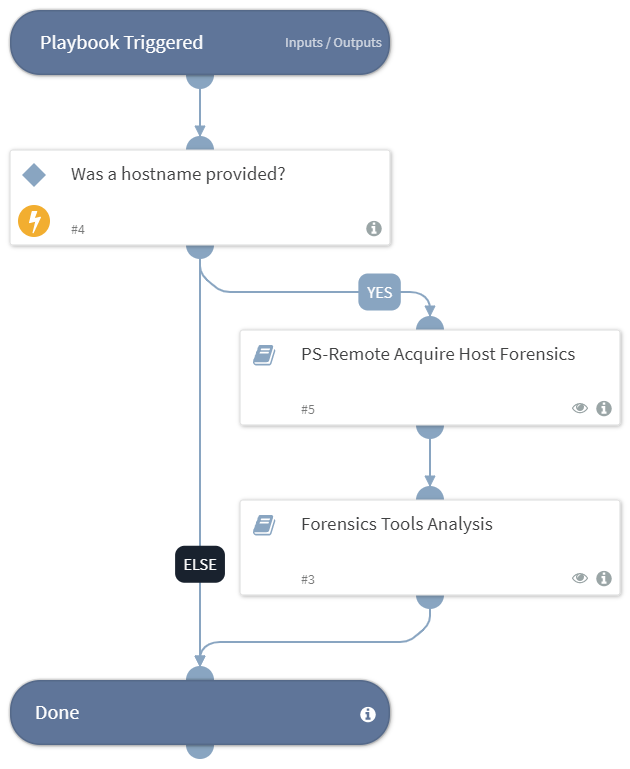

This playbook enables gathering forensic data from a host and analyzing the acquired data by using the relevant forensics automations.

## Dependencies
This playbook uses the following sub-playbooks, integrations, and scripts.

### Sub-playbooks
* Forensics Tools Analysis
* PS-Remote Acquire Host Forensics

### Integrations
This playbook does not use any integrations.

### Scripts
This playbook does not use any scripts.

### Commands
This playbook does not use any commands.

## Playbook Inputs
---

| **Name** | **Description** | **Default Value** | **Required** |
| --- | --- | --- | --- |
| Host | A single hostname or IP address from which to acquire the forensic data. For example, testpc01. |  | Optional |

## Playbook Outputs
---
There are no outputs for this playbook.

## Playbook Image
---

