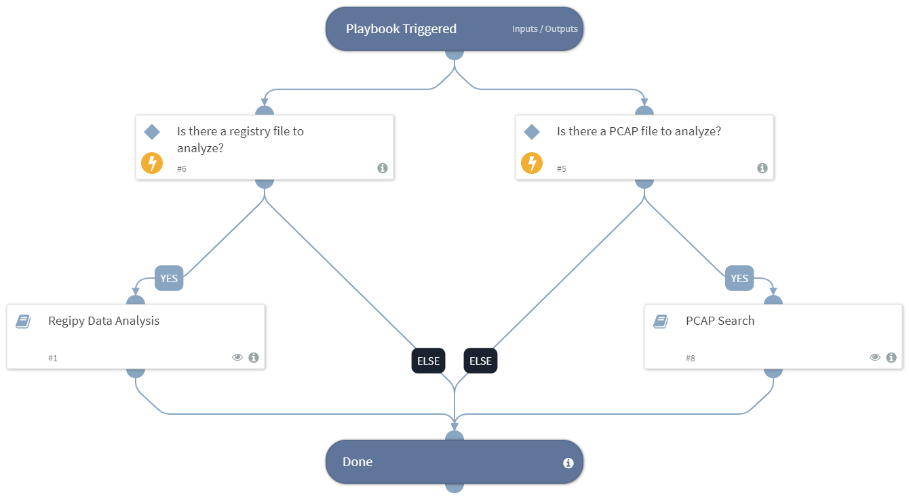

This playbook allows the user to analyze forensic evidence acquired from a host, such as registry files, memory dump files, and PCAP files.

## Dependencies
This playbook uses the following sub-playbooks, integrations, and scripts.

### Sub-playbooks
* Registry Parse Data Analysis
* PCAP Search

### Integrations
This playbook does not use any integrations.

### Scripts
This playbook does not use any scripts.

### Commands
This playbook does not use any commands.

## Playbook Inputs
---

| **Name** | **Description** | **Default Value** | **Required** |
| --- | --- | --- | --- |
| PcapEntryID | The entryid for the PCAP file to analyze. |  | Optional |
| RegistryEntryId | The entryid for the registry file to analyze. |  | Optional |

## Playbook Outputs
---
There are no outputs for this playbook.

## Playbook Image
---

