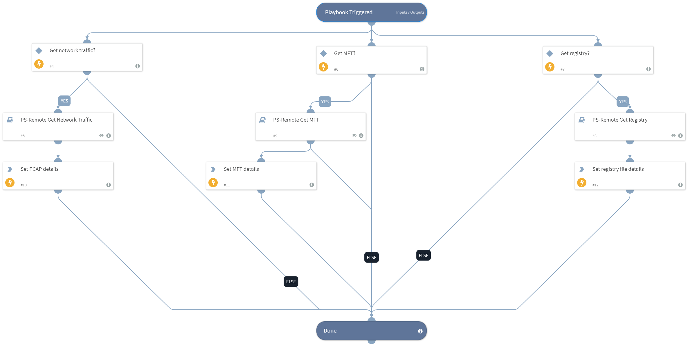

This playbook allows the user to gather multiple forensic data from a Windows endpoint, including network traffic, MFT (Master File Table), and registry export by using the PowerShell Remoting integration that enables connecting to a Windows host using just native Windows management tools. There is no need to install any 3rd-party tools.

## Dependencies
This playbook uses the following sub-playbooks, integrations, and scripts.

### Sub-playbooks
* PS-Remote Get Network Traffic
* PS-Remote Get Registry
* PS-Remote Get MFT

### Integrations
This playbook does not use any integrations.

### Scripts
* SetAndHandleEmpty

### Commands
This playbook does not use any commands.

## Playbook Inputs
---

| **Name** | **Description** | **Default Value** | **Required** |
| --- | --- | --- | --- |
| GetNetworkTraffic | This input specifies whether to capture network traffic on the host. | true | Optional |
| GetMft | This input specifies whether to acquire the MFT for the host. | true | Optional |
| GetRegistry | This input specifies whether to export the registry on the host. | true | Optional |
| Host | A single hostname or IP address for which to export the registry file. For example, testpc01. |  | Optional |

## Playbook Outputs
---

| **Path** | **Description** | **Type** |
| --- | --- | --- |
| PcapDetails | PCAP file details. | string |
| RegistryDetails | Registry file details. | string |
| MftDetails | MFT file details. | string |

## Playbook Image
---

