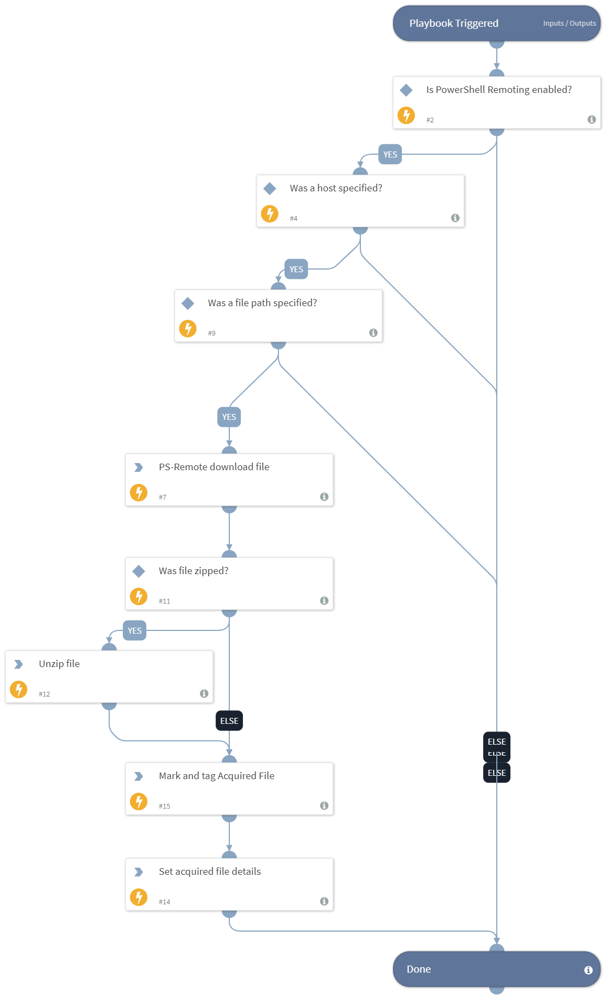

This playbook leverages the Windows built-in PowerShell and WinRM capabilities to connect to a Windows host to acquire a file as forensic evidence for further analysis.

## Dependencies
This playbook uses the following sub-playbooks, integrations, and scripts.

### Sub-playbooks
This playbook does not use any sub-playbooks.

### Integrations
This playbook does not use any integrations.

### Scripts
* UnzipFile
* IsIntegrationAvailable
* AddEvidence
* Set

### Commands
* ps-remote-download-file

## Playbook Inputs
---

| **Name** | **Description** | **Default Value** | **Required** |
| --- | --- | --- | --- |
| Host | A single hostname or IP address of the machine on which the file is located. For example, testpc01. |  | Optional |
| FilePath | The path on the hostname from which to retrieve the file.  For example, c:\\tmp\\test.txt. If you use the AddHostNameToFile input as true, the file downloaded to XSOAR will contain of the hostname. |  | Optional |
| ZipFile | Specify "true" to zip the MFT file before sending it to XSOAR. | true | Optional |
| AddHostNameToFile | Specify "true" for the name of the downloaded file to contain the hostname or "false" to keep the filename as configured in the FilePath argument. | true | Optional |

## Playbook Outputs
---

| **Path** | **Description** | **Type** |
| --- | --- | --- |
| AcquiredFile | The acquired file details. | string |
| File | The file to sample. | string |

## Playbook Image
---

