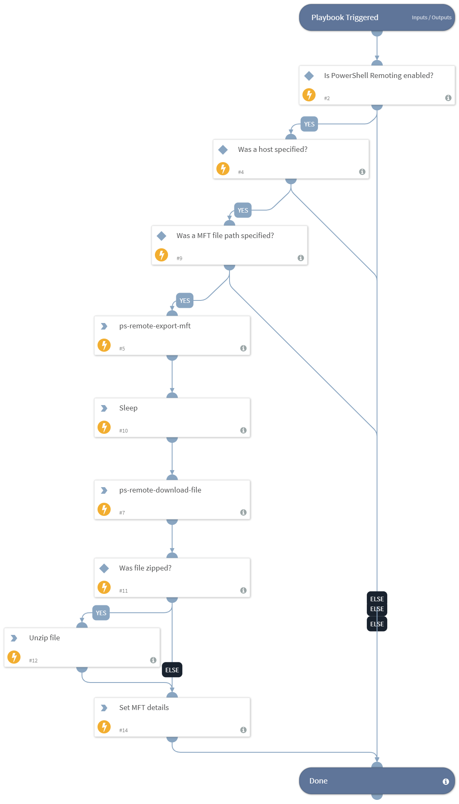

This playbook leverages the Windows built-in PowerShell and WinRM capabilities to connect to a Windows host to acquire and export the MFT (Master File Table) as forensic evidence for further analysis.

## Dependencies
This playbook uses the following sub-playbooks, integrations, and scripts.

### Sub-playbooks
This playbook does not use any sub-playbooks.

### Integrations
This playbook does not use any integrations.

### Scripts
* UnzipFile
* AddEvidence
* Set
* Sleep

### Commands
* ps-remote-export-mft
* ps-remote-download-file

## Playbook Inputs
---

| **Name** | **Description** | **Default Value** | **Required** |
| --- | --- | --- | --- |
| Host | A single hostname or IP address from which to export the registry file. For example, testpc01. |  | Optional |
| FilePath | The path on the hostname on which to create the MFT file. The default path will be c:\\mft.mft. If the AddHostNameToFile input is "true", the file downloaded to XSOAR will contain the hostname. | c:\mft.mft | Optional |
| VolumeForMft | The volume for which to create the MFT. The default is c.  | c | Optional |
| ZipMft | Specify "true" to zip the MFT file before sending it to XSOAR. | true | Optional |
| AddHostNameToFile | Specify "true" for the downloaded filename to be comprised of the hostname, or "false" to keep the filename as configured in the FilePath argument. | true | Optional |

## Playbook Outputs
---

| **Path** | **Description** | **Type** |
| --- | --- | --- |
| MftDetails | The MFT file details. | string |

## Playbook Image
---

