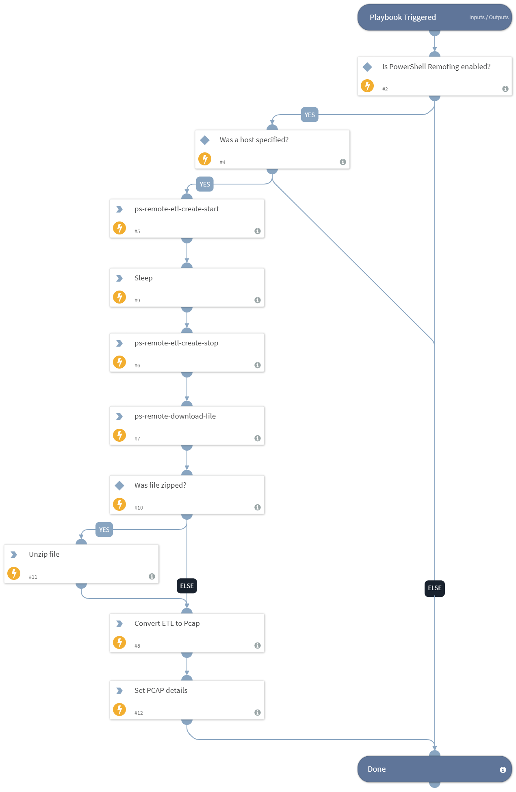

This playbook leverages the Windows built-in PowerShell and WinRM capabilities to connect to a Windows host. It then connects to the Netsh tool to create an ETL file which is the equivalent of a Wireshark PCAP file by using the PS-Remote integration. After receiving the resultant ETL, XSOAR will convert the ETL to a PCAP file to be parsed and enriched later. Review Microsoft documentation for how to use ETL filters (https://docs.microsoft.com/en-us/previous-versions/windows/it-pro/windows-server-2012-r2-and-2012/jj129382(v=ws.11)#using-filters-to-limit-etl-trace-file-details).

## Dependencies
This playbook uses the following sub-playbooks, integrations, and scripts.

### Sub-playbooks
This playbook does not use any sub-playbooks.

### Integrations
This playbook does not use any integrations.

### Scripts
* Etl2Pcap
* AddEvidence
* IsIntegrationAvailable
* UnzipFile
* Sleep
* Set

### Commands
* ps-remote-download-file
* ps-remote-etl-create-stop
* ps-remote-etl-create-start

## Playbook Inputs
---

| **Name** | **Description** | **Default Value** | **Required** |
| --- | --- | --- | --- |
| Host | A single hostname or IP address from which to create the ETL file. For example, testpc01. |  | Optional |
| EtlSizeLimit | The maximum file size in MB for the ETL. Once the file reached this size the capute will stop. For example, 10MB. | 10 | Optional |
| EtlPath | The path on the hostname on which to create the ETL file. The default path will be c:\\etl.etl. If the AddHostNameToFile input is "true", the file downloaded to XSOAR will contain the hostname. | c:\etl.etl | Optional |
| EtlFilter | The filter to apply when creating the ETL file. For example, IPv4.Address=1.1.1.1 will capture traffic just from the 1.1.1.1 IP address. If no filter is specified, all traffic will be recorded. |  | Optional |
| ETlTimeToRecord | The time to record in seconds. | 60 | Optional |
| ZipEtl | Specify "true" to zip the ETL file before sending it to XSOAR. | true | Optional |
| AddHostNameToFile | Specify "true" for the downloaded filename to contain the hostname, or "false" to keep the filename as configured in the FilePath argument. | true | Optional |

## Playbook Outputs
---

| **Path** | **Description** | **Type** |
| --- | --- | --- |
| PcapDetails | The PCAP file details. | string |

## Playbook Image
---

