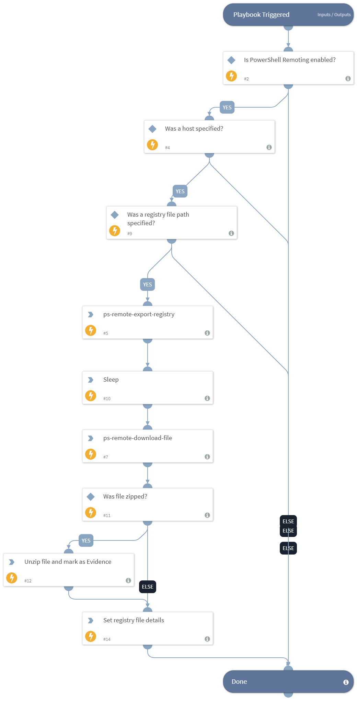

This playbook leverages the Windows built-in PowerShell and WinRM capabilities to connect to a Windows host to acquire and export the registry as forensic evidence for further analysis. The capture can be for the entire registry or for a specific hive or path.

## Dependencies
This playbook uses the following sub-playbooks, integrations, and scripts.

### Sub-playbooks
This playbook does not use any sub-playbooks.

### Integrations
This playbook does not use any integrations.

### Scripts
* AddEvidence
* Set
* Sleep
* UnzipFile
* IsIntegrationAvailable

### Commands
* ps-remote-download-file
* ps-remote-export-registry

## Playbook Inputs
---

| **Name** | **Description** | **Default Value** | **Required** |
| --- | --- | --- | --- |
| Host | A single hostname or IP address from which to export the registry file. For example, testpc01. |  | Optional |
| RegistryHive | The registry hive/path to export. If no value is specified, the entire registry will be exported. | all | Optional |
| FilePath | The path on the hostname on which to create the registry file. The default path will be c:\\registry.reg. If the AddHostNameToFile input is "true", the file downloaded to XSOAR will contain the hostname. | c:\registry.reg | Optional |
| ZipRegistry | Specify "true" to zip the reg file before sending it to XSOAR. | true | Optional |
| AddHostNameToFile | Specify "true" for the downloaded filename to contain the hostname, or "false" to keep the filename as configured in the FilePath argument. | true | Optional |

## Playbook Outputs
---

| **Path** | **Description** | **Type** |
| --- | --- | --- |
| RegistryDetails | The registry file details. | string |

## Playbook Image
---

