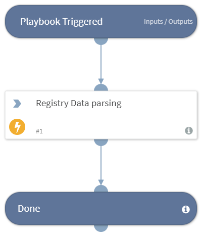

Note: This is a beta pack, which lets you implement and test pre-release software. Since the pack is beta, it might contain bugs. Updates to the pack during the beta phase might include non-backward compatible features. We appreciate your feedback on the quality and usability of the pack to help us identify issues, fix them, and continually improve.

One of the most common issues when investigating an incident on a Windows host is how to acquire the forensic evidence as quickly as possible as the incident occurs. An analyst may need to login or remotely deploy an agent or applications such as Wireshark or begin copying files from the host. Often the investigation will take place after the malware was already executed and evidence was deleted.

##### What does this pack do?
This pack provides an easy, quick, and agentless method to acquire forensic data from Windows hosts by leveraging built-in capabilities within Windows such as Winrm and PowerShell as the infrastructure and multiple other Windows built-in capabilities for creating the evidence.
The common use cases we cover in this pack are acquiring a network capture file from a host, acquiring the MFT (Master File Table) and the hosts registry. Once the objects are created, we upload them to XSOAR and analyze them accordingly.

The pack includes: 
- The ETL2PCAP automation that converts ETL files (Windows native traffic recording format) to PCAP files that can be opened in Wireshark or XSOAR’s PCAP miner tool.
- The Registry Parse automation which allows you to parse registry hives in order to extract common data or specific data provided by the user.
- Multiple playbooks for acquiring, parsing, and analyzing data from Windows hosts.

As part of this pack, you will also get the out-of-the-box forensics incident type and a layout. These are easily customizable to suit the needs of your organization.

For more information, visit our  [Cortex XSOAR Developer Docs](https://xsoar.pan.dev/docs/reference/playbooks/ps-remote-acquire-host-forensics)

