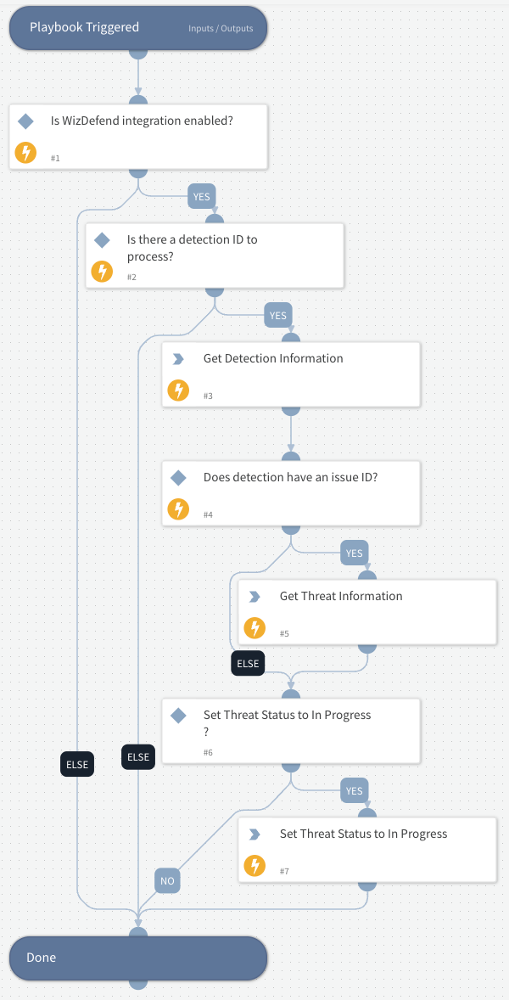

# Assess Wiz Detections

This playbook provides a structured workflow for assessing and investigating Wiz Detections that come from the WizDefend integration.

## Dependencies
This playbook uses the following sub-playbooks, integrations, and scripts.

### Sub-playbooks
This playbook does not use any sub-playbooks.

### Integrations
* WizDefend

### Scripts
* SetIncident

### Commands
* wiz-get-detection
* wiz-get-detections

## Playbook Inputs
---
There are no inputs for this playbook.

## Playbook Outputs
---
There are no outputs for this playbook.

## Playbook Image
---

## Workflow
1. Gets detailed information about the detection using the detection ID
2. Gathers additional related detections using the resource ID
3. Ensures the detection URL is properly set in the incident data
4. Guides the analyst through impact assessment
5. Provides guidance for assigning an appropriate owner
6. Structures the documentation of investigation findings