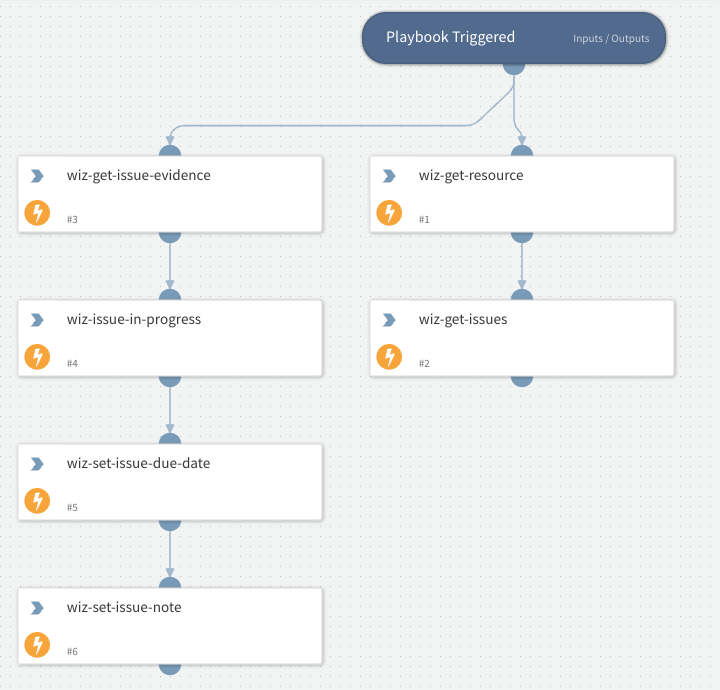

Example basic Playbook to assess Wiz Issues

## Dependencies
This playbook uses the following sub-playbooks, integrations, and scripts.

### Sub-playbooks
This playbook does not use any sub-playbooks.

### Integrations
* Wiz

### Scripts
This playbook does not use any scripts.

### Commands
* wiz-get-resource
* wiz-set-issue-note
* wiz-issue-in-progress
* wiz-get-issue-evidence
* wiz-get-issues
* wiz-set-issue-due-date

## Playbook Inputs
---
There are no inputs for this playbook.

## Playbook Outputs
---
There are no outputs for this playbook.

## Playbook Image
---
