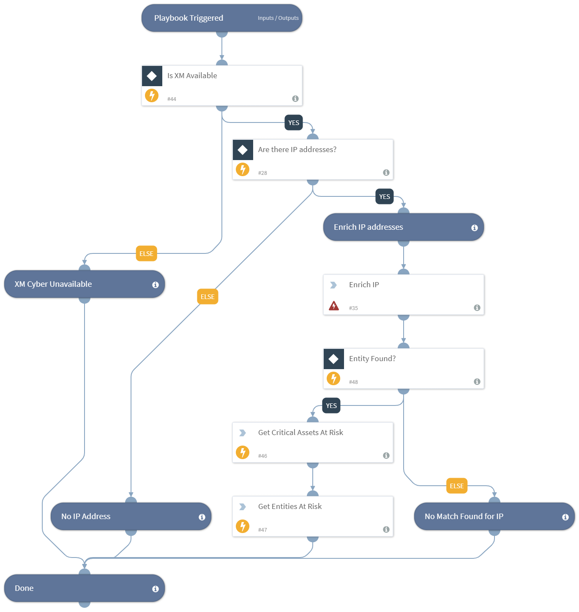

Enrich an endpoint by IP addresses using XM Cyber integration.
- Resolve IP address to entity
- Get entity information for IP addresses regarding impact on critical assets and complexity of compromise

## Dependencies
This playbook uses the following sub-playbooks, integrations, and scripts.

### Sub-playbooks
This playbook does not use any sub-playbooks.

### Integrations
* XMCyber

### Scripts
* IsIntegrationAvailable

### Commands
* xmcyber-enrich-from-ip
* xmcyber-affected-entities-list
* xmcyber-affected-critical-assets-list

## Playbook Inputs
---

| **Name** | **Description** | **Default Value** | **Required** |
| --- | --- | --- | --- |
| IP | The IP address to enrich. | IP.Address | Optional |

## Playbook Outputs
---

| **Path** | **Description** | **Type** |
| --- | --- | --- |
| Endpoint | The endpoint's object. | unknown |
| Endpoint.Hostname | The hostname to enrich. | string |
| Endpoint.IP | A list of endpoint IP addresses. | string |
| Endpoint.OS | OS of the device corresponding to the IP | string |
| XMCyber.Entity.isAsset | Entity is a critical asset | boolean |
| XMCyber.Entity.affectedEntities | Number of unique entities at risk from this entity | number |
| XMCyber.Entity.averageComplexity | Average complexity to compromise this entity | number |
| XMCyber.Entity.criticalAssetsAtRisk | Number of unique critical assets at risk from this entity | number |
| XMCyber.Entity.averageComplexityLevel | Level of the average complexity to compromise this entity | string |
| XMCyber.Entity.type | Entity Type | string |
| XMCyber.Entity.entitiesAtRiskList | Entities at risk from this entity | unknown |
| XMCyber.Entity.criticalAssetsAtRiskList | Critical assets at risk from this entity | unknown |

## Playbook Image
---

