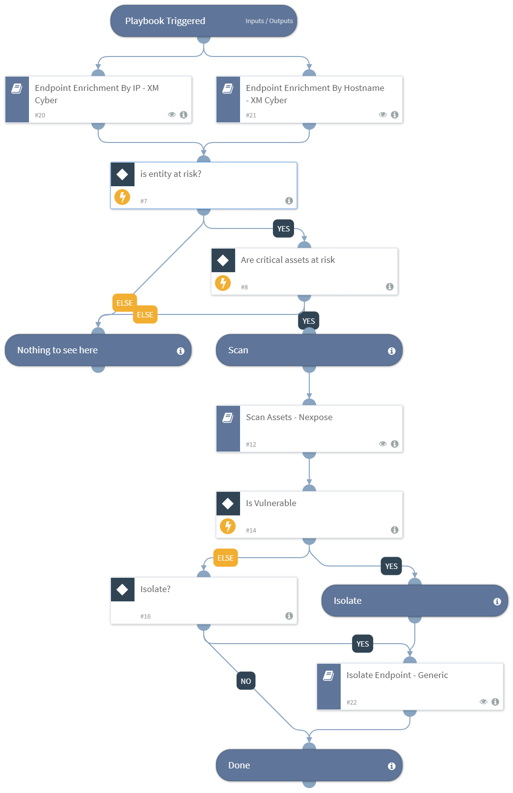

An example of playbook using data from XM Cyber to help decide about scanning and isolating a threat

## Dependencies
This playbook uses the following sub-playbooks, integrations, and scripts.

### Sub-playbooks
* Isolate Endpoint - Generic V2
* Endpoint Enrichment By Hostname - XM Cyber
* Endpoint Enrichment By IP - XM Cyber
* Scan Assets - Nexpose

### Integrations
This playbook does not use any integrations.

### Scripts
This playbook does not use any scripts.

### Commands
This playbook does not use any commands.

## Playbook Inputs
---
There are no inputs for this playbook.

## Playbook Outputs
---

| **Path** | **Description** | **Type** |
| --- | --- | --- |
| Traps.IsolateResult.Status | The status of the isolation operation. | string |
| Nexpose.Scan.Status | The scan status. Valid values are aborted, unknown, running, finished, stopped, error, paused, dispatched, integrating | string |
| Nexpose.Scan.Assets | The number of assets found in the scan | number |
| Nexpose.Scan.Vulnerabilities.Total | The total number of vulnerabilities. | number |
| XMCyber.Entity.isAsset | Entity is a critical asset | boolean |
| XMCyber.Entity.averageComplexityLevel | Level of the average complexity to compromise this entity | string |
| XMCyber.Entity.criticalAssetsAtRisk | Number of unique critical assets at risk from this entity | number |

## Playbook Image
---
