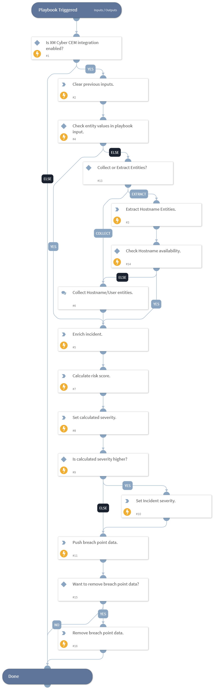

This playbook enriches the incident using the hostname indicators and user data and increases the severity based on the calculated risk score and pushes breach points of the identified entities to XM Cyber.

## Dependencies

This playbook uses the following sub-playbooks, integrations, and scripts.

### Sub-playbooks

This playbook does not use any sub-playbooks.

### Integrations

This playbook does not use any integrations.

### Scripts

* DeleteContext
* Set

### Commands

* findIndicators
* setIncident
* xmcyber-calculate-risk-score
* xmcyber-enrich-incident
* xmcyber-push-breach-point
* xmcyber-remove-breach-point

## Playbook Inputs

---

| **Name** | **Description** | **Default Value** | **Required** |
| --- | --- | --- | --- |
| entity_values | Specify the hostname or user entity. Supports comma separated values. |  | Optional |
| compromise_risk_score | Specify the weight of Compromise Risk Score to apply to the final score calculation. Provide the value between 0 and 1. | 0.5 | Optional |
| choke_point_score | Specify the weight of Choke Point Score to apply to the final score calculation. Provide the value between 0 and 1. | 0.5 | Optional |
| attribute_name | The name of the custom label you want to push to CEM as an imported attribute. | XSOAR_BP | Optional |
| parameter | When setting up the condition for when to push the breach point data, this is the parameter of the condition. It is a list of predefined parameters for determining the criteria. Select "All" to apply the breach point label to all entities.  Possible values are: All, Entity ID, Affected Unique Entities, Compromise Risk Score, Choke Point Score, Labels, Domain Name, Is Enabled, Last Login Date, Last Password Set Date. | All | Optional |
| operator | When setting up the condition for when to push the breach point data, this is the operator of the condition.  Possible values are: Less than, Greater than, Less than equal to, Greater than equal to, Equals, Not equal to, Contains, Not Contains. | Equals | Optional |
| value | When setting up the condition for when to push the breach point data, this is the value of the condition. Can be boolean, string, integer, float, or date values.  Supported date formats: 2 minutes, 2 hours, 2 days, 2 weeks, 2 months, 2 years, yyyy-mm-dd, yyyy-mm-ddTHH:MM:SSZ.  For example: 01 Dec 2025, 01 Dec 2025 04:45:33, 2025-12-10T14:05:44Z. | True | Optional |

## Playbook Outputs

---
There are no outputs for this playbook.

## Playbook Image

---

