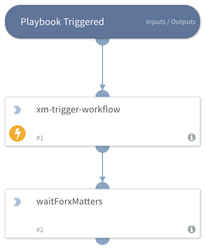

Trigger an xMatters workflow to notify a user for a response.

## Dependencies
This playbook uses the following sub-playbooks, integrations, and scripts.

### Sub-playbooks
This playbook does not use any sub-playbooks.

### Integrations
* xMatters

### Scripts
This playbook does not use any scripts.

### Commands
* xm-trigger-workflow

## Playbook Inputs
---
There are no inputs for this playbook.

## Playbook Outputs
---
There are no outputs for this playbook.

## Playbook Image
---

