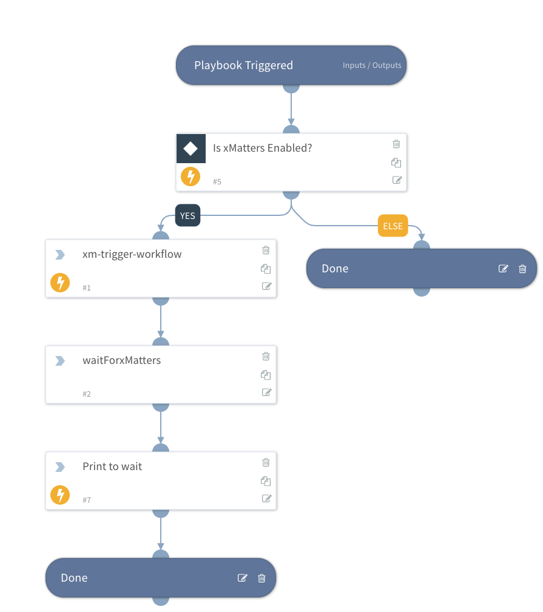

Trigger an xMatters workflow to notify a user for a response. This playbook would be used as a sub-playbook to notify an xMatters Group or User and then wait for a response. The user's response is passed as an output to the playbook for use in a parent playbook for branching. 

See the `xMatters - Example Conditional Actions` playbook for an example.

## Dependencies
* xMatters

### Sub-playbooks
This playbook does not use any sub-playbooks.

### Integrations
* xMatters

### Scripts
This playbook does not use any scripts.

### Commands
* xm-trigger-workflow

## Playbook Inputs

| **Name** | **Description** | **Default Value** | **Required** |
| --- | --- | --- | --- |
| recipients | A comma separated list of Groups or Users to target for a notification |  | Optional |
| subject | A brief summary of the reason to notify |  | Optional |
| body | Detailed description of the reason to notify |  | Optional |
| incident_id | The related incident_id | | Optional | 

## Playbook Outputs

| **Name** | **Description** |
| --- | --- | 
| xMatters.UserResponse | The user's response | 
| xMatters.RequestId | The requestId of the request to xMatters. This can be used for troubleshooting. |

## Playbook Image

