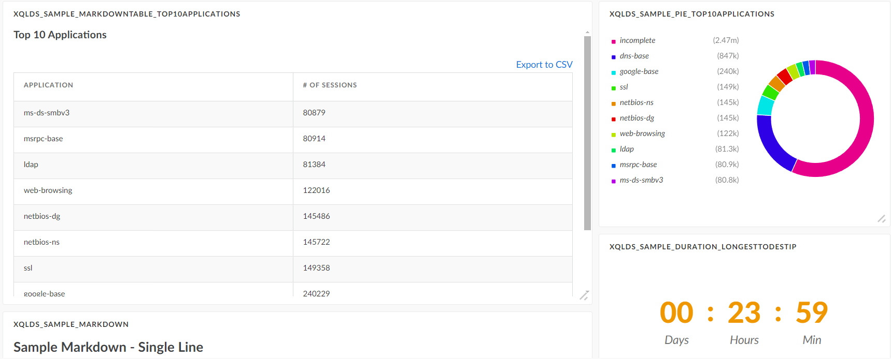
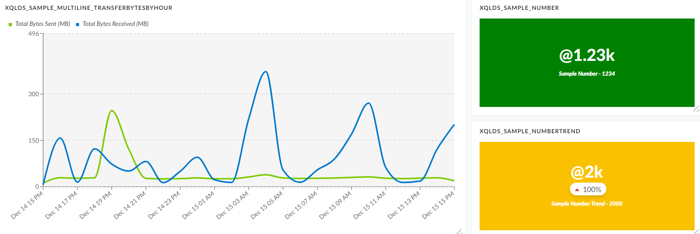
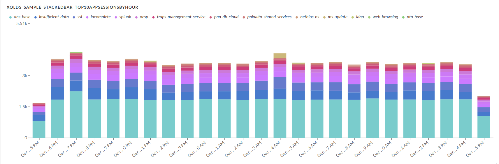

This pack helps you easily implement a script for the General Purpose Dynamic Section to display a graph or table widget based on the results of an XQL query.

# What does this pack do?

This pack provides a helper script, along with some sample scripts and templates, that runs an XQL query and creates an entry for the General Purpose Dynamic Section to display a graph or table widget based on the results.
The supported widget types are:

* Markdown Table
* Markdown Text
* Pie Chart
* Line Chart (Single-line/Multi-line)
* Single Bar
* Stacked bar
* Duration
* Number
* Number Trend

