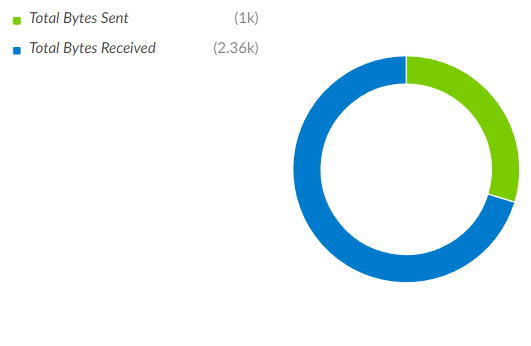

Run an XQL query and creates an entry for the General Purpose Dynamic Section to display a graph or table widget based on the results.
The query is executed by the `xdr-xql-generic-query` command.


## Script Data
---

| **Name** | **Description** |
| --- | --- |
| Script Type | python3 |
| Tags | Utility |


## Inputs
---

| **Argument Name** | **Description** |
| --- | --- |
| templates_type | The type of the templates data. |
| template_name | The name of a template to choose it from 'templates'. |
| templates | A list of templates to choose from for building an entry. |
| base_time | The base time for the relative time provided to earliest_time or latest_time \(The default is the first available value from the following: alert.occurred, incident.occurred, alert.created, incident.created, now\). |
| round_time | The value \(in seconds\) used to round down the base time \(Default = 0\). |
| earliest_time | The earliest time at which the time range of the query starts \(Default = 24 hours ago\). |
| latest_time | The latest time at which the time range of the query ends \(Default = now\). |
| variable_substitution | The pair of default opening and closing markers that enclose a variable name \(Default = $\{,\}\). |
| cache_type | The name of the type that defines which data is stored and retrieved from the cache to create the entry \(Default = dataset\). |
| max_retries | The maximum number of retries to query XQL for recoverable errors \(Default = 10\). |
| retry_interval | The wait time \(in seconds\) between retries \(Default = 10\). |
| polling_interval | The polling interval \(in seconds\) to wait for results \(Default = 10\). |
| xql_query_instance | The name of the integration instance to execute xdr-xql-generic-query. |


## Outputs
---

| **Path** | **Description** | **Type** |
| --- | --- | --- |
| XQLDSHelper.QueryParams | The query parameters. | unknown |
| XQLDSHelper.QueryHash | The hash value of the query parameters. | string |
| XQLDSHelper.Entry | The entry data for the general dynamic section. | unknown |


## Structure of the templates
---

The data provided to `templates` depends on the parameter specified in `templates_type`.

 - templates_type: `raw`
   * Specifies the list of templates directly. The details will be provided later.

 - templates_type: `list`
   * Specifies the name of a list managed in the `Lists` of Cortex XSIAM/XSOAR. The list of templates is retrieved from it.


The list of templates must be either a dictionary or a serialized JSON string.
It can contain multiple templates, and a summary of the structure is provided below.

```
{
  <template_name>: <template>,
  :
}
```

A template must be a dictionary node with two mandatory dictionary nodes (`query` and `entry`) and an optional dictionary node (`config`).
The summary of the template structure in the templates is provided below.

```
{
  <template_name>: {
    "config": {
      "variable_substitution": {
        "opening": "<opening marker>",
        "closing": "<closing marker>"
      }
    },
    "query": {
      "xql": "<query string>",
      "command": {
        "name": "<command name>",
        "using": "<instance name>"
      },
      "time_range": {
        "round_time": "<round time>"
      }
    },
    "entry": {
      "type": "<widget type>",
      "<widget type>": <widget type dependent data>
    }
  }
  :
}
```

### Node: config
---
| **Path** | **Description** | **Type** |
| --- | --- | --- |
| .config.variable_substitution.opening | [Optional] The opening marker of the enclosure for variable substitution. It overrides the opening marker specified in the `variable_substitution` parameter of the arguments. | String |
| .config.variable_substitution.closing | [Optional] The closing marker of the enclosure for variable substitution. It overrides the opening marker specified in the `variable_substitution` parameter of the arguments. | String |


### Node: query
---
| **Path** | **Description** | **Type** |
| --- | --- | --- |
| .query.xql | The XQL query string to retrieve the record set to create an entry. [Variable Substitution](#Variable-Substitution) is supported. | String |
| .query.command.using | [Optional] The name of the integration instance to execute the XQL query command. It overrides `xql_query_instance` in the argument parameters. | String |
| .query.time_range.round_time | [Optional] The value (in seconds) used to round down the base time. It overrides `round_time` in the argument parameters. | String or Number |


### Node: entry
---
| **Path** | **Description** | **Type** |
| --- | --- | --- |
| .entry.type | The name of the entry type, which must be one of the following: `markdown`, `markdown-table`, `number`, `number-trend`, `pie`, `line`, `single-bar`, `stacked-bar` or `duration`. | String |
| .entry.markdown | [Entry-dependent parameters] This node is required only when `markdown` is set in `.entry.type`. | Dict |
| .entry.markdown-table | [Entry-dependent parameters] This node is required only when `markdown-table` is set in `.entry.type`. | Dict |
| .entry.number | [Entry-dependent parameters] This node is required only when `number` is set in `.entry.type`. | Dict |
| .entry.number-trend | [Entry-dependent parameters] This node is required only when `number-trend` is set in `.entry.type`. | Dict |
| .entry.pie | [Entry-dependent parameters] This node is required only when `pie` is set in `.entry.type`. | Dict |
| .entry.line | [Entry-dependent parameters] This node is required only when `line` is set in `.entry.type`. | Dict |
| .entry.single-bar | [Entry-dependent parameters] This node is required only when `single-bar` is set in `.entry.type`. | Dict |
| .entry.stacked-bar | [Entry-dependent parameters] This node is required only when `stacked-bar` is set in `.entry.type`. | Dict |
| .entry.duration | [Entry-dependent parameters] This node is required only when `duration` is set in `.entry.type`. | Dict |

The `.entry.type` specifies the type of the entry, as shown below.

| **Entry Type** | **Entry** | **Image** |
| --- | --- | --- |
| markdown | Markdown |  |
| markdown-table | Markdown Table |  |
| number | Number |  |
| number-trend | Number Trend |  |
| pie | Pie Chart |  |
| line | Line Chart |  |
| single-bar | Single-Bar Chart |  |
| stacked-bar | Stacked-Bar Chart |  |
| duration | Time duration |  |

This node supports [Variable Substitution](#Variable-Substitution) for all parameters.


#### Node: entry.markdown
---
| **Path** | **Description** | **Type** |
| --- | --- | --- |
| .test | The markdown text to display. | String |
| .default | [Optional] The default entry applied when no record set is returned. If not specified, an empty string will be applied. | String or Dict |

A sample structure of `markdown` in an entry node is shown below.

```
"entry": {
  "type": "markdown",
  "markdown": {
    "text": "## ${.dataset=>val[0].text}",
    "default": "## No data"
  }
}
```


#### Node: entry.markdown-table
---
| **Path** | **Description** | **Type** |
| --- | --- | --- |
| .title | [Optional] The title of the markdown table. | String |
| .sort.by | [Optional] The name of the field by which to sort the record set. | String |
| .sort.order | [Optional] The sort order. Specifies either `asc` (default) for ascending or `desc` for descending. | String |
| .columns | [Optional] A list of table columns in the specified order. If not specified, all fields in the record set are displayed in the table. | List |
| .columns.field | [Optional] The name of the field used to display the field value. | String |
| .columns.label | [Optional] The label for the column. If not specified, the field name is used as the label. | String |
| .default | [Optional] The default entry applied when no record set is returned. If not specified, an empty string will be applied. | String or Dict |


A sample structure of `markdown-table` in an entry node is shown below.

```
"entry": {
  "type": "markdown-table",
  "markdown-table": {
    "title": "Top 10 Applications",
    "sort": {
      "by": "count",
      "order": "asc"
    },
    "columns": [
      {
        "field": "app",
        "label": "Application"
      },
      {
        "field": "count",
        "label": "# of sessions"
      }
    ],
    "default": "## No data"
  }
}
```

That is intended to create a table of the top 10 applications from the record set, as shown below, retrieved by the XQL query.

| **app** | **count** |
| --- | --- |
| netbios-dg | 145486 |
| msrpc-base | 80914 |
| web-browsing | 122016 |
| incomplete | 2479222 |
| ldap | 81384 |
| dns-base | 847200 |
| netbios-ns | 145722 |
| ms-ds-smbv3 | 80879 |
| ssl | 149358 |
| google-base | 240229 |

The table will be created as shown below:

**Top 10 Applications**
| **Application** | **# of sessions** |
| --- | --- |
| ms-ds-smbv3 | 80879 |
| msrpc-base | 80914 |
| ldap | 81384 |
| web-browsing | 122016 |
| netbios-dg | 145486 |
| netbios-ns | 145722 |
| ssl | 149358 |
| google-base | 240229 |
| dns-base | 847200 |
| incomplete | 2479222 |


#### Node: entry.number
---
| **Path** | **Description** | **Type** |
| --- | --- | --- |
| .field | The name of the field used to display the field value. | String |
| .params | [Optional] The parameters provided to `Contents.params` in the widget entry. | Dict |

The structure of a `number` widget entry is shown below for the General Purpose Dynamic Section.
The `.params` is passed to `Contents.params`.
For more details, refer to the Cortex XSIAM/XSOAR admin guide.

```
{
  "Type": 17,
  "ContentsFormat": "number",
  "Contents": {
    "stats": 53,
    "params": <.params>
  }
}
```

A sample structure of `number` in an entry node is shown below.

```
"entry": {
  "type": "number",
  "number": {
    "field": "n",
    "params": {
      "name": "Sample Number",
      "sign": "@",
      "colors": {
        "type": "above",
        "items": {
          "#FF0000": {
            "value": 300
          },
          "#FFFF00": {
            "value": 500
          },
          "green": {
            "value": 1000
          }
        }
      }
    }
  }
}
```

That is intended to create a number widget from the record set, as shown below, retrieved by the XQL query.

| **n** |
| --- |
| 1234 |

The widget will be displayed as shown below.


The record set must contain at most one record for the number widget entry. An error is raised if it contains more than one record.


#### Node: entry.number-trend
---
| **Path** | **Description** | **Type** |
| --- | --- | --- |
| .prev-field | The name of the field used to track the value before the change or update. | String |
| .curr-field | The name of the field that represents the current value after the change or update. | String |
| .params | [Optional] The parameters provided to `Contents.params` in the widget entry. | Dict |

`number-trend` is a variation of the `number` widget entry, and will create the structure shown below for the General Purpose Dynamic Section.
The `.params` is passed to `Contents.params`.
For more details, refer to the Cortex XSIAM/XSOAR admin guide.

```
{
  "Type": 17,
  "ContentsFormat": "number",
  "Contents": {
    "stats": {
      "prevSum": 53,
      "currSum": 60
    },
    "params": <.params>
  }
}
```

A sample structure of `number-trend` in an entry node is shown below.

```
"entry": {
  "type": "number-trend",
  "number-trend": {
    "prev-field": "last_n",
    "curr-field": "curr_n",
    "params": {
      "name": "Sample Number Trend",
      "sign": "@",
      "colors": {
        "type": "above",
        "items": {
          "#00CD33": {
            "value": 1000
          },
          "#FAC100": {
            "value": 1500
          },
          "green": {
            "value": 2000
          }
        }
      }
    }
  }
}
```

That is intended to create a number-trend widget from the record set, as shown below, retrieved by the XQL query.

| **last_n** | **curr_n** |
| --- | --- |
| 1000 | 2000 |


The widget will be displayed as shown below.


The record set must contain at most one record for the number-trend widget entry. An error is raised if it contains more than one record.


#### Node: entry.pie
---
| **Path** | **Description** | **Type** |
| --- | --- | --- |
| .group | Specifies `records` or `fields`. The details will be provided later in this section. | String |
| .records | [Group-dependent parameters] This node is required only when `records` is set in `.group`. | Dict |
| .fields | [Group-dependent parameters] This node is required only when `fields` is set in `.group`. | Dict |
| .params | [Optional] The parameters provided to `Contents.params` in the widget entry. | Dict |


> .group

When specifying `records` for `.group`, it indicates that each record represents a slice in the pie chart, with the corresponding legend label.

For example, given the following data:

| **app** | **count** |
| --- | --- |
| dns-base | 847200 |
| ssl | 149358 |
| netbios-dg | 145486 |
| ms-ds-smbv3 | 80879 |
| google-base | 240229 |
| incomplete | 2479222 |
| web-browsing | 122016 |
| ldap | 81384 |
| msrpc-base | 80914 |
| netbios-ns | 145722 |

The `count` values are displayed on the slices, with each corresponding `app` (e.g., dns-base, ssl, netbios-dg) shown as a legend label.

In this case, the settings must be configured under the `.records` node, as shown below:

| **Path** | **Description** | **Type** |
| --- | --- | --- |
| .records.name-field | The name of the field used to display the legend labels for each slice in the pie chart. | String |
| .records.data-field | The name of the field that represents the summed value for each slice. | String |
| .records.colors | [Optional] The color configuration for each slice. For more details, see [.colors](#Common-Node:-.colors). | List, Dict, or String |
| .records.sort.by | [Optional] The name of the field by which to sort the record set. If not specified, the value of `.records.data-field` will be used by default. | String |
| .records.sort.order | [Optional] The sort order. Specifies either `asc` (default) for ascending or `desc` for descending. | String |


Below is a sample XQL query and the corresponding `records` structure in the entry node.

```
dataset = panw_ngfw_traffic_raw 
| filter app != null
| comp approx_top(app, 10) as apps
| arrayexpand apps
| alter app = apps->value, count = to_integer(apps->count)
| fields app, count
```

```
"pie": {
	"group": "records",
	"records": {
		"name-field": "app",
		"data-field": "count",
		"sort": {
			"by": "count",
			"order": "desc"
		}
	}
}
```

This is a sample pie chart created using those settings.


When specifying `fields` for `.group`, it indicates that each field's value is represented as a separate slice in the pie chart.
In this case, the values for each field are displayed individually, and each field is associated with its own distinct legend label.

For example, given the following data:

| **total_bytes_sent** | **total_bytes_received** |
| --- | --- |
| 1023405 | 5050643 |

The `total_bytes_sent` and `total_bytes_received` fields will each be displayed as separate slices in the pie chart.
Each slice will be labeled accordingly, with the legend reflecting the field names, such as `total_bytes_sent` and `total_bytes_received`.

In this case, the settings must be configured under the `.fields` node, as shown below:

| **Path** | **Description** | **Type** |
| --- | --- | --- |
| .fields | A dictionary that defines the fields used for the pie chart slices, where each key represents a field name. | Dict |
| .fields.&lt;field-name&gt;.label | [Optional] The label to be displayed in the legend for the slices. If not specified, the field name will be used as the label. | String |
| .fields.&lt;field-name&gt;.color | [Optional] [Optional] The color palette for the slices. If not specified, the default color will be applied. | String |


Below is a sample XQL query and the corresponding `fields` structure in the entry node.

```
dataset = panw_ngfw_traffic_raw
| dedup session_id
| comp sum(bytes_sent) as total_bytes_sent, sum(bytes_received) as total_bytes_received
| fields total_bytes_sent, total_bytes_received
```

```
"pie": {
	"group": "fields",
	"fields": {
		"total_bytes_sent_mb": {
			"label": "Total Bytes Sent",
			"color": "rgb(122, 204, 0)"
		},
		"total_bytes_received_mb": {
			"label": "Total Bytes Received",
			"color": "rgb(0, 122, 204)"
		}
	}
}
```

Each key defined in the `.fields` is plotted as a separate slice in the pie chart, in the order they are specified.
For example, in the above configuration, `total_bytes_sent_mb` will be displayed as the first slice, and `total_bytes_received_mb` will be displayed as the second slice.

This is a sample pie chart created using those settings.


> .params

The structure of a `pie` widget entry is shown below for the General Purpose Dynamic Section.
The `.params` is passed to `Contents.params`.
For more details, refer to the Cortex XSIAM/XSOAR admin guide.

```
{
  "Type": 17,
  "ContentsFormat": "pie",
  "Contents": {
    "stats": ** snip **,
    "params": <.params>
  }
}
```

---
#### Tips: Sorting Fields by Value in .group = "fields"

When specifying `fields` for `.group`, each slice is plotted in the order defined in `.fields`.
This sample XQL query and the corresponding settings for the pie entry.
In this case, `total_bytes_sent_mb` will be displayed as the first slice, and `total_bytes_received_mb` will be displayed as the second slice.

```
dataset = panw_ngfw_traffic_raw
| dedup session_id
| comp sum(bytes_sent) as total_bytes_sent, sum(bytes_received) as total_bytes_received
```
```
"pie": {
	"group": "fields",
	"fields": {
		"total_bytes_sent_mb": {},
		"total_bytes_received_mb": {}
	}
}
```

If you want to plot each field ordered by total bytes, you need to use `.group` = `records` instead.
To achieve this, modify the XQL query as shown below:

```
dataset = panw_ngfw_traffic_raw
| dedup session_id
| comp sum(bytes_sent) as total_bytes_sent, sum(bytes_received) as total_bytes_received
| alter x = arraycreate(
    object_create("name", "Total Bytes Sent", "value", total_bytes_sent),
    object_create("name", "Total Bytes Received", "value", total_bytes_received)
)
| arrayexpand x
| alter name = x -> name, value = x -> value
| fields name, value
```

This XQL query will return results similar to the following:

| **name** | **value** |
| --- | --- |
| Total Bytes Sent | 847200 |
| Total Bytes Received | 149358 |

To plot these fields ordered by total bytes, use `.group` = `records` with the following settings:

```
"pie": {
	"group": "records",
	"records": {
		"name-field": "name",
		"data-field": "value",
		"sort": {
			"by": "value",
			"order": "desc"
		}
	}
}
```


#### Node: entry.line
---
| **Path** | **Description** | **Type** |
| --- | --- | --- |
| .x.by | The name of the field by which values are aggregated into groups for the X-axis (e.g., time) of the line chart. | String |
| .x.order | [Optional] The sort order of the values on the X-axis. Specifies either `asc` (default) for ascending or `desc` for descending. | String |
| .x.field | [Optional] The name of the field that represents the value displayed for each X-axis item. | String |
| .y.group | Specifies `records` or `fields`. The details will be provided later in this section. | String |
| .y.records | [Group-dependent parameters] This node is required only when `records` is set in `.y.group`. | Dict |
| .y.fields | [Group-dependent parameters] This node is required only when `fields` is set in `.y.group`. | Dict |
| .params | [Optional] The parameters provided to `Contents.params` in the widget entry. | Dict |

> y.group

When specifying `records` for `.y.group`, it indicates that the values are aggregated and displayed on the Y-axis, with the corresponding legend labels for each item in the series.

For example, given the following data:

| **time** | **app** | **count** |
| --- | --- | --- |
| 00:00 | dns-base | 847200 |
| 00:00 | ssl | 149358 |
| 00:00 | ldap | 46000 |
| 01:00 | dns-base | 742800 |
| 01:00 | ssl | 150386 |
| 01:00 | ldap | 95686 |
| 02:00 | dns-base | 8469141 |
| 02:00 | ssl | 156459 |
| 02:00 | ldap | 138657 |

The `count` values are displayed on the Y-axis, with each corresponding `app` (e.g., dns-base, ssl, ldap) appearing as a legend label.

In this case, the settings must be configured under the `.y.records` node, as shown below:

| **Path** | **Description** | **Type** |
| --- | --- | --- |
| .y.records.name-field | The name of the field used to display the legend labels for each item in the series. | String |
| .y.records.data-field | The name of the field that represents the summed value plotted for each X-axis item. | String |
| .y.records.colors | [Optional] The color configuration for each item in the series. For more details, see [.colors](#Common-Node:-.colors). | List, Dict or String |

Below is a sample XQL query and the corresponding `records` structure in the entry node.

```
dataset = panw_ngfw_traffic_raw 
| filter app != null
| bin _time span = 1h timeshift = 3600
| dedup session_id
| comp approx_top(app, 10) as apps by _time
| limit 240 // to allow retrieving up to 10 apps x 24 hours of records, as the default limit is 100.
| arrayexpand apps
| alter app = apps->value, count = to_integer(apps->count)
| alter time_eng = format_timestamp("%b %d %H %p", _time)
| alter time_ymd = format_timestamp("%Y-%m-%d %H %p", _time)
| fields app, count, time_eng, time_ymd
```

```
"entry": {
  "type": "line",
  "line": {
    "x": {
      "by": "_time",
      "order": "asc",
      "field": "time_eng"
    },
    "y": {
      "group": "records",
      "records": {
        "name-field": "app",
        "data-field": "count"
      }
    }
  }
}
```

This is a sample line chart created using those settings.


When specifying `fields` for `.y.group`, it indicates that the values for each field are displayed individually on the Y-axis.
In this case, each field's value is plotted as a separate series, with distinct legend labels for each field.

For example, given the following data:

| **time** | **total_bytes_sent** | **total_bytes_received** |
| --- | --- | --- |
| 00:00 | 10234 | 50643 |
| 01:00 | 45011 | 68643 |
| 01:00 | 67633 | 345782 |

The `total_bytes_sent` and `total_bytes_received` fields are displayed as separate series on the Y-axis,
and each series will have its own legend label (e.g., `total_bytes_sent` and `total_bytes_received`).

In this case, the settings must be configured under the `.y.fields` node, as shown below:

| **Path** | **Description** | **Type** |
| --- | --- | --- |
| .y.fields | A dictionary that defines the fields used for the line chart series, where each key represents a field name. | Dict |
| .y.fields.&lt;field-name&gt;.label | [Optional] The label to be displayed in the legend for the series. If not specified, the field name will be used as the label. | String |
| .y.fields.&lt;field-name&gt;.color | [Optional] [Optional] The color palette for the series. If not specified, the default color will be applied. | String |


Below is a sample XQL query and the corresponding `fields` structure in the entry node.

```
dataset = panw_ngfw_traffic_raw 
| filter app != null
| bin _time span = 1h timeshift = 3600
| dedup session_id
| comp sum(bytes_sent) as total_bytes_sent, sum(bytes_received) as total_bytes_received by _time
| alter time_eng = format_timestamp("%b %d %H %p", _time)
| alter time_ymd = format_timestamp("%Y-%m-%d %H %p", _time)
| fields total_bytes_sent, total_bytes_received, time_eng, time_ymd
```

```
"entry": {
  "type": "line",
  "line": {
    "x": {
      "by": "_time",
      "order": "asc",
      "field": "time_eng"
    },
    "y": {
      "group": "fields",
      "fields": {
        "total_bytes_sent": {
          "label": "Total Bytes Sent",
          "color": "rgb(122, 204, 0)"
        },
        "total_bytes_received": {
          "label": "Total Bytes Received",
          "color": "rgb(0, 122, 204)"
        }
      }
    }
  }
}
```

This is a sample line chart created using those settings.


> .params

The structure of a `line` widget entry is shown below for the General Purpose Dynamic Section.
The `.params` is passed to `Contents.params`.
For more details, refer to the Cortex XSIAM/XSOAR admin guide.

```
{
  "Type": 17,
  "ContentsFormat": "line",
  "Contents": {
    "stats": ** snip **,
    "params": <.params>
  }
}
```


#### Node: entry.single-bar
---
| **Path** | **Description** | **Type** |
| --- | --- | --- |
| .group | Specifies `records` or `fields`. The details will be provided later in this section. | String |
| .records | [Group-dependent parameters] This node is required only when `records` is set in `.group`. | Dict |
| .fields | [Group-dependent parameters] This node is required only when `fields` is set in `.group`. | Dict |
| .params | [Optional] The parameters provided to `Contents.params` in the widget entry. | Dict |


> .group

When specifying `records` for `.group`, it indicates that each record represents a bar in the single-bar chart, with the corresponding legend label.

For example, given the following data:

| **app** | **count** |
| --- | --- |
| dns-base | 847200 |
| ssl | 149358 |
| netbios-dg | 145486 |
| ms-ds-smbv3 | 80879 |
| google-base | 240229 |
| incomplete | 2479222 |
| web-browsing | 122016 |
| ldap | 81384 |
| msrpc-base | 80914 |
| netbios-ns | 145722 |

The `count` values are displayed on the groups, with each corresponding `app` (e.g., dns-base, ssl, netbios-dg) shown as a legend label.

In this case, the settings must be configured under the `.records` node, as shown below:

| **Path** | **Description** | **Type** |
| --- | --- | --- |
| .records.name-field | The name of the field used to display the legend labels for each bar in the single-bar chart. | String |
| .records.data-field | The name of the field that represents the summed value for each bar. | String |
| .records.colors | [Optional] The color configuration for each bar. For more details, see [.colors](#Common-Node:-.colors). | List, Dict, or String |
| .records.sort.by | [Optional] The name of the field by which to sort the record set. If not specified, the value of `.records.data-field` will be used by default. | String |
| .records.sort.order | [Optional] The sort order. Specifies either `asc` (default) for ascending or `desc` for descending. | String |


Below is a sample XQL query and the corresponding `records` structure in the entry node.

```
dataset = panw_ngfw_traffic_raw 
| filter app != null
| comp approx_top(app, 10) as apps
| arrayexpand apps
| alter app = apps->value, count = to_integer(apps->count)
| fields app, count
```

```
"single-bar": {
	"group": "records",
	"records": {
		"name-field": "app",
		"data-field": "count",
		"sort": {
			"by": "count",
			"order": "desc"
		}
	},
	"params": {
		"layout": "horizontal"
	}
}
```

This is a sample single-bar chart created using those settings.


When specifying `fields` for `.group`, it indicates that each field's value is represented as a separate bar in the single-bar chart.
In this case, the values for each field are displayed individually, and each field is associated with its own distinct legend label.

For example, given the following data:

| **total_bytes_sent** | **total_bytes_received** |
| --- | --- |
| 1023405 | 5050643 |

The `total_bytes_sent` and `total_bytes_received` fields will each be displayed as separate bars in the single-bar chart.
Each slice will be labeled accordingly, with the legend reflecting the field names, such as `total_bytes_sent` and `total_bytes_received`.

In this case, the settings must be configured under the `.fields` node, as shown below:

| **Path** | **Description** | **Type** |
| --- | --- | --- |
| .fields | A dictionary that defines the fields used for the single-bar chart groups, where each key represents a field name. | Dict |
| .fields.&lt;field-name&gt;.label | [Optional] The label to be displayed in the legend for the bars. If not specified, the field name will be used as the label. | String |
| .fields.&lt;field-name&gt;.color | [Optional] [Optional] The color palette for the bars. If not specified, the default color will be applied. | String |


Below is a sample XQL query and the corresponding `fields` structure in the entry node.

```
dataset = panw_ngfw_traffic_raw
| dedup session_id
| comp sum(bytes_sent) as total_bytes_sent, sum(bytes_received) as total_bytes_received
| fields total_bytes_sent, total_bytes_received
```

```
"single-bar": {
	"group": "fields",
	"fields": {
		"total_bytes_sent_mb": {
			"label": "Total Bytes Sent",
			"color": "rgb(122, 204, 0)"
		},
		"total_bytes_received_mb": {
			"label": "Total Bytes Received",
			"color": "rgb(0, 122, 204)"
		}
	}
}
```

Each key defined in the `.fields` is plotted as a separate bar in the single-bar chart, in the order they are specified.
For example, in the above configuration, `total_bytes_sent_mb` will be displayed as the first bar, and `total_bytes_received_mb` will be displayed as the second bar.

This is a sample single-bar chart created using those settings.


> .params

`single-bar` is a variation of the `bar` widget entry, and will create the structure shown below for the General Purpose Dynamic Section.
The `.params` is passed to `Contents.params`.
For more details, refer to the Cortex XSIAM/XSOAR admin guide.

```
{
  "Type": 17,
  "ContentsFormat": "bar",
  "Contents": {
    "stats": ** snip **,
    "params": <.params>
  }
}
```

---
#### Tips: Sorting Fields by Value in .group = "fields"

When specifying `fields` for `.group`, each bar is plotted in the order defined in `.fields`.
This sample XQL query and the corresponding settings for the single-bar entry.
In this case, `total_bytes_sent_mb` will be displayed as the first bar, and `total_bytes_received_mb` will be displayed as the second bar.

```
dataset = panw_ngfw_traffic_raw
| dedup session_id
| comp sum(bytes_sent) as total_bytes_sent, sum(bytes_received) as total_bytes_received
```
```
"single-bar": {
	"group": "fields",
	"fields": {
		"total_bytes_sent_mb": {},
		"total_bytes_received_mb": {}
	}
}
```

If you want to plot each field ordered by total bytes, you need to use `.group` = `records` instead.
To achieve this, modify the XQL query as shown below:

```
dataset = panw_ngfw_traffic_raw
| dedup session_id
| comp sum(bytes_sent) as total_bytes_sent, sum(bytes_received) as total_bytes_received
| alter x = arraycreate(
    object_create("name", "Total Bytes Sent", "value", total_bytes_sent),
    object_create("name", "Total Bytes Received", "value", total_bytes_received)
)
| arrayexpand x
| alter name = x -> name, value = x -> value
| fields name, value
```

This XQL query will return results similar to the following:

| **name** | **value** |
| --- | --- |
| Total Bytes Sent | 847200 |
| Total Bytes Received | 149358 |

To plot these fields ordered by total bytes, use `.group` = `records` with the following settings:

```
"single-bar": {
	"group": "records",
	"records": {
		"name-field": "name",
		"data-field": "value",
		"sort": {
			"by": "value",
			"order": "desc"
		}
	}
}
```


#### Node: entry.stacked-bar
---
| **Path** | **Description** | **Type** |
| --- | --- | --- |
| .x.by | The name of the field by which values are aggregated into groups for the X-axis (e.g., time) of the stacked-bar chart. | String |
| .x.order | [Optional] The sort order of the values on the X-axis. Specifies either `asc` (default) for ascending or `desc` for descending. | String |
| .x.field | [Optional] The name of the field that represents the value displayed for each X-axis item. | String |
| .y.group | Specifies `records` or `fields`. The details will be provided later in this section. | String |
| .y.records | [Group-dependent parameters] This node is required only when `records` is set in `.y.group`. | Dict |
| .y.fields | [Group-dependent parameters] This node is required only when `fields` is set in `.y.group`. | Dict |
| .params | [Optional] The parameters provided to `Contents.params` in the widget entry. | Dict |

> y.group

When specifying `records` for `.y.group`, it indicates that the values are aggregated and displayed on the Y-axis, with the corresponding legend labels for each item in the groups.

For example, given the following data:

| **time** | **app** | **count** |
| --- | --- | --- |
| 00:00 | dns-base | 847200 |
| 00:00 | ssl | 149358 |
| 00:00 | ldap | 46000 |
| 01:00 | dns-base | 742800 |
| 01:00 | ssl | 150386 |
| 01:00 | ldap | 95686 |
| 02:00 | dns-base | 8469141 |
| 02:00 | ssl | 156459 |
| 02:00 | ldap | 138657 |

The `count` values are displayed on the Y-axis, with each corresponding `app` (e.g., dns-base, ssl, ldap) appearing as a legend label.

In this case, the settings must be configured under the `.y.records` node, as shown below:

| **Path** | **Description** | **Type** |
| --- | --- | --- |
| .y.records.name-field | The name of the field used to display the legend labels for each item in the groups. | String |
| .y.records.data-field | The name of the field that represents the summed value plotted for each X-axis item. | String |
| .y.records.colors | [Optional] The color configuration for each item in the groups. For more details, see [.colors](#Common-Node:-.colors). | List, Dict, or String |

Below is a sample XQL query and the corresponding `records` structure in the entry node.

```
dataset = panw_ngfw_traffic_raw 
| filter app != null
| bin _time span = 1h timeshift = 3600
| dedup session_id
| comp approx_top(app, 10) as apps by _time
| limit 240 // to allow retrieving up to 10 apps x 24 hours of records, as the default limit is 100.
| arrayexpand apps
| alter app = apps->value, count = to_integer(apps->count)
| alter time_eng = format_timestamp("%b %d %H %p", _time)
| alter time_ymd = format_timestamp("%Y-%m-%d %H %p", _time)
| fields app, count, time_eng, time_ymd
```

```
"entry": {
  "type": "stacked-bar",
  "stacked-bar": {
    "x": {
      "by": "_time",
      "order": "asc",
      "field": "time_eng"
    },
    "y": {
      "group": "records",
      "records": {
        "name-field": "app",
        "data-field": "count"
      }
    },
    "params": {
      "layout": "horizontal"
    }
  }
}
```

This is a sample stacked-bar chart created using those settings.


When specifying `fields` for `.y.group`, it indicates that the values for each field are displayed individually on the Y-axis.
In this case, each field's value is plotted as a separate group, with distinct legend labels for each field.

For example, given the following data:

| **time** | **total_bytes_sent** | **total_bytes_received** |
| --- | --- | --- |
| 00:00 | 10234 | 50643 |
| 01:00 | 45011 | 68643 |
| 01:00 | 67633 | 345782 |

The `total_bytes_sent` and `total_bytes_received` fields are displayed as separate groups on the Y-axis,
and each groups will have its own legend label (e.g., `total_bytes_sent` and `total_bytes_received`).

In this case, the settings must be configured under the `.y.fields` node, as shown below:

| **Path** | **Description** | **Type** |
| --- | --- | --- |
| .y.fields | A dictionary that defines the fields used for the line chart groups, where each key represents a field name. | Dict |
| .y.fields.&lt;field-name&gt;.label | [Optional] The label to be displayed in the legend for the groups. If not specified, the field name will be used as the label. | String |
| .y.fields.&lt;field-name&gt;.color | [Optional] [Optional] The color palette for the groups. If not specified, the default color will be applied. | String |


Below is a sample XQL query and the corresponding `fields` structure in the entry node.

```
dataset = panw_ngfw_traffic_raw 
| filter app != null
| bin _time span = 1h timeshift = 3600
| dedup session_id
| comp sum(bytes_sent) as total_bytes_sent, sum(bytes_received) as total_bytes_received by _time
| alter time_eng = format_timestamp("%b %d %H %p", _time)
| alter time_ymd = format_timestamp("%Y-%m-%d %H %p", _time)
| fields total_bytes_sent, total_bytes_received, time_eng, time_ymd
```

```
"entry": {
  "type": "stacked-bar",
  "stacked-bar": {
    "x": {
      "by": "_time",
      "order": "asc",
      "field": "time_eng"
    },
    "y": {
      "group": "fields",
      "fields": {
        "total_bytes_sent": {
          "label": "Total Bytes Sent",
          "color": "rgb(122, 204, 0)"
        },
        "total_bytes_received": {
          "label": "Total Bytes Received",
          "color": "rgb(0, 122, 204)"
        }
      }
    },
    "params": {
      "layout": "horizontal"
    }
  }
}
```

This is a sample stacked-bar chart created using those settings.


> .params

`stacked-bar` is a variation of the `bar` widget entry, and will create the structure shown below for the General Purpose Dynamic Section.
The `.params` is passed to `Contents.params`.
For more details, refer to the Cortex XSIAM/XSOAR admin guide.

```
{
  "Type": 17,
  "ContentsFormat": "bar",
  "Contents": {
    "stats": ** snip **,
    "params": <.params>
  }
}
```
next(iter(x), {})
x[0] if x else {}
x and x[0] or {}
data_list and data_list[0] or {}
next(iter(data_list ), {})

#### Node: entry.duration
---
| **Path** | **Description** | **Type** |
| --- | --- | --- |
| .field | The name of the field whose value specifies the duration, and the value must be in seconds. | String |
| .params | [Optional] The parameters provided to `Contents.params` in the widget entry. | Dict |

The structure of a `duration` widget entry is shown below for the General Purpose Dynamic Section.
The `.params` is passed to `Contents.params`.
For more details, refer to the Cortex XSIAM/XSOAR admin guide.

```
{
  "Type": 17,
  "ContentsFormat": "duration",
  "Contents": {
    "stats": 86340,
    "params": <.params>
  }
}
```

A sample structure of `duration` in an entry node is shown below.

```
"entry": {
  "type": "duration",
  "duration": {
    "field": "_duration"
  }
}
```

That is intended to create a number widget from the record set, as shown below, retrieved by the XQL query.

| **_duration** |
| --- |
| 86340 |

The widget will be displayed as shown below.


The record set must contain at most one record for the duration widget entry. An error is raised if it contains more than one record.


#### Common Node: .colors
---

The `colors` node configures color palettes for each slice, series, or group in the graph chart.
The value can be of type `str`, `dict`, or `list`.


##### .colors (str) - specified color

When the value is of type `str`, it specifies the color applied to all items (slice, series, or group).


```
"colors": "rgb(0, 144, 255)"
```

##### .colors (dict) - color mapping

When the value is of type `dict`, it represents the color mapping.
Each key in the dictionary corresponds to a specific category or group (a slice, series, or group) in the chart,
and the associated value is the color that will be applied to that category.

For example, in the provided configuration:

```
"colors": {
  "dns-base": "rgb(0, 144, 255)",
  "incomplete": "rgb(255, 144, 0)",
  "ssl": "rgb(255, 0, 144)"
}
```

The category `dns-base` will be colored `rgb(0, 144, 255)`, `incomplete` will be colored `rgb(255, 144, 0)`, and `ssl` will be colored `rgb(255, 0, 144)`.
If a category is not specified in the mapping, it will use the default color scheme.


##### .colors (list) - color order

When the value is of type `list`, it represents an array of colors that will be applied sequentially to each item (slice, series, or group) in the chart.
The colors in the list are applied in the order they appear, starting with the first item in the chart.
If the number of items exceeds the number of colors in the list, the default color scheme will be applied.

For example, in the provided configuration:
```
"colors": [
  "rgb(0, 144, 255)",
  "rgb(20, 144, 255)",
  "rgb(40, 144, 255)",
  "rgb(60, 144, 255)",
  "rgb(80, 144, 255)",
  "rgb(100, 144, 255)",
  "rgb(120, 144, 255)",
  "rgb(140, 144, 255)",
  "rgb(160, 144, 255)",
  "rgb(180, 144, 255)",
  "rgb(200, 144, 255)"
]
```

The colors will be applied to the chart items in the following order: `rgb(0, 144, 255)` for the first item, `rgb(20, 144, 255)` for the second item, and so on.
If there are more than 11 items in the chart, the default color scheme will be applied for the remaining items.


## Variable Substitution

Variable Substitution is a syntax used to dynamically replace variables within a string. It enables the insertion of values from Lists, Context Data, Alert Context (Cortex XSIAM), Incident Context (Cortex XSOAR) or Extended Variables, into predefined templates.
By default, a variable is enclosed by `${` and `}`, and those symbols can be changed using the `.config.variable_substitution` in the template or the `variable_substitution` argument parameter.

e.g.
```
| filter action_remote_ip = "${alert.remoteip}"
```

The syntax supports the [DT expression](https://xsoar.pan.dev/docs/integrations/dt), allowing you to make template text more flexible and customizable.

e.g.
```
| filter action_remote_ip = "${alert.remoteip=>val ? val[0] : "255.255.255.255"}"
```

Variables can be replaced by the standard Cortex XSIAM/XSOAR DT expression.

 - ${&lt;context-path&gt;}
 - ${lists.&lt;list-name&gt;}
 - ${alert.&lt;alert-field&gt;}
 - ${incident.&lt;incident-field&gt;}

In addition, it supports extended variables that start with `.`. Currently, only one value is defined for those variables.

 - ${.dataset}
   * It refers to the record set retrieved by the XQL query.


### Caching

When caching is enabled, data is stored in the context data and retrieved from it to create the entry, preventing repeated execution of the same query with the same conditions in order to improve performance.
It is managed under the `XQLDSHelperCache.<template-name>` path within the context data.
Caching can be controlled by the `cache_type` argument parameter.

 - cache_type: `dataset`
   * All the record sets retrieved from the query are stored in the cache. Entries will be correctly created even when only the parameters in the "entry" are modified, as they are rebuilt from the raw record sets in the cache, provided the query parameters remain unchanged.

 - cache_type: `entry`
   * Only entry data is stored in the cache. The same entry is returned if the query parameters remain unchanged. This option helps minimize the cache data size. However, if only the parameters in the "entry" are modified, the correct entry cannot be retrieved because it does not query the record set again to recreate a new entry with the updated settings in the "entry".


### Sample Content Bundle

To assist you more effectively, we’ve provided sample automation scripts with List data, including XQL query strings, in a content bundle.
You can conveniently download them using the link here.

 - [XQLDS_Sample_content-bundle.tar.gz](https://github.com/demisto/content/tree/master/Packs/XQLDSHelper/Scripts/XQLDSHelper/test_data/XQLDS_Sample_content-bundle.tar.gz)

