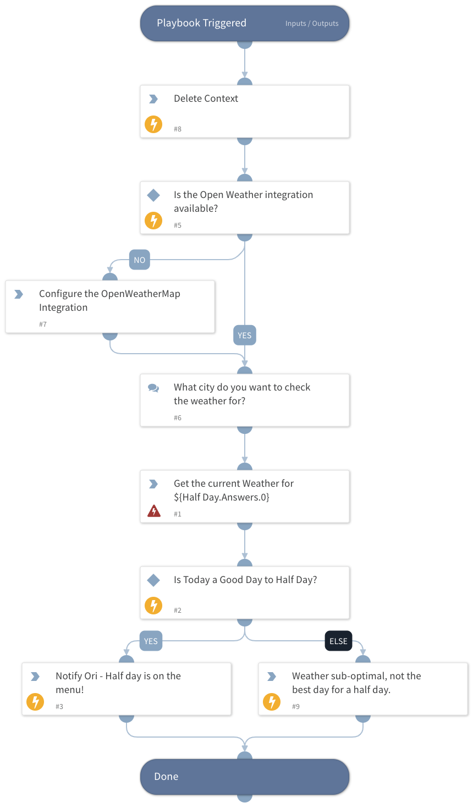

This playbook demos the BYOI OpenWeatherMap integration, as part of the XSOAR Training Pack. 

## Dependencies

This playbook uses the following sub-playbooks, integrations, and scripts.

### Sub-playbooks

This playbook does not use any sub-playbooks.

### Integrations

* OpenWeatherMap

### Scripts

* IsIntegrationAvailable
* Print
* DeleteContext

### Commands

* openweather-by-city

## Playbook Inputs

---
There are no inputs for this playbook.

## Playbook Outputs

---
There are no outputs for this playbook.

## Playbook Image

---

