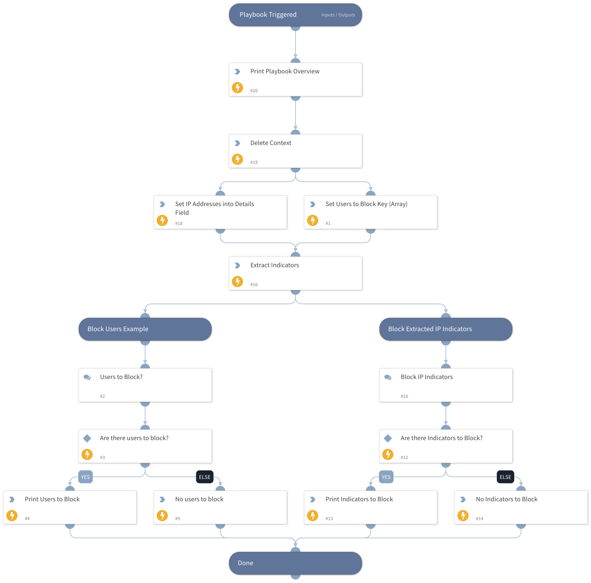

This playbooks sets a list of users to a key in Context (UsersToBlock) and extracts IP addresses and then presents that list to the user in a data collection task.   

User can pick one, multiple, or no users/ips, and it will print the results. 

Use case for this would be to get a list of users to take further action on, or filter down the list for example.   

This technique can be adapted to actual data in context to present a list of IPs, URLs, etc for blocking.

## Dependencies

This playbook uses the following sub-playbooks, integrations, and scripts.

### Sub-playbooks

This playbook does not use any sub-playbooks.

### Integrations

This playbook does not use any integrations.

### Scripts

* Print
* CreateArray
* DeleteContext

### Commands

* extractIndicators
* setIncident

## Playbook Inputs

---
There are no inputs for this playbook.

## Playbook Outputs

---
There are no outputs for this playbook.

## Playbook Image

---

