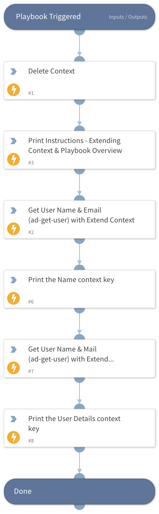

This playbook uses the extend context technique when looking up an AD user.

The simple task puts their Name and Email in their own context keys.

The advanced task creates a UserDetails key with the name and email as a dictionary underneath.

## Dependencies

This playbook uses the following sub-playbooks, integrations, and scripts.

### Sub-playbooks

This playbook does not use any sub-playbooks.

### Integrations

* XSOAR Engineer Training

### Scripts

* Print
* DeleteContext

### Commands

* ad-get-user

## Playbook Inputs

---
There are no inputs for this playbook.

## Playbook Outputs

---
There are no outputs for this playbook.

## Playbook Image

---

