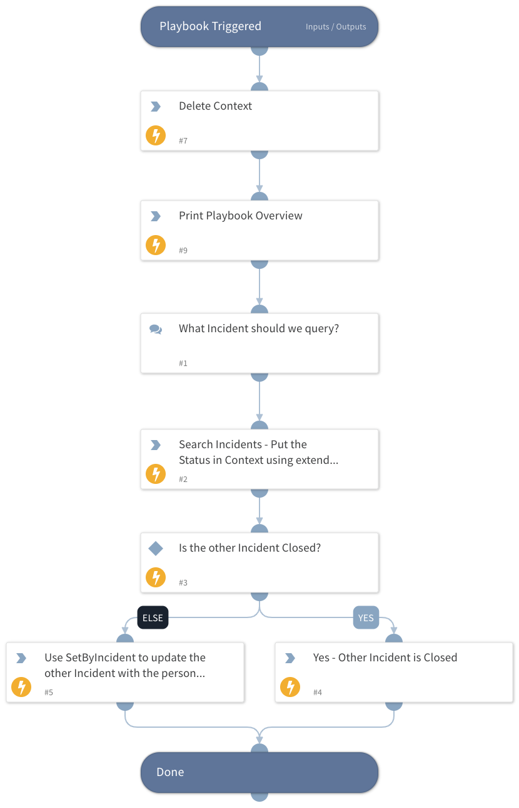

Example Playbook which queries for Status from one incident, and then does a set by incident on it if it's not closed.   The use case is to update the original open Incident with additional information (such as another reporting user for a phishing email), so we can keep track, and deduplicate.

Each step in the playbook may have some additional details in the details tab to explain what we are doing. 

## Dependencies

This playbook uses the following sub-playbooks, integrations, and scripts.

### Sub-playbooks

This playbook does not use any sub-playbooks.

### Integrations

This playbook does not use any integrations.

### Scripts

* Print
* SearchIncidentsV2
* DeleteContext
* SetByIncidentId

### Commands

This playbook does not use any commands.

## Playbook Inputs

---
There are no inputs for this playbook.

## Playbook Outputs

---
There are no outputs for this playbook.

## Playbook Image

---

