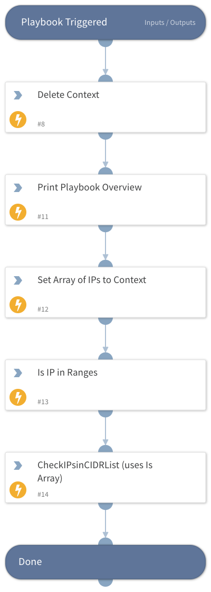

This playbook demonstrates how a playbook task loops over an array of data, and different ways to handle that.

By default when you pass an array into an integration command or an Automation script, it run the command for each item in the array.   

This behaviour can be changed by using the "Is Array" option on the argument, which tells XSOAR to expect an array in this field, and run once instead.

This playbook demonstrates this using 2 automations, one is IsIPinRanges, the other is CheckCIDRinList, which is a custom automation in this pack.  Both can be viewed from the Automations menu.

## Dependencies

This playbook uses the following sub-playbooks, integrations, and scripts.

### Sub-playbooks

This playbook does not use any sub-playbooks.

### Integrations

This playbook does not use any integrations.

### Scripts

* Set
* CheckIPsinCIDRList
* IsIPInRanges
* DeleteContext
* Print

### Commands

This playbook does not use any commands.

## Playbook Inputs

---
There are no inputs for this playbook.

## Playbook Outputs

---
There are no outputs for this playbook.

## Playbook Image

---

