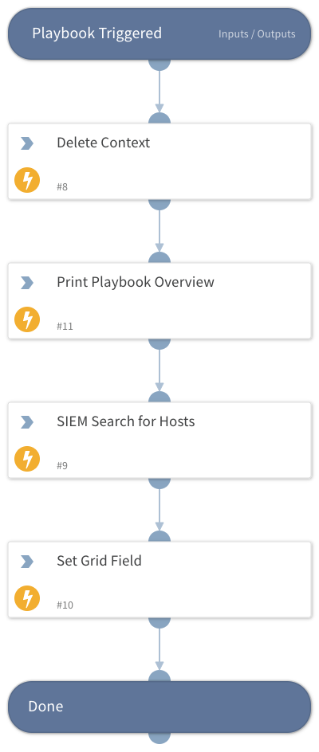

This playbook demos the set grid field automation.  

## Dependencies

This playbook uses the following sub-playbooks, integrations, and scripts.

### Sub-playbooks

This playbook does not use any sub-playbooks.

### Integrations

* XSOAREngineerTraining

### Scripts

* Print
* DeleteContext
* SetGridField

### Commands

* siem-search

## Playbook Inputs

---
There are no inputs for this playbook.

## Playbook Outputs

---
There are no outputs for this playbook.

## Playbook Image

---

