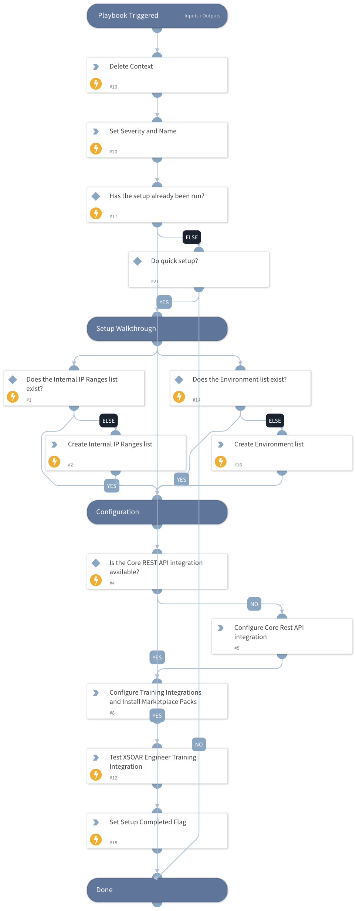

This playbook walks you through setting up the XSOAR Training Pack

## Dependencies

This playbook uses the following sub-playbooks, integrations, and scripts.

### Sub-playbooks

This playbook does not use any sub-playbooks.

### Integrations

* XSOAREngineerTraining

### Scripts

* IsIntegrationAvailable
* DeleteContext

### Commands

* setIncident
* createList
* ad-get-user

## Playbook Inputs

---
There are no inputs for this playbook.

## Playbook Outputs

---
There are no outputs for this playbook.

## Playbook Image

---

