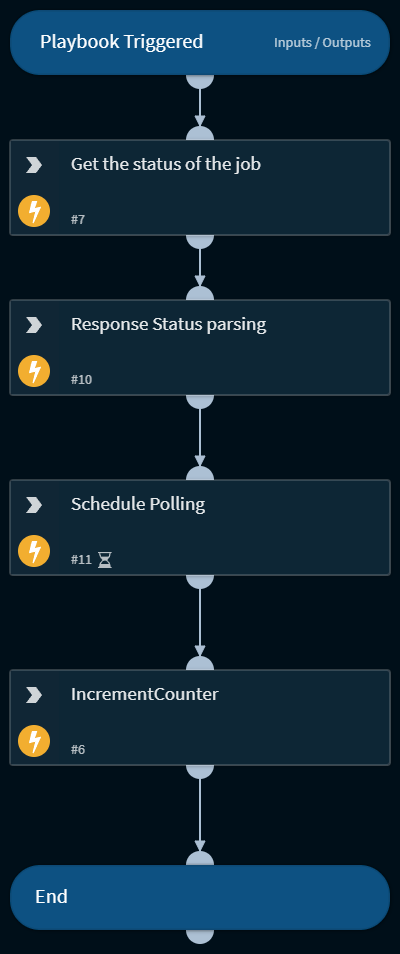

This playbook tracks the user responses and  resends the emails to recipients who have not responded

## Dependencies
This playbook uses the following sub-playbooks, integrations, and scripts.

### Sub-playbooks
This playbook does not use any sub-playbooks.

### Integrations
* XSOARWebServer

### Scripts
* xsoar-ws-parse-context
* xsoar-ws-poll-status

### Commands
* xsoar-ws-get-action-status
* setIncident

## Playbook Inputs
---

| **Name** | **Description** | **Default Value** | **Required** |
| --- | --- | --- | --- |
| Jobuuid | Data collection Job uuid  |  | Optional |
| FileAttachments | The file id of the attachment to send to the recipient |  | Optional |
| EmailSubject | Mail Subject |  | Optional |
| PollingTimebetweenRuns | The amount of time between two scheduled commands that poll the response |  | Optional |

## Playbook Outputs
---

| **Path** | **Description** | **Type** |
| --- | --- | --- |
| WSActionStatus(val.job_uuid==obj.job_uuid) | Merges the output to the main playbook | unknown |

## Playbook Image
---
