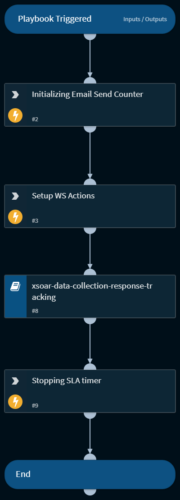

Playbook to demonstrate the features of XSOAR-Web-Server. It sends an html email to a set of users up to 2 times. The email can contain multiple html links, that the users can click and the response will be available in the context. This playbook sets up the webserver to handle http get requests

## Dependencies
This playbook uses the following sub-playbooks, integrations, and scripts.

### Sub-playbooks
* xsoar-data-collection-response-tracking

### Integrations
* XSOARWebServer

### Scripts
This playbook does not use any scripts.

### Commands
* xsoar-ws-setup-simple-action
* stopTimer
* setIncident

## Playbook Inputs
---

| **Name** | **Description** | **Default Value** | **Required** |
| --- | --- | --- | --- |
| useremails | The emails to send the data collection links to. | Replace with comma separated user emails | Required |
| htmltemplate | The template for the acknowledgement email is an HTML string with multiple hyper links with each hyper link has a place holder like "$action\{number\}" with number varying across number of actions | lists.AcknowledgementEmailHTML | Required |
| useractions | Comma separated list of actions that get registered when the corresponding links are clicked. Make sure that your template has an equal number of placeholders | happy,angry | Required |

## Playbook Outputs
---
There are no outputs for this playbook.

## Playbook Image
---
