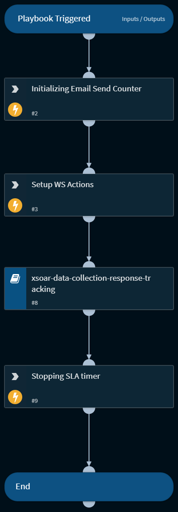

Playbook to demonstrate the features of XSOAR-Web-Server. It sends an html email to a set of users up to 2 times. The email can contain multiple html links, that the users can click and the response will be available in the context

## Dependencies
This playbook uses the following sub-playbooks, integrations, and scripts.

### Sub-playbooks
* xsoar-data-collection-response-tracking

### Integrations
* XSOARWebServer

### Scripts
This playbook does not use any scripts.

### Commands
* stopTimer
* xsoar-ws-setup-form-submission
* setIncident

## Playbook Inputs
---

| **Name** | **Description** | **Default Value** | **Required** |
| --- | --- | --- | --- |
| useremails | Comma separated email addresses for sending the emails | Replace with user emails | Optional |
| htmltemplate | The template for the data collection task supports a form with action marked as "$action1". The program as of now only supports one form with method post. | Paste the template here or select a list which contains the template | Optional |

## Playbook Outputs
---
There are no outputs for this playbook.

## Playbook Image
---
