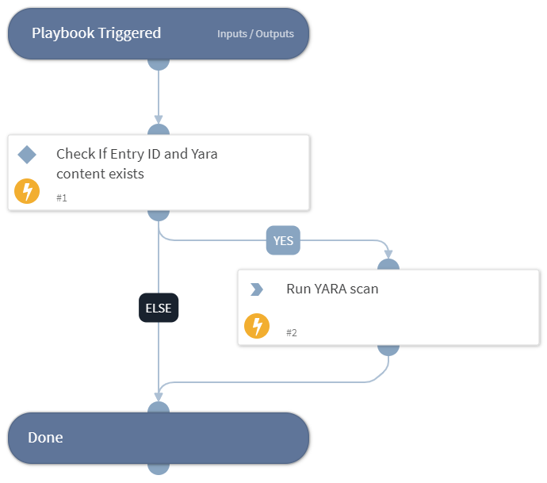

A playbook to run YARA scan against uploaded file.
To run the playbook, provide the YARA rule content and the entry ID of the file you intend to scan.

### Scripts

* YaraScan

## Playbook Inputs

---

| **Name** | **Description** | **Default Value** | **Required** |
| --- | --- | --- | --- |
| EntryID | The entry ID of a file to scan | File.EntryID | Optional |
| YARA | The YARA rule content |  | Optional |

## Playbook Outputs

---

| **Path** | **Description** | **Type** |
| --- | --- | --- |
| Yara | The Yara context path | unknown |
| Yara.Filename | The filename of the file that was scanned. | string |
| Yara.HasError | Whether there was an error when performing the scan. | boolean |
| Yara.HasMatch | Whether the file matched any of the rules. | boolean |
| Yara.entryID | The entry ID of the scanned file. | string |
| Yara.fileID | The file ID of the scanned file. | string |
| Yara.MatchCount | The number of rules that matched the file. | number |
| Errors | A list of errors that occurred during the scan. | unknown |
| Matches | The matches from the YARA scan. | unknown |
| Matches.Meta | Metadata about the rule \(as defined in the rule itself\). | unknown |
| Matches.Namespace | The namespace defined in the rule. | string |
| Matches.RuleName | The rule name that matched. | string |
| Matches.Strings | A list of strings that the rule matched. | string |
| Matches.Tags | A list of tags that are defined in the rule. | unknown |

## Playbook Image

---

