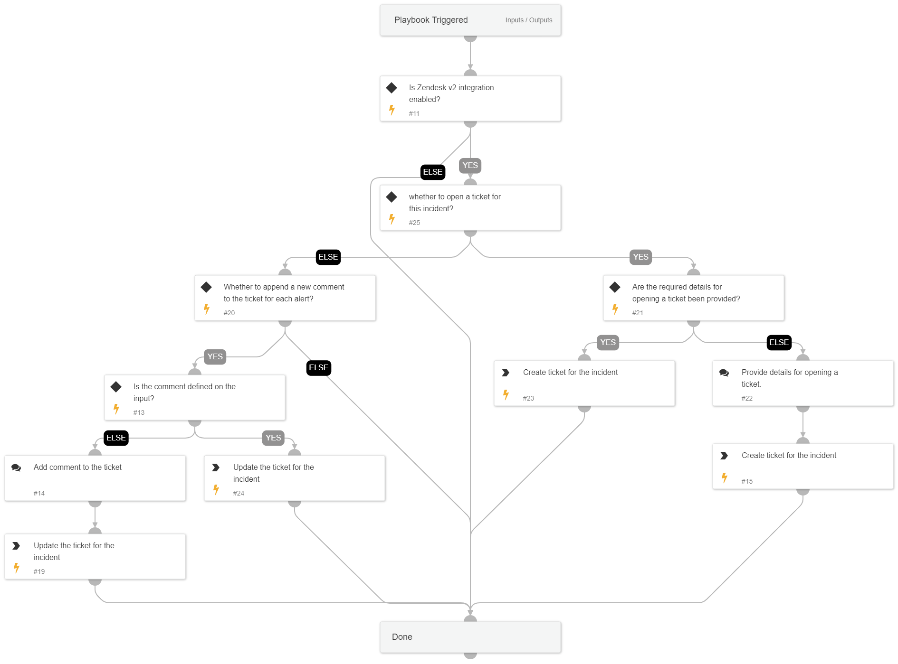

`Zendesk - Ticket Management` allows you to open a new ticket or comment on an existing ticket.

## Dependencies

This playbook uses the following sub-playbooks, integrations, and scripts.

### Sub-playbooks

This playbook does not use any sub-playbooks.

### Integrations

* Zendeskv2

### Scripts

This playbook does not use any scripts.

### Commands

* zendesk-ticket-update
* zendesk-ticket-create

## Playbook Inputs

---

| **Name** | **Description** | **Default Value** | **Required** |
| --- | --- | --- | --- |
| ZendeskTicketID | The ticket ID. |  | Optional |
| ZendeskAssigne | The agent currently assigned to the ticket. |  | Optional |
| ZendeskCollaborators | The users currently CC'ed on the ticket. |  | Optional |
| description | The ticket description. |  | Required |
| ZendeskPriority | The urgency with which the ticket should be addressed. Allowed values are "urgent", "high", "normal", or "low". | high | Optional |
| ZendeskRequester | The user who requested this ticket. |  | Required |
| ZendeskStatus | The state of the ticket. Allowed values are "new", "open", "pending", "hold", "solved", or "closed". |  | Optional |
| ZendeskSubject | The value of the subject field for this ticket. |  | Required |
| ZendeskTags | The array of tags applied to this ticket. |  | Optional |
| ZendeskType | The type of this ticket. Allowed values are "problem", "incident", "question", or "task". |  | Required |
| CommentToAdd | Comment for the ticket. |  | Optional |
| addCommentPerEndpoint | Whether to add a new comment to the ticket for each endpoint in the incident. Possible values: True/False. | True | Optional |
| Action | Whether to open a new ticket or to add a new comment. Possible values: NewTicket/AddComment. |  | Optional |

## Playbook Outputs

---

| **Path** | **Description** | **Type** |
| --- | --- | --- |
| Zendesk.Ticket.id | The ticket ID. | unknown |

## Playbook Image

---

