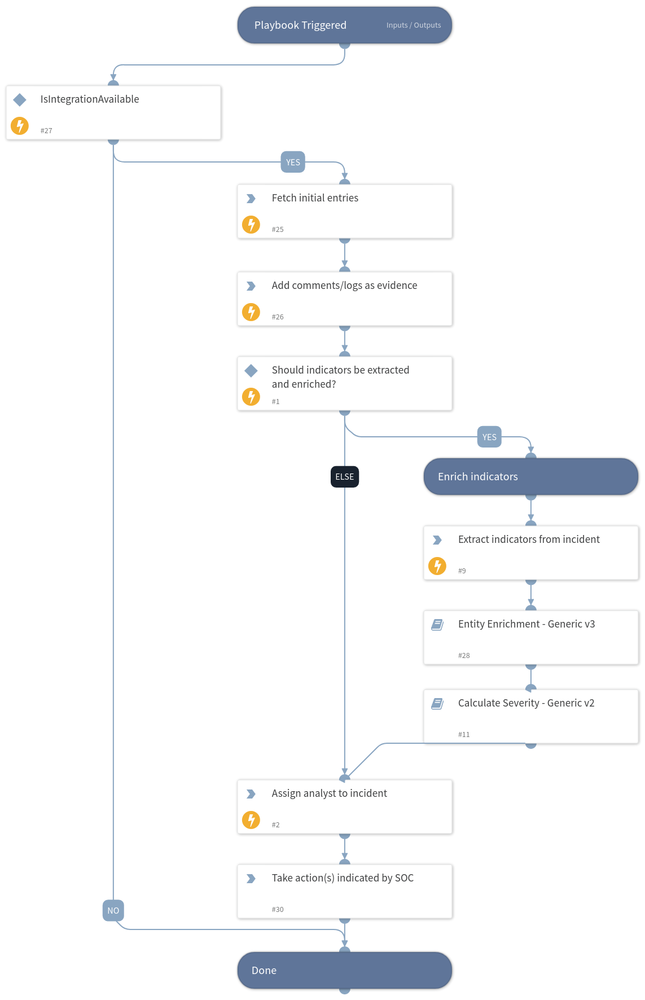

This playbok is triggered by fetching escalated ZTAP Alerts.
The playbook fetches newly escalated alerts.
Then, the playbook performs enrichment on the incident's indicators.
Lastly, it adds comments/logs as Evidence.

## Dependencies
This playbook uses the following sub-playbooks, integrations, and scripts.

### Sub-playbooks
* Entity Enrichment - Generic v3
* Calculate Severity - Generic v2

### Integrations
* ZeroTrustAnalyticsPlatform

### Scripts
* AssignAnalystToIncident
* IsIntegrationAvailable
* ZTAPBuildTimeline

### Commands
* extractIndicators
* ztap-get-alert-entries

## Playbook Inputs
---

| **Name** | **Description** | **Default Value** | **Required** |
| --- | --- | --- | --- |
| Enrich | Determines whether to enrich all indicators in the incident. | True | Optional |
| OnCall | Set to true to assign only user that is currently on shift. Requires Cortex XSOAR v5.5 or later. | false | Optional |

## Playbook Outputs
---
There are no outputs for this playbook.

## Playbook Image
---

