# Integration and Setup Instructions

The companion integration for Zerohack XDR.
Current versions allow the user to collect data from the XDR and later versions will support data exfiltration to XDR.
This integration was integrated and tested with version 1.0 of Zerohack XDR

## Create API key on Zerohack XDR for Cortex XSOAR

1. Navigate to **Side Panel** > **Administration** > **Integration** > **Key Management**.

    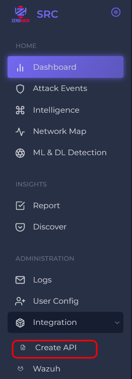

2. Click on Create API key.  

    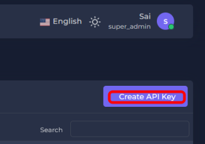

3. Click on Drop down of Select application.

    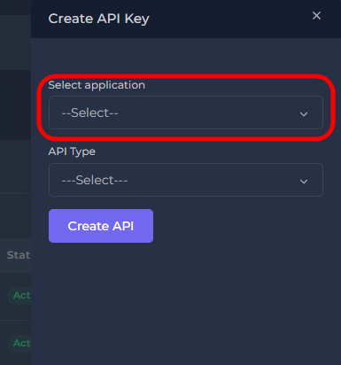

4. Click on Palo Alto XSOAR.

    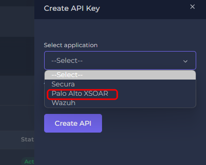

5. Select API Type "Full Control".

   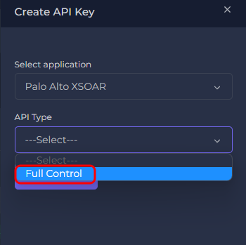

6. Click on Create Api.

   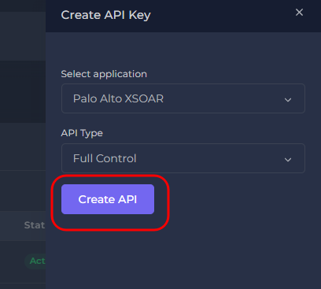

7. Copy your API key.   

   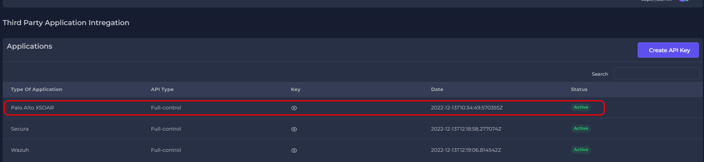
 
## Configure Zerohack XDR on Cortex XSOAR

1. Navigate to **Settings** on bottom left corner of dashboard > **Integrations** > **Servers & Services**.

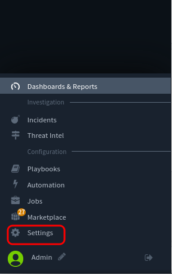

2. Search for Zerohack XDR.

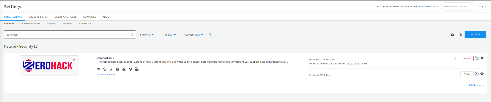

3. Click **Add instance** to create and configure a new integration instance.

   

    | **Parameter** | **Description** | **Required** |
    | --- | --- | --- |
    | Fetch incidents |  | False |
    | Incident type |  | False |
    | Maximum number of incidents per fetch | This number determines how many incidents must be fetched with each API call. It is suggested you keep it below 100. | False |
    | Zerohack XDR API Key | This API key can be generated from your zerohack XDR account. Please ensure that you fill this field before you test the integration. | True |
    | First fetch time | This parameter decides how many old events you want to fetch when starting the integration. | False |
    | Trust any certificate (not secure) |  | False |
    | Incidents Fetch Interval |  | True |
    | Minimum Severity | This parameter defines the lowest severity level \(xdr\) to use for fetching incidents. | True |

4. Click on Gear Icon.

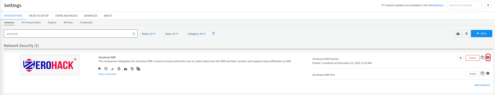

5. Click **Test** to validate the URLs, token, and connection.

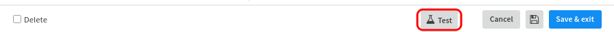

6. Access the Fetch results.

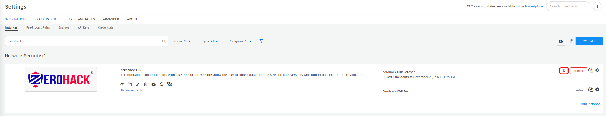

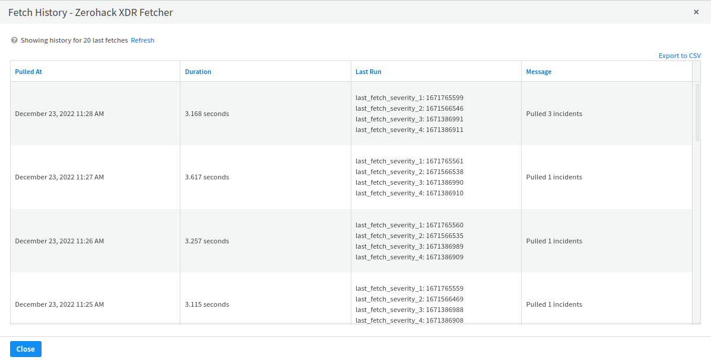   
## Commands
You can execute these commands from the Cortex XSOAR CLI, as part of an automation, or in a playbook.
After you successfully execute a command, a DBot message appears in the War Room with the command details.
### zerohack-get-latest-incident
***
Fetch a single incident of your choice of severity level to study the incidents structure before you start continously fecthing incidents.

#### Base Command

`zerohack-get-latest-incident`
#### Input

| **Argument Name** | **Description** | **Required** |
| --- | --- | --- |
| severity_level | The severity level helps in extracting latest incident of a specific severity. | Required | 

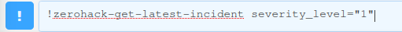

#### Context Output

    
    "message_type": "success",
    "data_len": 1,
    "data": [
        {
            "tcp_port": "22.0",
            "ip_rep": "unknown",
            "dl_threat_class": "Potentially Bad Traffic",
            "ml_severity": 2,
            "attacker_mac": "ff:ff:ff:ff:ff:ff",
            "geoip_region_name": null,
            "target_mac_address": "ff:ff:ff:ff:ff:ff",
            "geoip_postal_code": null,
            "timezone": "UTC-0.0",
            "dl_severity": 2,
            "geoip_asn_number": null,
            "platform": "aws",
            "attack_os": "Linux 2.2.x-3.x",
            "ids_threat_severity": 2.0,
            "geoip_country_name": null,
            "packet_id": 464887,
            "attacker_ip": "8.8.8.8",
            "geoip_location_properties": null,
            "udp_port": "nan",
            "geoip_longitude": null,
            "geoip_location_string": null,
            "service_name": "TCP",
            "geoip_latitude": null,
            "ids_threat_type": "ET SCAN Potential SSH Scan OUTBOUND",
            "ml_accuracy": 82,
            "attack_epoch_time": 1662120908000,
            "type_of_threat": "Lateral Movement",
            "ml_threat_class": "Misc Attack",
            "target_os": "Linux 2.2.x-3.x",
            "@timestamp": "2022-09-02 12:18:26.22009012",
            "attack_timestamp": "2022-09-02 12:15:08",
            "target_ip": "8.8.8.8",
            "dl_accuracy": 80,
            "geoip_city": null,
            "geoip_region_code": null,
            "ids_threat_class": "Attempted Information Leak",
            "icmp_port": null,
            "geoip_location_array": null,
            "geoip_country_code": null,
            "geoip_asn_name": null
        }
    ]

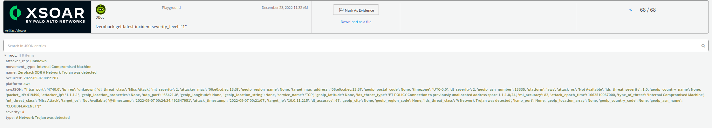
