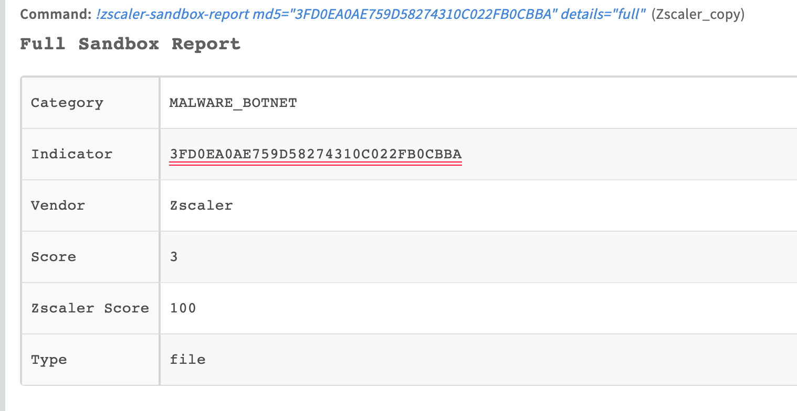
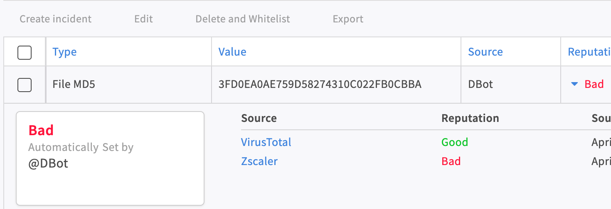

Zscaler is a cloud security solution built for performance and flexible scalability. This integration enables you to manage URL and IP address allow lists and block lists, manage and update categories, get Sandbox reports, create, manage, and update IP destination groups and manually log in, log out, and activate changes in a Zscaler session.

For the integration to work properly, the Zscaler user must have admin permissions.

Category ID is the same as the category name, except all letters are capitalized and each word is separated with an underscore instead of spaces. For example, if the category name is Other Education, then the Category ID is OTHER_EDUCATION.

A custom category ID has the format `CUSTOM_01`, which is not indicative of the category. Use the `zscaler-get-categories` command to get a custom category and its configured name.

## Configure Zscaler Internet Access in Cortex


| **Parameter** | **Description** | **Required** |
| --- | --- | --- |
| Cloud Name (i.e. <https://zsapi.zscalertwo.net>) | See <https://help.zscaler.com/zia/getting-started-zia-api#RetrieveBaseURL> on how to retrieve your cloud name. | True |
| Username |  | True |
| Password |  | True |
| API Key |  | True |
| Source Reliability | Reliability of the source providing the intelligence data. | False |
| Auto Logout | If enabled, the integration will log out after executing each command. | False |
| Auto Activate Changes | If enabled, the integration will activate the command changes after each execution. If disabled, use the 'zscaler-activate-changes' command to activate Zscaler command changes. | False |
| Trust any certificate (not secure) |  | False |
| Use system proxy settings |  | False |
| Timeout (in seconds) for HTTP requests to Zscaler |  | False |


## Commands

You can execute these commands from the CLI, as part of an automation, or in a playbook.
After you successfully execute a command, a DBot message appears in the War Room with the command details.

### zscaler-blacklist-url

***
Adds the specified URLs to the block list.

#### Base Command

`zscaler-blacklist-url`

#### Input

| **Argument Name** | **Description** | **Required** |
| --- | --- | --- |
| url | A comma-separated list of URLs to add to block list. For example, snapchat.com,facebook.com. | Required | 

#### Context Output

There is no context output for this command.

#### Command Example

```!zscaler-blacklist-url url=phishing.com,malware.net```

#### Human Readable Output

Added the following URLs to the block list successfully:
phishing.com
malware.net

### url

***
Looks up the classification for the each of the specified URLs.

#### Base Command

`url`

#### Input

| **Argument Name** | **Description** | **Required** |
| --- | --- | --- |
| url | A comma-separated list of URLs for which to look up the classification.  For example, abc.com,xyz.com. The maximum number of URLs per call is 100. A URL cannot exceed 1024 characters. If there are multiple URLs, set the 'multiple' argument to 'true'. | Required | 
| multiple | Whether there are multiple URLs in the 'url' argument. If a URL contains commas, set this argument to 'false' and enter the single URL as the 'url' argument. Possible values are: true, false. Default is true. | Optional | 

#### Context Output

| **Path** | **Type** | **Description** |
| --- | --- | --- |
| URL.Data | string | The URL that was searched. | 
| URL.Address | string | The URL that was searched. | 
| Zscaler.URL.urlClassifications | string | The classification of the URL. For example, MUSIC or WEB_SEARCH. | 
| Zscaler.URL.urlClassificationsWithSecurityAlert | string | The classifications of the URLs that have security alerts. | 
| URL.Malicious.Vendor | string | For malicious URLs, the vendor that tagged the URL as malicious. | 
| URL.Malicious.Description | string | For malicious URLs, the reason the vendor tagged the URL as malicious. | 
| DBotScore.Indicator | string | The indicator that was tested. | 
| DBotScore.Type | string | The indicator type. | 
| DBotScore.Vendor | string | The vendor used to calculate the score. | 
| DBotScore.Score | number | The actual score. | 

#### Command Example

```!url url=facebook.com```

#### Context Example

```json
{
    "DBotScore": [
        {
            "Indicator": "facebook.com",
            "Score": 1,
            "Type": "url",
            "Vendor": "Zscaler"
        }
    ],
    "URL": {
        "Address": "facebook.com",
        "Data": "facebook.com",
        "urlClassifications": "SOCIAL_NETWORKING"
    }
}
```

#### Human Readable Output

>### Zscaler URL Lookup

>|url|urlClassifications|
>|---|---|
>| facebook.com | SOCIAL_NETWORKING |

### ip

***
Looks up the classification for each of the specified IP addresses.

#### Base Command

`ip`

#### Input

| **Argument Name** | **Description** | **Required** |
| --- | --- | --- |
| ip | A comma-separated list of IP address for which to look up the classification. For example, 8.8.8.8,1.2.3.4. The maximum number of URLs per call is 100. An IP address cannot exceed 1024 characters. | Required | 

#### Context Output

| **Path** | **Type** | **Description** |
| --- | --- | --- |
| IP.Address | string | The IP address that was searched. | 
| Zscaler.IP.ipClassifications | string | The classification of the IP address. For example, MUSIC or WEB_SEARCH. | 
| Zscaler.IP.iplClassificationsWithSecurityAlert | string | Classifications that have a security alert for the IP address. | 
| IP.Malicious.Vendor | string | For malicious IP addresses, the vendor that tagged the IP address as malicious. | 
| IP.Malicious.Description | string | For malicious IP addresses, the reason the vendor tagged the IP address as malicious. | 
| DBotScore.Indicator | string | The indicator that was tested. | 
| DBotScore.Type | string | The indicator type. | 
| DBotScore.Vendor | string | The vendor used to calculate the score. | 
| DBotScore.Score | number | The actual score. | 

#### Command Example

```!ip ip=8.8.8.8```

#### Context Example

```json
{
    "DBotScore": [
        {
            "Indicator": "8.8.8.8",
            "Score": 1,
            "Type": "ip",
            "Vendor": "Zscaler"
        }
    ],
    "IP": {
        "Address": "8.8.8.8",
        "ipClassifications": "WEB_SEARCH"
    }
}
```

#### Human Readable Output

>### Zscaler IP Lookup

>|ip|ipClassifications|
>|---|---|
>| 8.8.8.8 | WEB_SEARCH |

### zscaler-undo-blacklist-url

***
Removes the specified URLs from the block list.

#### Base Command

`zscaler-undo-blacklist-url`

#### Input

| **Argument Name** | **Description** | **Required** |
| --- | --- | --- |
| url | A comma-separated list of URLs to remove from the block list. For example, snapchat.com,facebook.com. | Required | 

#### Context Output

There is no context output for this command.

### zscaler-whitelist-url

***
Adds the specified URLs to the allow list.

#### Base Command

`zscaler-whitelist-url`

#### Input

| **Argument Name** | **Description** | **Required** |
| --- | --- | --- |
| url | A comma-separated list of URLs to add to the allow list. For example, snapchat.com,facebook.com. | Required | 

#### Context Output

There is no context output for this command.

#### Command Example

```!zscaler-whitelist-url url=phising.com,malware.net```

#### Human Readable Output

Added the following URLs to the allow list successfully:
phishing.com
malware.net

### zscaler-undo-whitelist-url

***
Removes the specified URLs from the allow list.

#### Base Command

`zscaler-undo-whitelist-url`

#### Input

| **Argument Name** | **Description** | **Required** |
| --- | --- | --- |
| url | A comma-separated list of URLs to remove from the allow list. For example, snapchat.com,facebook.com. | Required | 

#### Context Output

There is no context output for this command.

#### Command Example

```!zscaler-undo-whitelist-url url=phising.com,malware.net```

#### Human Readable Output

Removed the following URLs from the allow list successfully:
phishing.com
malware.net

### zscaler-undo-whitelist-ip

***
Removes the specified IP addresses from the allow list.

#### Base Command

`zscaler-undo-whitelist-ip`

#### Input

| **Argument Name** | **Description** | **Required** |
| --- | --- | --- |
| ip | A comma-separated list of IP addresses to remove from the allow list. For example, 8.8.8.8,1.2.3.4. | Required | 

#### Context Output

There is no context output for this command.

#### Command Example

```!zscaler-undo-whitelist-ip ip=2.2.2.2,3.3.3.3```

#### Human Readable Output

Removed the following IP addresses from the allow list successfully:
2.2.2.2
3.3.3.3

### zscaler-whitelist-ip

***
Adds the specified IP address to the allow list.

#### Base Command

`zscaler-whitelist-ip`

#### Input

| **Argument Name** | **Description** | **Required** |
| --- | --- | --- |
| ip | A comma-separated list of IP addresses to add to the allow list. For example, 8.8.8.8,1.2.3.4. | Required | 

#### Context Output

There is no context output for this command.

#### Command Example

```!zscaler-whitelist-ip ip=2.2.2.2,3.3.3.3```

#### Human Readable Output

Added the following IP addresses to the allow list successfully:
2.2.2.2
3.3.3.3

### zscaler-undo-blacklist-ip

***
Removes the specified IP addresses from the block list.

#### Base Command

`zscaler-undo-blacklist-ip`

#### Input

| **Argument Name** | **Description** | **Required** |
| --- | --- | --- |
| ip | A comma-separated list of IP addresses to remove from the allow list. For example, 8.8.8.8,1.2.3.4. | Required | 

#### Context Output

There is no context output for this command.

#### Command Example

```!zscaler-undo-blacklist-ip ip=2.2.2.2,3.3.3.3```


#### Human Readable Output

Removed the following IP addresses from the block list successfully:
2.2.2.2
3.3.3.3

### zscaler-blacklist-ip

***
Adds the specified IP addresses to the block list.

#### Base Command

`zscaler-blacklist-ip`

#### Input

| **Argument Name** | **Description** | **Required** |
| --- | --- | --- |
| ip | A comma-separated list of IP addresses to add to the block list. For example, 8.8.8.8,1.2.3.4. | Required | 

#### Context Output

There is no context output for this command.

#### Command Example

```!zscaler-blacklist-ip ip=2.2.2.2,3.3.3.3```


#### Human Readable Output

Added the following IP addresses to the block list successfully:
2.2.2.2
3.3.3.3

### zscaler-category-add-url

***
Adds URLs to the specified category.  
Ensure that the URLs are properly formatted according to Zscaler's guidelines. For more information on valid URL formats, refer to the (Zscaler URL Format Guidelines)[https://help.zscaler.com/zia/url-format-guidelines].

#### Base Command

`zscaler-category-add-url`

#### Input

| **Argument Name** | **Description** | **Required** |
| --- | --- | --- |
| category-id | The ID of the category to add the specified URLs to. For example, RADIO_STATIONS. You can retrieve the category IDs by running the 'zscaler-get-categories' command. | Required | 
| url | A comma-separated list of URLs to add to the specified category. For example, pandora.com,spotify.com. | Optional | 
| retaining-parent-category-url | A comma-separated list of URLs to add to the retaining parent category section inside the specified category. For example, pandora.com,spotify.com. | Optional | 

#### Context Output

| **Path** | **Type** | **Description** |
| --- | --- | --- |
| Zscaler.Category.CustomCategory | boolean | True, if the category is a custom category. Otherwise, false. | 
| Zscaler.Category.Description | string | The description of the category. | 
| Zscaler.Category.ID | string | The ID of the category. | 
| Zscaler.Category.URL | string | The URL of the category. | 

#### Command Example

```!zscaler-category-add-url category-id=MUSIC url=demisto.com,apple.com```

#### Context example

```json
{
    "Zscaler": {
      "Category": {
        "CustomCategory": false,
        "Description": "MUSIC_DESC",
        "ID": "MUSIC",
        "URL": [
            "demisto.com",
            "apple.com"
        ]
      }
    }
}
```

#### Human Readable Output

Added the following URL addresses to category MUSIC:

*   demisto.com
*   apple.com

### zscaler-category-add-ip

***
Adds IP address to the specified category.

#### Base Command

`zscaler-category-add-ip`

#### Input

| **Argument Name** | **Description** | **Required** |
| --- | --- | --- |
| category-id | The ID of the category to add the specified IP addresses to. For example, RADIO_STATIONS. You can retrieve the category IDs by running the 'zscaler-get-categories' command. | Required | 
| ip | A comma-separated list of IP address to add to the specified category. For example, 1.2.3.4,8.8.8.8. | Optional | 
| retaining-parent-category-ip | A comma-separated list of IP address to add to the retaining parent category section inside the specified category. For example, 1.2.3.4,8.8.8.8. | Optional | 

#### Context Output

| **Path** | **Type** | **Description** |
| --- | --- | --- |
| Zscaler.Category.CustomCategory | boolean | True, if the category is a custom category. Otherwise, false. | 
| Zscaler.Category.Description | string | The description of the category. | 
| Zscaler.Category.ID | string | The ID of the category. | 
| Zscaler.Category.URL | string | The URL of the category | 

#### Command Example

`!zscaler-category-add-ip category-id=REFERENCE_SITES ip=1.2.3.4,8.8.8.8`

#### Context Example

```json
{
    "Zscaler": {
      "Category": {
        "CustomCategory": false,
        "Description": "REFERENCE_SITES_DESC",
        "ID": "REFERENCE_SITES",
        "URL": [
            "1.2.3.4",
            "8.8.8.8"
        ]
      }
    }
}
```

#### Human Readable Output

Added the following IP addresses to category REFERENCE_SITES:

*   1.2.3.4
*   8.8.8.8

### zscaler-category-remove-url

***
Removes URLs from the specified category.

#### Base Command

`zscaler-category-remove-url`

#### Input

| **Argument Name** | **Description** | **Required** |
| --- | --- | --- |
| category-id | The ID of the category to remove the specified URLs from. For example, RADIO_STATIONS. You can retrieve the category IDs by running the 'zscaler-get-categories' command. | Required | 
| url | A comma-separated list of URLs to remove from the specified category. For example, pandora.com,spotify.com. | Optional | 
| retaining-parent-category-url | A comma-separated list of URLs to remove from the retaining parent category section inside the specified category. For example, pandora.com,spotify.com. | Optional | 

#### Context Output

| **Path** | **Type** | **Description** |
| --- | --- | --- |
| Zscaler.Category.CustomCategory | boolean | True, if the category is a custom category. Otherwise, false. | 
| Zscaler.Category.Description | string | The description of the category. | 
| Zscaler.Category.ID | string | The ID of the category. | 
| Zscaler.Category.URL | string | The URL of the category. | 

#### Command Example

`!zscaler-category-remove-url category-id=MUSIC url=apple.com`

#### Context Example

```json
{
    "Zscaler": {
      "Category": {
        "CustomCategory": false,
        "Description": "MUSIC_DESC",
        "ID": "MUSIC",
        "URL": [
            "demisto.com"
        ]
      }
    }
}
```

##### Human Readable Output

Removed the following URL addresses to category MUSIC:

*   apple.com

### zscaler-category-remove-ip

***
Removes IP address from the specified category.

#### Base Command

`zscaler-category-remove-ip`

#### Input

| **Argument Name** | **Description** | **Required** |
| --- | --- | --- |
| category-id | The ID of the category to remove the specified IP addresses from. For example, RADIO_STATIONS. You can retrieve the category IDs by running the 'zscaler-get-categories' command. | Required | 
| ip | A comma-separated list of IP addresses to remove from the specified category. For example, 1.2.3.4,8.8.8.8. | Optional | 
| retaining-parent-category-ip | A comma-separated list of IP address to remove from the retaining parent category section inside the specified category. For example, 1.2.3.4,8.8.8.8. | Optional | 

#### Context Output

| **Path** | **Type** | **Description** |
| --- | --- | --- |
| Zscaler.Category.CustomCategory | boolean | True, if the category is a custom category. Otherwise, false. | 
| Zscaler.Category.Description | string | The description of the category. | 
| Zscaler.Category.ID | string | The ID of the category. | 
| Zscaler.Category.URL | string | The URL of the category. | 

#### Command Example

`!zscaler-category-remove-ip category-id=REFERENCE_SITES ip=1.2.3.4`

##### Context Example

```json
{
    "Zscaler": {
      "Category": {
        "CustomCategory": false,
        "Description": "REFERENCE_SITES_DESC",
        "ID": "REFERENCE_SITES",
        "URL": [
            "8.8.8.8"
        ]
      }
    }
}
```

##### Human Readable Output

Removed the following IP addresses to category REFERENCE\_SITES:

*   1.2.3.4

### zscaler-get-categories

***
Retrieves a list of all categories.

#### Base Command

`zscaler-get-categories`

#### Input

| **Argument Name** | **Description** | **Required** |
| --- | --- | --- |
| displayURL | Whether to display the URLs of each category in the War Room. URLs will always be returned to the Context Data. Possible values are: true, false. Default is false. | Optional | 
| custom_categories_only | Whether to retrieve only custom categories to the War Room. Possible values are: true, false. Default is false. | Optional | 
| get_ids_and_names_only | Whether to retrieve only a list containing URL category IDs and names. Even if *displayURL* is set to true, URLs will not be returned. Please note - the API does not support the combination of custom_only and get_ids_and_names_only. Possible values are: true, false. Default is false. | Optional | 

#### Context Output

| **Path**                                    | **Type** | **Description**                                               |
|---------------------------------------------|----------|---------------------------------------------------------------|
| Zscaler.Category.ID                         | string   | The ID of the category.                                       | 
| Zscaler.Category.CustomCategory             | boolean  | True, if the category is a custom category. Otherwise, false. | 
| Zscaler.Category.URL                        | string   | The URL of the category.                                      | 
| Zscaler.Category.RetainingParentCategoryURL | string   | The URLs of the retaining parent category.                    | 
| Zscaler.Category.Description                | string   | The description of the category.                              | 
| Zscaler.Category.Name                       | string   | The name of the category.                                     | 

#### Command Example

```!zscaler-get-categories```

#### Context Example

```json
{  
   "Zscaler":{  
      "Category":{  
         "ID":"INTERNET_SERVICES",
         "Description":"INTERNET_SERVICES_DESC",
         "URL":[  
            "google.com",
            "facebook.com"
         ],
         "CustomCategory":"false"
      },
      "ID":"CUSTOM_01",
      "Name":"CustomCategory",
      "URL":[  
         "demisto.com",
         "apple.com"
      ],
      "RetainingParentCategoryURL":[  
         "pandora.com",
         "spotify.com"
      ],
      "CustomCategory":"true"
   }
}
```

#### Human Readable Output

| CustomCategory | Description            | ID                | Name           | URL                     | RetainingParentCategoryURL |
|----------------|------------------------|-------------------|----------------|-------------------------|----------------------------|
| false          | INTERNET_SERVICES_DESC | INTERNET_SERVICES |                | google.com,facebook.com |                            |
| true           |                        | CUSTOM_01         | CustomCategory | demisto.com,apple.com   | pandora.com","spotify.com  |

### zscaler-get-blacklist

***
Retrieves the Zscaler default block list.

#### Base Command

`zscaler-get-blacklist`

#### Input

| **Argument Name** | **Description** | **Required** |
| --- | --- | --- |
| filter | Filter results by URL or IP objects. Possible values are: url, ip. | Optional | 
| query | Query (Python regular expression) to match against. For example, 8.*.*.8. | Optional | 

#### Context Output

| **Path** | **Type** | **Description** |
| --- | --- | --- |
| Zscaler.Blacklist | string | The Zscaler block list. | 

#### Command Example

```!zscaler-get-blacklist```

#### Context Example

```json
{
    "Zscaler": {
        "Blacklist": [
            "malicious.com,
            "bad.net"
        ]
    }
}
```

#### Human Readable Output

Zscaler block list

*   malicious.com
*   bad.net

### zscaler-get-whitelist

***
Retrieves the Zscaler default allow list.

#### Base Command

`zscaler-get-whitelist`

#### Input

There are no input arguments for this command.

#### Context Output

| **Path** | **Type** | **Description** |
| --- | --- | --- |
| Zscaler.Whitelist | string | The Zscaler allow list. | 

#### Command Example

````!zscaler-get-whitelist````

#### Context Example

```json
{
    "Zscaler": {
        "Whitelist": [
            "demisto.com,
            "apple.com"
        ]
    }
}
```

#### Human Readable Output

Zscaler whitelist

*   demisto.com
*   apple.net

### zscaler-sandbox-report

***
Retrieves a full or summary report of the file that was analyzed by Sandbox. The file is represented by the specified MD5 hash.

#### Base Command

`zscaler-sandbox-report`

#### Input

| **Argument Name** | **Description** | **Required** |
| --- | --- | --- |
| md5 | The MD5 hash of a file. | Required | 
| details | The type of report. Possible values are 'full' or 'summary'. Default is 'full'. | Optional | 

#### Context Output

| **Path** | **Type** | **Description** |
| --- | --- | --- |
| File.MD5 | string | The MD5 hash of the file. | 
| File.Malicious.Vendor | string | For malicious files, the vendor that tagged the file as malicious. | 
| File.Malicious.Description | string | For malicious files, the reason the vendor tagged the file as malicious. | 
| File.DetectedMalware | string | The malware detected in the file. | 
| File.FileType | string | The file type. | 
| DBotScore.Indicator | string | The MD5 hash file that was tested. | 
| DBotScore.Type | string | The MD5 hash file type. | 
| DBotScore.Vendor | string | The vendor that calculated the DBot score. | 
| DBotScore.Score | number | The actual DBot score. | 

#### Command Example

`!zscaler-sandbox-report md5=3FD0EA0AE759D58274310C022FB0CBBA details=summary`

#### Context Example

```json
{
    "DBotScore": {
        "Vendor": "Zscaler", 
        "Indicator": "3FD0EA0AE759D58274310C022FB0CBBA", 
        "Score": 3, 
        "Type": "file"
    }, 
    "File": {
        "Zscaler": {
            "FileType": null, 
            "DetectedMalware": ""
        }, 
        "Malicious": {
            "Vendor": "Zscaler", 
            "Description": "Classified as Malicious, with threat score: 100"
        }, 
        "MD5": "3FD0EA0AE759D58274310C022FB0CBBA"
    }
}
```

#### Human Readable Output

##### Full Sandbox Report

|Category|Indicator|Vendor|Score|Zscaler Score|Type|
|--- |--- |--- |--- |--- |--- |
|MALWARE_BOTNET|3FD0EA0AE759D58274310C022FB0CBBA|Zscaler|3|100|file|

#### Additional Information

[](../../doc_files/56854828-8a921480-6945-11e9-8784-cb55e6c7d83e.png)

[](../../doc_files/56854735-291d7600-6944-11e9-8c05-b917cc25e322.png)

### zscaler-login

***
Manually create a Zscaler login session. This command will also try to log out of the previous session.

#### Base Command

`zscaler-login`

#### Input

There are no input arguments for this command.

#### Context Output

There is no context output for this command.

#### Command Example

```!zscaler-login```

#### Human Readable Output

>Zscaler session created successfully.

### zscaler-logout

***
Logs out of the current Zscaler session.

#### Base Command

`zscaler-logout`

#### Input

There are no input arguments for this command.

#### Context Output

There is no context output for this command.

#### Command Example

```!zscaler-logout```

#### Human Readable Output

>API session logged out of Zscaler successfully.

### zscaler-activate-changes

***
Activates the changes executed by other Zscaler commands in this session.

#### Base Command

`zscaler-activate-changes`

#### Input

There are no input arguments for this command.

#### Context Output

There is no context output for this command.

#### Command Example

```!zscaler-activate-changes```

#### Human Readable Output

>Changes have been activated successfully.

### zscaler-url-quota

***
Gets information on the number of unique URLs that are currently provisioned for your organization as well as how many URLs you can add before reaching that number.

#### Base Command

`zscaler-url-quota`

#### Input

There are no input arguments for this command.

#### Context Output

| **Path** | **Type** | **Description** |
| --- | --- | --- |
| Zscaler.remainingUrlsQuota | Number | The number of URLs you can add before reaching the quota. | 
| Zscaler.uniqueUrlsProvisioned | Number | The number of unique URLs that are currently provisioned for your organization. | 

### zscaler-get-users

***
Get Zscaler users

#### Base Command

`zscaler-get-users`

#### Input

| **Argument Name** | **Description** | **Required** |
| --- | --- | --- |
| name | Filer by user name. | Optional | 
| page | Specifies the page offset. | Optional | 
| pageSize | Specifies the page size. Default is 100. | Optional | 

#### Context Output

There is no context output for this command.

### zscaler-update-user

***
Updates the user information for the specified ID.

#### Base Command

`zscaler-update-user`

#### Input

| **Argument Name** | **Description** | **Required** |
| --- | --- | --- |
| id | The unique identifier for the user. | Required | 
| user | New user information. Docs: <https://help.zscaler.com/zia/api#/User%20Management/updateUser>. | Required | 


#### Context Output

There is no context output for this command.

### zscaler-get-departments

***
Get a list of departments. It can be searched by name.

#### Base Command

`zscaler-get-departments`

#### Input

| **Argument Name** | **Description** | **Required** |
| --- | --- | --- |
| name | Filter by department name. | Optional | 
| page | Specifies the page offset. | Optional | 
| pageSize | Specifies the page size. Default is 100. | Optional | 

#### Context Output

There is no context output for this command.

### zscaler-get-usergroups

***
Gets a list of groups

#### Base Command

`zscaler-get-usergroups`

#### Input

| **Argument Name** | **Description** | **Required** |
| --- | --- | --- |
| name | Filter by group name or comment. | Optional | 
| page | Specifies the page offset. | Optional | 
| pageSize | Specifies the page size. Default is 100. | Optional | 

#### Context Output

There is no context output for this command.

### zscaler-create-ip-destination-group

***
Adds a new IP destination group.

#### Base Command

`zscaler-create-ip-destination-group`

#### Input

| **Argument Name** | **Description** | **Required** |
| --- | --- | --- |
| name | Destination IP group name. | Required | 
| type | Destination IP group type (i.e., the group can contain destination IP addresses, countries, URL categories or FQDNs). Possible values are: DSTN_IP, DSTN_FQDN, DSTN_DOMAIN, DSTN_OTHER. | Required | 
| addresses | Destination IP addresses, FQDNs, or wildcard FQDNs added to the group. | Optional | 
| description | Additional information about the destination IP group. | Optional | 
| ip_categories | Destination IP address URL categories. You can identify destinations based on the URL category of the domain. To retrieve a list of possible values, you can execute the zscaler-get-categories command. | Optional | 
| countries | Destination IP address countries. You can identify destinations based on the location of a server. A list of possible values can be found here <https://help.zscaler.com/zia/firewall-policies#/ipDestinationGroups-post>. | Optional | 

#### Context Output

| **Path** | **Type** | **Description** |
| --- | --- | --- |
| Zscaler.IPDestinationGroup.ID | number | Unique identifier for the destination IP group. | 
| Zscaler.IPDestinationGroup.Name | string | Destination IP group name. | 
| Zscaler.IPDestinationGroup.Type | string | Destination IP group type \(i.e., the group can contain destination IP addresses, countries, URL categories or FQDNs\). | 
| Zscaler.IPDestinationGroup.Description | string | Destination IP group description. | 
| Zscaler.IPDestinationGroup.Addresses | string | Destination IP addresses, FQDNs, or wildcard FQDNs added to the group. | 
| Zscaler.IPDestinationGroup.IpCategories | string | Destination IP address URL categories. You can identify destinations based on the URL category of the domain. | 
| Zscaler.IPDestinationGroup.Countries | string | Destination IP address countries. You can identify destinations based on the location of a server. | 
| Zscaler.IPDestinationGroup.IsNonEditable | boolean | If set to true, the destination IP address group is non-editable. This field is applicable only to predefined IP address groups, which cannot be modified. | 

#### Command Example

```!zscaler-create-ip-destination-group addresses="127.0.0.2,127.0.0.1" description=Localhost name=Test99 type=DSTN_IP```

#### Context example

```json
{
    "Zscaler.IPDestinationGroup": {
        "ID": 2000359, 
        "Name": "Test99", 
        "Type": "DSTN_IP", 
        "Addresses": [
            "127.0.0.2", 
            "127.0.0.1"
        ], 
        "Description": "Localhost",
        "IpCategories": [], 
        "Countries": [], 
        "IsNonEditable": false
    }
}
```

#### Human Readable Output

IP Destination group created
|Addresses|Countries|Description|ID|IpCategories|IsNonEditable|Name|Type|
|---|---|---|---|---|---|---|---|
| 127.0.0.2,<br>127.0.0.1 |  | Localhost | 2000359 |  | false | Test99 | DSTN_IP |

### zscaler-edit-ip-destination-group

***
Updates the IP destination group information for the specified group ID.

#### Base Command

`zscaler-edit-ip-destination-group`

#### Input

| **Argument Name** | **Description** | **Required** |
| --- | --- | --- |
| ip_group_id | The unique identifier for the IP destination group. | Required | 
| name | Destination IP group name. | Optional | 
| addresses | Destination IP addresses, FQDNs, or wildcard FQDNs added to the group. | Optional | 
| description | Additional information about the destination IP group. | Optional | 
| ip_categories | Destination IP address URL categories. You can identify destinations based on the URL category of the domain. To retrieve a list of possible values you can execute the zscaler-get-categories command. | Optional | 
| countries | Destination IP address countries. You can identify destinations based on the location of a server. A list of possible values can be found here <https://help.zscaler.com/zia/firewall-policies#/ipDestinationGroups/{ipGroupId}-put>. | Optional | 
| is_non_editable | If set to true, the destination IP address group is non-editable. This field is applicable only to predefined IP address groups, which cannot be modified. Possible values are: True, False. Default is False. | Optional | 

#### Context Output

| **Path** | **Type** | **Description** |
| --- | --- | --- |
| Zscaler.IPDestinationGroup.ID | number | Unique identifier for the destination IP group. | 
| Zscaler.IPDestinationGroup.Name | string | Destination IP group name. | 
| Zscaler.IPDestinationGroup.Type | string | Destination IP group type \(i.e., the group can contain destination IP addresses, countries, URL categories or FQDNs\). | 
| Zscaler.IPDestinationGroup.Description | string | Destination IP group description. | 
| Zscaler.IPDestinationGroup.Addresses | string | Destination IP addresses, FQDNs, or wildcard FQDNs added to the group. | 
| Zscaler.IPDestinationGroup.IpCategories | string | Destination IP address URL categories. You can identify destinations based on the URL category of the domain. | 
| Zscaler.IPDestinationGroup.Countries | string | Destination IP address countries. You can identify destinations based on the location of a server. | 

#### Command Example

```!zscaler-edit-ip-destination-group ip_group_id=2000359 addresses="127.0.0.2" description="Localhost v2" name=Test01```

#### Context example

```json
{
    "Zscaler.IPDestinationGroup": {
        "ID": 2000359, 
        "Name": "Test01", 
        "Type": "DSTN_IP", 
        "Description": "Localhost v2",
        "Addresses": [
          "127.0.0.2"
        ],
        "IpCategories": [], 
        "Countries": []
    }
}
```

#### Human Readable Output

IP Destination group updated
|Addresses|Countries|Description|ID|IpCategories|Name|Type|
|---|---|---|---|---|---|---|
| 127.0.0.2 |  | Localhost v2 | 2000359 |  | Test01 | DSTN_IP |

### zscaler-list-ip-destination-groups

***
Gets a list of all IP destination groups or the IP destination group information for the specified group ID.

#### Base Command

`zscaler-list-ip-destination-groups`

#### Input

| **Argument Name** | **Description** | **Required** |
| --- | --- | --- |
| ip_group_id | A comma-separated list of unique identifiers for the IP destination groups. | Optional | 
| exclude_type | The IP group type to be excluded from the results. Possible values are: DSTN_IP, DSTN_FQDN, DSTN_DOMAIN, DSTN_OTHER. | Optional | 
| category_type | The IP group type to be filtered from results. This argument is only supported when the 'lite' argument is set to True. Possible values are: DSTN_IP, DSTN_FQDN, DSTN_DOMAIN, DSTN_OTHER. | Optional | 
| include_ipv6 | Retrieve IPv6 destination groups. Possible values are: True, False. Default is False. | Optional | 
| limit | Limit of the results to be retrieved. Default is 50. | Optional | 
| all_results | Whether to retrieve all results at once. Possible values are: True, False. Default is False. | Optional | 
| lite | Whether to retrieve only limited information of IP destination groups. Includes ID, name and type of the IP destination groups. Possible values are: True, False. Default is False. | Optional | 

#### Context Output

| **Path** | **Type** | **Description** |
| --- | --- | --- |
| Zscaler.IPDestinationGroup.ID | string | Unique identifier for the destination IP group. | 
| Zscaler.IPDestinationGroup.Name | string | Destination IP group name. | 
| Zscaler.IPDestinationGroup.Type | string | Destination IP group type \(i.e., the group can contain destination IP addresses, countries, URL categories or FQDNs\). | 
| Zscaler.IPDestinationGroup.Addresses | string | Destination IP addresses, FQDNs, or wildcard FQDNs added to the group. | 
| Zscaler.IPDestinationGroup.Description | string | Additional information about the destination IP group | 
| Zscaler.IPDestinationGroup.IpCategories | string | Destination IP address URL categories. You can identify destinations based on the URL category of the domain. | 
| Zscaler.IPDestinationGroup.Countries | string | Destination IP address countries. You can identify destinations based on the location of a server. | 

#### Command Example

```!zscaler-list-ip-destination-groups exclude_type=DSTN_OTHER```

#### Context example

```json
{
    "Zscaler.IPDestinationGroup": [
    {
        "ID": 1997898, 
        "Name": "Test99", 
        "Type": "DSTN_IP", 
        "Addresses": ["127.0.0.2"], 
        "Description": "Localhost v2", 
        "IpCategories": [], 
        "Countries": []
    },
    {
        "ID": 2001335, 
        "Name": "Test01", 
        "Type": "DSTN_IP", 
        "Addresses": ["127.0.0.1"], 
        "Description": "Localhost v1", 
        "IpCategories": [], 
        "Countries": []
    }      
    ]
}
```

#### Human Readable Output

IPv4 Destination groups (2)
|Addresses|Countries|Description|ID|IpCategories|Name|Type|
|---|---|---|---|---|---|---|
| 127.0.0.2 |  | Localhost v2 | 1997898 |  | Test99 | DSTN_IP |
| 127.0.0.1 |  | Localhost v1 | 2001335 |  | Test01 | DSTN_IP |

```!zscaler-list-ip-destination-groups lite=True```

#### Context Example

```json
[
    {
        "ID": 1964949, 
        "Name": "Russia-Region", 
        "Type": "DSTN_OTHER"
    }
]
```

#### Human Readable Output

IPv4 Destination groups lite (1)
ID|Name|Type|
|---|---|---|
| 1964949 |  | Russia-Region | DSTN_OTHER 

### zscaler-delete-ip-destination-groups

***
Deletes the IP destination groups for the specified group ID.

#### Base Command

`zscaler-delete-ip-destination-groups`

#### Input

| **Argument Name** | **Description** | **Required** |
| --- | --- | --- |
| ip_group_ids | A comma-separated list of unique identifiers for the IP destination groups. | Optional | 

#### Context Output

There is no context output for this command.

#### Command Example

```!zscaler-delete-ip-destination-groups ip_group_id=2077311,2030563```

#### Human Readable Output

IP Destination Group 2077311,2030563 deleted successfully