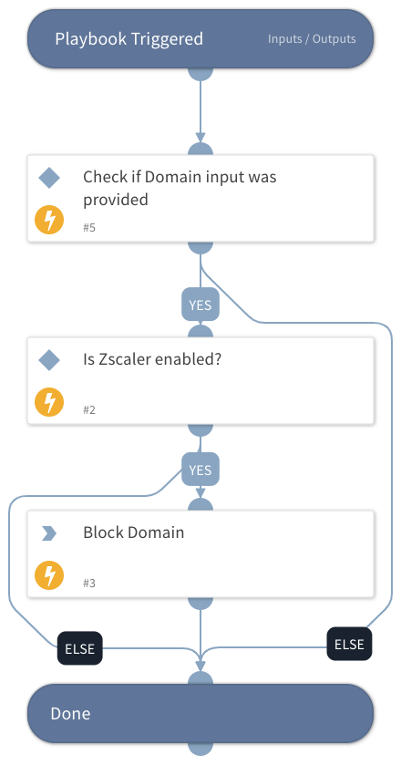

This playbook blocks domains using Zscaler.
The playbook checks whether the Zscaler integration is enabled, whether the Domain input has been provided and if so, blocks the domain.

## Dependencies
This playbook uses the following sub-playbooks, integrations, and scripts.

### Sub-playbooks
This playbook does not use any sub-playbooks.

### Integrations
* Zscaler

### Scripts
This playbook does not use any scripts.

### Commands
* zscaler-blacklist-url

## Playbook Inputs
---

| **Name** | **Description** | **Default Value** | **Required** |
| --- | --- | --- | --- |
| Domain | The Domain to block. |  | Optional |

## Playbook Outputs
---
There are no outputs for this playbook.

## Playbook Image
---
