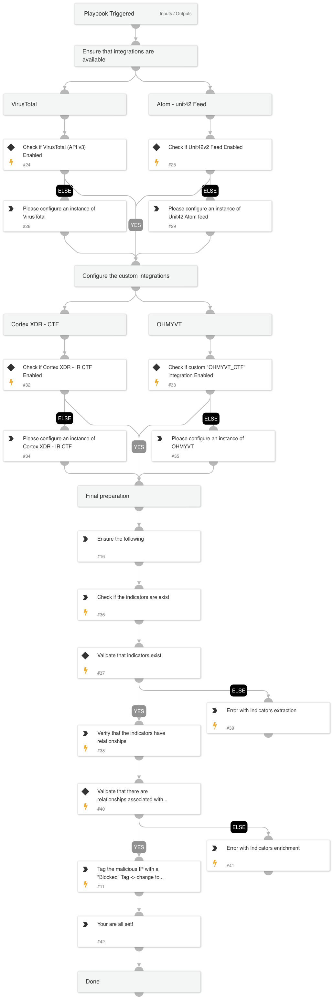

This playbook aims to assit in configuring you env for the Capture The Flag (CTF) game.

## Dependencies

This playbook uses the following sub-playbooks, integrations, and scripts.

### Sub-playbooks

This playbook does not use any sub-playbooks.

### Integrations

This playbook does not use any integrations.

### Scripts

* IsIntegrationAvailable
* SearchIndicatorRelationships
* AppendindicatorFieldWrapper
* PrintErrorEntry
* SearchIndicator

### Commands

This playbook does not use any commands.

## Playbook Inputs

---
There are no inputs for this playbook.

## Playbook Outputs

---
There are no outputs for this playbook.

## Playbook Image

---

