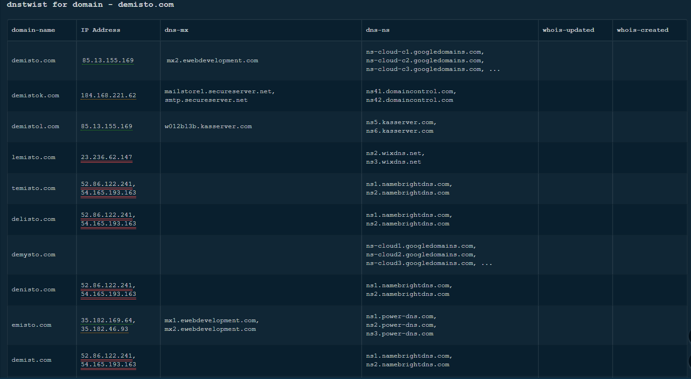

<!-- HTML_DOC -->

Cortex XSOAR interfaces with dnstwist to research what sort of trouble users can get in trying to type a domain name. Find similar-looking domains that adversaries can use for attacking. dnstwist detect typosquatting, phishing attacks, fraud, and corporate espionage. Useful as an additional source of targeted threat intelligence.

The integration uses Docker image <strong>demisto/dnstwist:1.0</strong>.

<h2>Use Cases</h2>

dnstwist takes in a domain name as a seed, generates a list of potential phishing domains, and then checks to see if they are registered.

Additionally, it can test if the mail server from MX (mail exchange) record can be used to intercept misdirected corporate e-mails, and it can generate fuzzy hashes of the web pages to see if they are live phishing sites.

<h2>Configure dnstwist on Cortex XSOAR</h2>
<ol>
<li>Navigate to <strong>Settings</strong> &gt; <strong>Integrations</strong> &gt; <strong>Servers &amp; Services</strong>.</li>
<li>Search for dnstwist.</li>
<li>Click <strong>Add instance</strong> to create and configure a new integration instance.
<ul>
<li>
<strong>Name</strong>: a textual name for the integration instance.</li>
</ul>
</li>
</ol>
<ol start="4">
<li>Click <strong>Test</strong> to validate the new instance.</li>
</ol>
<h2>Commands</h2>

You can execute these commands from the Cortex XSOAR CLI, as part of an automation, or in a playbook.  After you successfully execute a command, a DBot message appears in the War Room with the command details.

<ol>
<li><a href="#h_74846460451544530995198">Check domain variations: dnstwist-domain-variations</a></li>
</ol>
<h3 id="h_74846460451544530995198">1. Check domain variations</h3>

Checks domain variations.

<h5>Base Command</h5>

<code>dnstwist-domain-variations</code>

<h5>Input</h5>
<table style="width: 740px;" border="2" cellpadding="6">
<thead>
<tr>
<th style="width: 138.667px;"><strong>Argument Name</strong></th>
<th style="width: 496.333px;"><strong>Description</strong></th>
<th style="width: 71px;"><strong>Required</strong></th>
</tr>
</thead>
<tbody>
<tr>
<td style="width: 138.667px;">domain</td>
<td style="width: 496.333px;">

The domain name for which to check for variations.

</td>
<td style="width: 71px;">Required</td>
</tr>
<tr>
<td style="width: 138.667px;">limit</td>
<td style="width: 496.333px;">

Maximum number results to return in the context. This helps manage browser performance. The Markdown entry will display all results.

</td>
<td style="width: 71px;">Optional</td>
</tr>
<tr>
<td style="width: 138.667px;">

whois

</td>
<td style="width: 496.333px;">

Whether to perform a query for the Whois creation or last updated time (slow).

</td>
<td style="width: 71px;">Optional</td>
</tr>
</tbody>
</table>

 

<h5>Context Output</h5>
<table style="width: 742px;" border="2" cellpadding="6">
<thead>
<tr>
<th style="width: 296.667px;"><strong>Path</strong></th>
<th style="width: 422.333px;"><strong>Description</strong></th>
</tr>
</thead>
<tbody>
<tr>
<td style="width: 296.667px;">dnstwist.Domain.Domains.Name</td>
<td style="width: 422.333px;">

Domain name variations.

</td>
</tr>
<tr>
<td style="width: 296.667px;">dnstwist.Domain.Domains.IP</td>
<td style="width: 422.333px;">

IP addresses that resolved to domain name variations.

</td>
</tr>
<tr>
<td style="width: 296.667px;">dnstwist.Domain.Domains.DNS-MX</td>
<td style="width: 422.333px;">

Mail exchange records that resolved to domain name variations.

</td>
</tr>
<tr>
<td style="width: 296.667px;">

dnstwist.Domain.Domains.DNS-NS

</td>
<td style="width: 422.333px;">Server names that resolved to domain name variations.</td>
</tr>
<tr>
<td style="width: 296.667px;">

dnstwist.Domain.Domains.WhoisUpdated

</td>
<td style="width: 422.333px;">Whois updated for domain name variations.</td>
</tr>
<tr>
<td style="width: 296.667px;">

dnstwist.Domain.Domains.WhoisCreated

</td>
<td style="width: 422.333px;">

Whois created for domain name variations.

</td>
</tr>
</tbody>
</table>

 

<h5>Command Example</h5>

<code>!dnstwist-domain-variations domain=demisto.com</code>

<h5>Context Example</h5>
<pre>"dnstwist":	
	{
		"Domain": {
				"Name": "demisto.com",
				"IP" : ["85.13.155.169"]
				"Domains": [
							{
							"Name": "demistok.com",
						        "IP": ["52.86.122.241","54.165.193.163"]
						        },
							{
							 "Name": "demistol.com",
						         "IP": ["85.13.155.169"]									     
						        }
					]
			}
	}
</pre>
<h5>Human Readable Output</h5>

